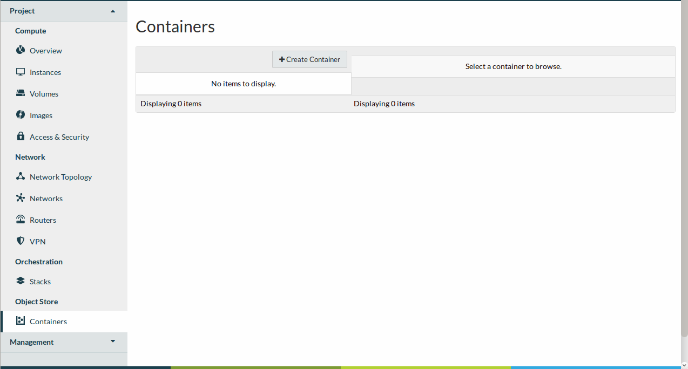
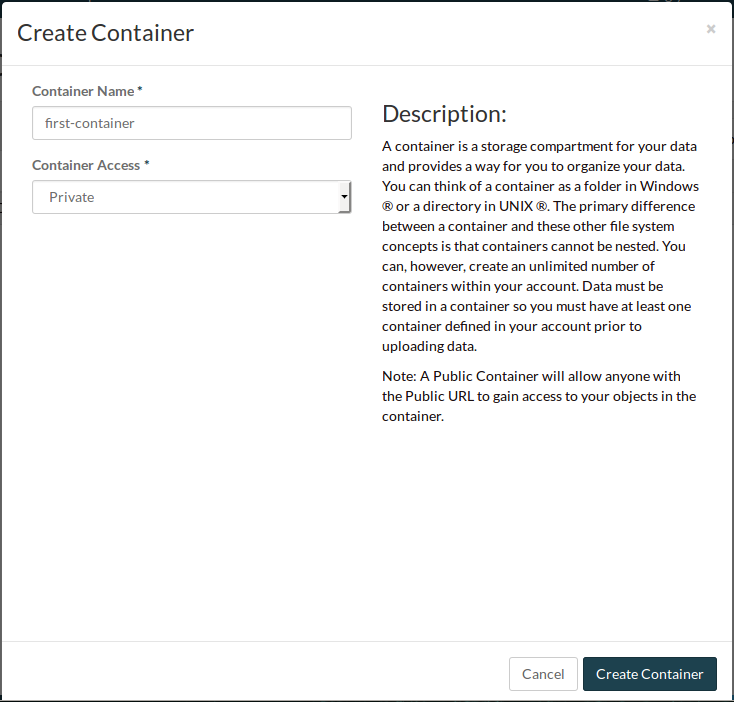
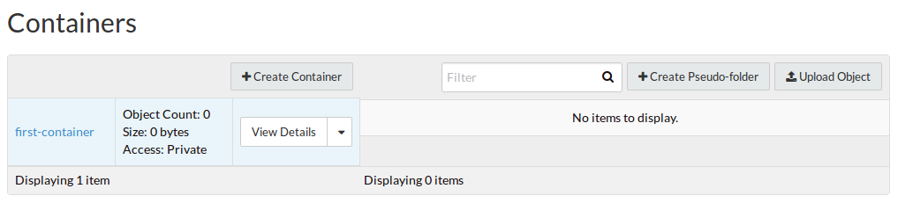
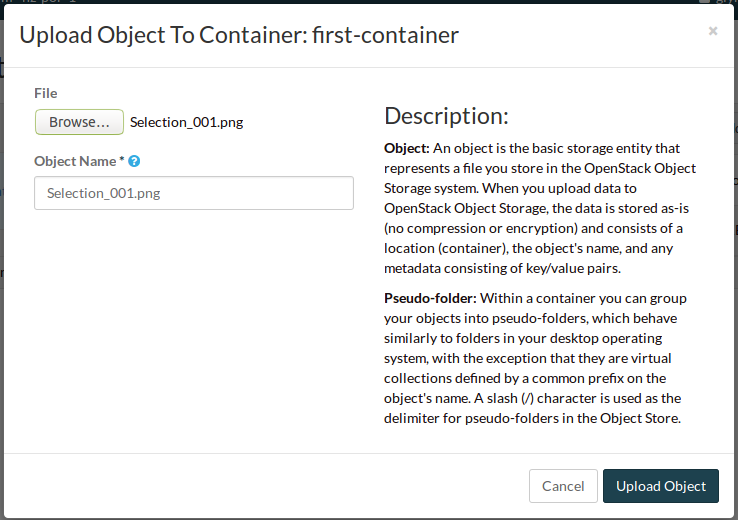
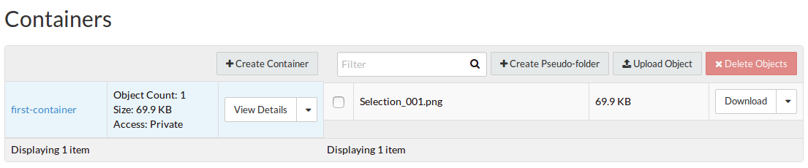

##############
Object storage
##############

********
Overview
********

Object storage is a web service to store and retrieve data from anywhere using
native web protocols. Each object typically includes the data itself, a
variable amount of metadata, and a globally unique identifier. All object
storage operations are done via a modern and easy to use REST API.

Object storage is the primary storage for modern (cloud-native) web and mobile
applications, as well as a place to archive data or a target for backup and
recovery. It is cost-effective, highly durable, highly available, scalable and
simple to use storage solution.

Our object storage service is a fully distributed storage system, with no
single points of failure and scalable to the exabyte level. The system is
self-healing and self-managing. Data stored in object storage is asynchronously
replicated to preserve three replicas of the data on different cloud regions.
The system runs frequent CRC checks to protect data from soft corruption. The
corruption of a single bit can be detected and automatically restored to a
healthy state. The loss of a region, server or a disk leads to the data being
quickly recovered from another disk, server or region.

*********************************
Object storage from the dashboard
*********************************

Data must be stored in a container (also referred to as a bucket) so we need
to create at least one container prior to uploading data.  To create a new
container navigate to the "Containers" section and click "Create Container".

|

Provide a name for the container and select the appropriate access level and
click "Create".

.. note::

  Setting "Public" level access on a container means that anyone
  with the containers URL can access the content of that container.

|

You should now see the newly created container. As this is a new container it
currently does not contain any data.  Click on "Upload Object" to add some
content.

|

Click on the "Browse" button to select the file you wish to upload and click
"Upload Object"

|

In the Containers view the Object Count has gone up to one and the size of
the container is now 69.9KB

***********************************
Using the command line client tools
***********************************

First ensure that you have installed the correct version of the tools for your
operating system version and have sourced your OpenStack RC file
see :ref:`command-line-interface` for full details.

To view the containers currently in existence in your project:

.. code-block:: bash

    $ openstack container list
    mycontainer-1
    mycontainer-2

To view the objects stored within a container:
**openstack object list <container_name>**

.. code-block:: bash

    $ openstack object list mycontainer-1
    +-------------+
    | Name        |
    +-------------+
    | file-1.txt  |
    | image-1.png |
    +-------------+

To create a new container: **openstack container create <container_name>**

.. code-block:: bash

    $ openstack container create mynewcontainer
    +---------+----------------+----------------------------------------------------+
    | account | container      | x-trans-id                                         |
    +---------+----------------+----------------------------------------------------+
    | v1      | mynewcontainer | tx000000000000000146531-0057bb8fc9-2836950-default |
    +---------+----------------+----------------------------------------------------+

To add a new object to a container:
**openstack object create <container_name> <file_name>**

.. code-block:: bash

    $ openstack object create mynewcontainer hello.txt
    +-----------+----------------+----------------------------------+
    | object    | container      | etag                             |
    +-----------+----------------+----------------------------------+
    | hello.txt | mynewcontainer | d41d8cd98f00b204e9800998ecf8427e |
    +-----------+----------------+----------------------------------+

To delete an object: **openstack object delete <container> <object>**

.. code-block:: bash

    $ openstack object delete mynewcontainer hello.txt

To delete a container: **openstack container delete <container>**

.. note::

  this will only work if the container is empty.

.. code-block:: bash

    $ openstack container delete mycontainer-1

To delete a container and all of the objects within the container:
**openstack container delete --recursive <container>**

  $ openstack container delete --recursive mycontainer-1

**********
Using cURL
**********

To access object storage using cURL it will be necessary to provide credentials
to authenticate the request.

This can be done by sourcing a valid RC file ( see
:ref:`command-line-interface` ) retrieving the account specific detail via the
swift commandline tools then exporting the required variables as shown below.

.. code-block:: bash

    $ source openstack-openrc.sh

    $ swift stat -v
     StorageURL: https://api.nz-por-1.catalystcloud.io:8443/v1/AUTH_0ef8ecaa78684c399d1d514b61698fda
                      Auth Token: 5f5a043e1bd24a8fa84b8785cca8e0fc
                         Account: AUTH_0ef8ecaa78684c399d1d514b61698fda
                      Containers: 48
                         Objects: 156
                           Bytes: 11293750551
 Containers in policy "policy-0": 48
    Objects in policy "policy-0": 156
      Bytes in policy "policy-0": 11293750551
     X-Account-Project-Domain-Id: default
                          Server: nginx/1.8.1
                     X-Timestamp: 1466047859.45584
                      X-Trans-Id: tx4bdb5d859f8c47f18b44d-00578c0e63
                    Content-Type: text/plain; charset=utf-8
                   Accept-Ranges: bytes

    $ export storageURL="https://api.nz-por-1.catalystcloud.io:8443/v1/AUTH_0ef8ecaa78684c399d1d514b61698fda"
    $ export token="5f5a043e1bd24a8fa84b8785cca8e0fc"

Then run the following command to get a list of all available containers for
that tenant

.. code-block:: bash

    curl -i -X GET -H "X-Auth-Token: $token" $storageURL

You can optionally specify alternative output formats; for example to use XML
or JSON using the following syntax

.. code-block:: bash

    curl -i -X GET -H "X-Auth-Token: $token" $storageURL?format=xml
    curl -i -X GET -H "X-Auth-Token: $token" $storageURL?format=json

To view the objects within a container simply append the container name to
the cURL request

.. code-block:: bash

    curl -i -X GET -H "X-Auth-Token: $token" $storageURL/mycontainer

*********
Swift API
*********

The Swift object storage service has a feature API that is fully documented on
the OpenStack website

.. seealso::

  The features supported by the Swift can be found at
  http://developer.openstack.org/api-ref/object-storage/

API endpoints
=============

+----------+---------+---------------------------------------------------------------+
| Region   | Version | Endpoint                                                      |
+==========+=========+===============================================================+
| nz-por-1 | 1       | https://api.nz-por-1.catalystcloud.io:8443/v1/AUTH_%tenantid% |
+----------+---------+---------------------------------------------------------------+
|          | 2       | https://api.cloud.catalyst.net.nz:5000/v2.0                   |
+----------+---------+---------------------------------------------------------------+
| nz_wlg_2 | 1       | https://api.cloud.catalyst.net.nz:8443/v1/AUTH_%tenantid%     |
+----------+---------+---------------------------------------------------------------+
|          | 2       | https://api.cloud.catalyst.net.nz:5000/v2.0                   |
+----------+---------+---------------------------------------------------------------+
| nz-hlz-1 | 1       | https://api.nz-hlz-1.catalystcloud.io:8443/v1/AUTH_%tenantid% |
+----------+---------+---------------------------------------------------------------+
|          | 2       | https://api.cloud.catalyst.net.nz:5000/v2.0                   |
+----------+---------+---------------------------------------------------------------+

Requirements
============

You need valid OpenStack credentials to interact using the Swift API.
These can be obtained from the RC file (under Access &
Security, API Access, or using the command line tools).

The standard client library is Python Swiftclient. This can be installed
into your current Python environment. The example below illustrates:

.. code-block:: bash

  # Make sure you have pip and virtualenv installed
  sudo apt-get install python-pip python-virtualenv

  # Create a new virtual environment for Python and activate it
  virtualenv venv
  source venv/bin/activate

  # Install Python Swiftclient library on your virtual environment
  pip install python-swiftclient

Sample code
===========

The code below demonstrates how you can use swiftclient to interact
with Swift via the version 2 compatible (auth) API. This version uses
the same endpoint for both regions, but you tell it which one you want
when connecting.

Before running this example ensure that you have sourced an openrc file, as
explained in :ref:`command-line-interface`.

.. code-block:: python

  #!/usr/bin/env python
  import os
  import swiftclient

  # Read configuration from environment variables (openstack.rc)
  auth_username = os.environ['OS_USERNAME']
  auth_password = os.environ['OS_PASSWORD']
  auth_url = os.environ['OS_AUTH_URL']
  project_name = os.environ['OS_TENANT_NAME']
  region_name = os.environ['OS_REGION_NAME']
  options = {'tenant_name': project_name, 'region_name': region_name}

  # Establish the connection with the object storage API
  conn = swiftclient.Connection(
          user = auth_username,
          key = auth_password,
          authurl = auth_url,
          insecure = False,
          auth_version = 2,
          os_options = options,
  )

  # Create a new container
  container_name = 'mycontainer'
  conn.put_container(container_name)

  # Put an object in it
  conn.put_object(container_name, 'hello.txt',
                  contents='Hello World!',
                  content_type='text/plain')

  # List all containers and objects
  for container in conn.get_account()[1]:
      cname = container['name']
      print 'container\t{0}'.format(cname)

      for data in conn.get_container(cname)[1]:
          print '\t{0}\t{1}\t{2}'.format(data['name'], data['bytes'],
          data['last_modified'])

To use the version 1 (auth) API you need to have previously authenticated,
and have remembered your token id (e.g using the keystone client). Also the
endpoint for the desired region must be used (here por).

https://api.nz-por-1.catalystcloud.io:8443/swift/v1/auth_tenant_id/container_name/object_name

.. code-block:: python

  #!/usr/bin/env python
  import swiftclient
  token = 'thetokenid'
  stourl = 'https://api.nz-por-1.catalystcloud.io:8443/v1/AUTH_<tenant_id>'

  conn = swiftclient.Connection(
          preauthtoken = token,
          preauthurl = stourl,
          insecure = False,
          auth_version = 1,
  )

  # ...rest of program is unchanged

******
S3 API
******

The Swift object storage service has an Amazon S3 emulation layer that supports
common S3 calls and operations.

.. seealso::

  The features supported by the S3 emulation layer can be found at
  https://wiki.openstack.org/wiki/Swift/APIFeatureComparison

  In addition, Swift3 middleware emulates the S3 REST API on top of OpenStack
  Swift is docmented fully at
  http://docs.openstack.org/mitaka/config-reference/object-storage/configure-s3.html

API endpoints
=============

+----------+-----------------------------------------------------+
| Region   | Endpoint                                            |
+==========+=====================================================+
| nz-por-1 | https://api.nz-por-1.catalystcloud.io:8443          |
+----------+-----------------------------------------------------+
| nz_wlg_2 | https://api.cloud.catalyst.net.nz:8443              |
+----------+-----------------------------------------------------+

Requirements
============

You need valid EC2 credentials in order to interact with the S3 compatible API.
You can obtain your EC2 credentials from the dashboard (under Access &
Security, API Access), or using the command line tools:

.. code-block:: bash

  keystone ec2-credentials-create

If you are using boto to interact with the API, you need boto installed on your
current Python environment. The example below illustrates how intall boto on a
virtual environment:

.. code-block:: bash

  # Make sure you have pip and virtualenv installed
  sudo apt-get install python-pip python-virtualenv

  # Create a new virtual environment for Python and activate it
  virtualenv venv
  source venv/bin/activate

  # Install Amazon's boto library on your virtual environment
  pip install boto

Sample code
===========

The code below demonstrates how you can use boto to interact with the S3
compatible API.

.. code-block:: python

  #!/usr/bin/env python

  import boto
  import boto.s3.connection

  access_key = 'fffff8888fffff888ffff'
  secret = 'bbbb5555bbbb5555bbbb555'
  api_endpoint = 'api.cloud.catalyst.net.nz'
  port = 8443
  mybucket = 'mytestbucket'

  conn = boto.connect_s3(aws_access_key_id=access_key,
                    aws_secret_access_key=secret,
                    host=api_endpoint, port=port,
                    calling_format=boto.s3.connection.OrdinaryCallingFormat())

  # Create new bucket if not already existing
  bucket = conn.lookup(mybucket)
  if bucket is None:
      bucket = conn.create_bucket(mybucket)

  # Store hello world file in it
  key = bucket.new_key('hello.txt')
  key.set_contents_from_string('Hello World!')

  # List all files in test bucket
  for key in bucket.list():
      print key.name

  # List all buckets
  for bucket in conn.get_all_buckets():
      print "{name}\t{created}".format(
          name = bucket.name,
          created = bucket.creation_date,
      )

*****************
Object Versioning
*****************

This provides a means by which multiple versions of your content can be stored
allowing for recovery from unintended overwrites.

First we need to create an archive container to store the older versions of our
objects

.. code-block:: bash

  $ curl -i -X PUT -H "X-Auth-Token: $token" $storageURL/archive

Now we can create a container to hold our objects. We must include the
``X-Versions-Location`` header which defines the container that holds the
previous versions of your objects.

.. code-block:: bash

  $ curl -i -X PUT -H "X-Auth-Token: $token" -H 'X-Versions-Location: archive' $storageURL/my-container
  HTTP/1.1 201 Created
  Server: nginx/1.10.1
  Date: Mon, 05 Dec 2016 23:50:00 GMT
  Content-Type: text/html; charset=UTF-8
  Content-Length: 0
  X-Trans-Id: txe6d2f4e289654d02a7329-005845fd28

Once the ``X-Versions-Location`` header has been applied to the container any
changes to objects in the container automatically result in a copy of the
original object being placed in the archive container. The backed up version
will have the following format:

.. code-block:: bash

  <length><object_name>/<timestamp>

Where <length> is the length of the object name ( as a 3 character zero padded
hex number ), <object_name> is the original object name and <timestamp> is the
unix timestamp of the original file creation.

<length> and <object_name> are then combined to make a new container
(pseudo-folder in the dashboard) with the backed up object stored within using
the timestamp as it's name.

.. note::

  You must UTF-8-encode and then URL-encode the container name before you
  include it in the X-Versions-Location header.

If we list out current containers we can see that we now have 2 empty
containers.

.. code-block:: bash

  $ openstack container list --long
  +--------------+-------+-------+
  | Name         | Bytes | Count |
  +--------------+-------+-------+
  | archive      |     0 |     0 |
  | my-container |     0 |     0 |
  +--------------+-------+-------+

If we upload a sample file in to my-container we can see the confirmation of
this operation which includes the etag, which is an MD5 hash of the objects
contents.

.. code-block:: bash

  $ openstack object create my-container file1.txt
  +-----------+--------------+----------------------------------+
  | object    | container    | etag                             |
  +-----------+--------------+----------------------------------+
  | file1.txt | my-container | 2767104ea585e1a98a23c52addeeae4a |
  +-----------+--------------+----------------------------------+

Now if the original file is modified and uploaded to the same container, we get
a successful confirmation except this time we get a new etag as the contents of
the file have changed.

.. code-block:: bash

  $ openstack object create my-container file1.txt
  +-----------+--------------+----------------------------------+
  | object    | container    | etag                             |
  +-----------+--------------+----------------------------------+
  | file1.txt | my-container | 9673f4c3efc2ee8dd9edbc2ba60c76c4 |
  +-----------+--------------+----------------------------------+

If we show the containers again we can see now that even though we only
uploaded the file into my-container we now also have a file present in the
archive container.

.. code-block:: bash

  $ os container list --long
  +--------------+-------+-------+
  | Name         | Bytes | Count |
  +--------------+-------+-------+
  | archive      |    70 |     1 |
  | my-container |    73 |     1 |
  +--------------+-------+-------+

Further investigation of the archive container reveals that we have a new
object, that was created automatically and named in accordance with the
convention outlined above

.. code-block:: bash

  $ openstack object list archive
  +-------------------------------+
  | Name                          |
  +-------------------------------+
  | 009file1.txt/1480982072.29403 |
  +-------------------------------+

*************
Temporary URL
*************

This a means by which a temporary URL can be generated to allow unauthenticated
access to the Swift object at the given path. The access is via the given HTTP
method (e.g. GET, PUT) and is valid for the number of seconds provided when the
URL is created.

The expiry time can be expressed as valid for the given number of seconds from
now or if the optional --absolute argument is provided, seconds is instead
interpreted as a Unix timestamp at which the URL should expire.

The syntax for the tempurl creation command is

**swift tempurl [command-option] method seconds path key**

This generates  a  temporary URL allowing unauthenticated access to the Swift
object at the given path, using the given HTTP method, for the given number of
seconds, using the given TempURL key. If optional --absolute argument is
provided, seconds is instead interpreted as a Unix timestamp at which the URL
should expire.

**Example:**

.. code-block:: bash

  swift tempurl GET $(date -d "Jan 1 2017" +%s) /v1/AUTH_foo/bar_container/quux.md my_secret_tempurl_key --absolute

- sets the expiry using the absolute method to be Jan 1 2017
- for the object : quux.md
- in the nested container structure : bar_container/quux.mdbar_container/
- with key : my_secret_tempurl_key

Creating Temporary URLs in the Catalyst Cloud
=============================================
At the time of writing the only method currently available for the creation of
temporary URLs is using the command line tools.

Firstly we need to associate a secret key with our object store account.

.. code-block:: bash

  $ openstack object store account set --property Temp-Url-Key='testkey'

You can then confirm the details of the key.

.. code-block:: bash

  $ openstack object store account show
  +------------+---------------------------------------+
  | Field      | Value                                 |
  +------------+---------------------------------------+
  | Account    | AUTH_b24e9ee3447e48eab1bc99cb894cac6f |
  | Bytes      | 128                                   |
  | Containers | 4                                     |
  | Objects    | 8                                     |
  | properties | Temp-Url-Key='testkey'                |
  +------------+---------------------------------------+

Then using the syntax outlined above you can create a temporary URL to access
an object residing in the object store.

We will create a URL that will be valid for 600 seconds and provide access to
the object "file2.txt" that is located in the container "my-container"

.. code-block:: bash

  $ swift tempurl GET 600 /v1/AUTH_b24e9ee3447e48eab1bc99cb894cac6f/my-container/file2.txt "testkey"
  /v1/AUTH_b24e9ee3447e48eab1bc99cb894cac6f/my-container/file2.txt?temp_url_sig=2dbc1c2335a53d5548dab178d59ece7801e973b4&temp_url_expires=1483990005

We can test this using cURL and appending the generated URL to the Catalyst
Cloud's server URL "https://api.nz-por-1.catalystcloud.io:8443". If it is
successful the request should return the contents of the object.

.. code-block:: bash

  $ curl -i "https://api.nz-por-1.catalystcloud.io:8443/v1/AUTH_b24e9ee3447e48eab1bc99cb894cac6f/my-container/file2.txt?temp_url_sig=2dbc1c2335a53d5548dab178d59ece7801e973b4&temp_url_expires=1483990005"
  HTTP/1.1 200 OK
  Server: nginx/1.10.1
  Date: Mon, 09 Jan 2017 19:22:05 GMT
  Content-Type: text/plain
  Content-Length: 501
  Accept-Ranges: bytes
  Last-Modified: Mon, 09 Jan 2017 19:18:47 GMT
  Etag: 137eed1d424a58831892172f5433594a
  X-Timestamp: 1483989526.71129
  Content-Disposition: attachment; filename="file2.txt"; filename*=UTF-8''file2.txt
  X-Trans-Id: tx9aa84268bd984358b6afe-005873e2dd

  "For those who have seen the Earth from space, and for the hundreds and perhaps thousands more who will, the experience most certainly changes your perspective. The things that we share in our world are far more valuable than those which divide us." "For those who have seen the Earth from space, and for the hundreds and perhaps thousands more who will, the experience most certainly changes your perspective. The things that we share in our world are far more valuable than those which divide us."

We could also access the object by taking the same URL that we passed to cURL
and pasting it into a web browser.

****************************************
Static websites hosted in object storage
****************************************

It is possible to host simple websites that contain only static content from
within a container.

First setup a container and configure the read ACL to allow read access and
optionally allow files to be listed.

.. code-block:: bash

  swift post con0
  swift post -r '.r:*,.rlistings' con0

To confirm the ACL settings, or any of the other metadata settings that follow
run the following command.

.. code-block:: bash

  swift stat con0
           Account: AUTH_b24e9ee3447e48eab1bc99cb894cac6f
         Container: con0
           Objects: 3
             Bytes: 35354
          Read ACL: .r:*,.rlistings
         Write ACL:
           Sync To:
          Sync Key:
     Accept-Ranges: bytes
        X-Trans-Id: tx54e1341d5fd74634b19c5-005906aaf6
            Server: nginx/1.10.1
       X-Timestamp: 1493608620.58190
  X-Storage-Policy: Policy-0
      Content-Type: text/plain; charset=utf-8

Next upload the files you wish to host.

.. code-block:: bash

  swift upload con0 index.html error.html image.png styles.css

It is possible to allow listing of all files in the container by enabling
web-listings. It is also possible to style theses listing using a separate CSS
file to the one you would use to style the actual website.

Upload the css file and enable the web listing and styling for the listing.

.. code-block:: bash

  swift upload con0 listing.css
  swift post -m 'web-listings: true' con0
  swift post -m 'web-listings-css:listings.css' con0

You should now be able to view the files in the container by visiting the
containers URL, where %AUTH_ID% & %container_name% are replaced by your values.

https://object-storage.nz-por-1.catalystcloud.io/v1/%AUTH_ID%/%container_name%/

To enable the container to work as a full website it is also necessary to
enable the index and optionally the error settings.

.. code-block:: bash

  swift post -m 'web-index:index.html' con0
  swift post -m 'web-error:error.html' con0

You should now be able to view the index file as a website.

https://object-storage.nz-por-1.catalystcloud.io/v1/%AUTH_ID%/%container_name%/

**************************
Working with Large Objects
**************************

Typically the size of a single object cannot exceed 5GB. It is possible
however, to use several smaller objects to break up the large object. When this
approach is taken the resulting large object is made ou of two types of
objects:

- **Segment Objects** which store the actual content. You need to split your content into chunks
  and then upload each piece as its own segment object.

- A **manifest object** then links the segment objects into a single logical object. To download
  the object you download the manifest and object storage then concatenates the segments and
  returns the the contents.

There are tools avaiable, both GUI and CLI, that will handle the segmentation
of large objects for you. For all other cases you must manually split the
oversized files and manage the manifest objects yourself.

Using the Swift commandline tool
================================
The Swift tool which is included in the `python-swiftclient`_ library, for example, is
capable of handling oversized files
and gives you the choice of using either ``static large objects (SLO)`` or
``dynamic large objects (DLO)``, which will be explained in more detail later.

.. _python-swiftclient: http://github.com/openstack/python-swiftclient

|

Here are 2 examples of how to upload a large object to an object storage container using the Swift
tool. For the purpose of keeping output brief we are using a 512MB file in the example.

example 1 : DLO
---------------
The default mode for the tool is the ``dynamic large object`` type so in this example the only
other parameter that is required is the segment size. The ``-S`` flag is used to specify the size
of each chunk, in this case  104857600 bytes (100MB).

.. code-block:: bash

  $ swift upload mycontainer -S 104857600 large_file
  large_file segment 5
  large_file segment 0
  large_file segment 4
  large_file segment 3
  large_file segment 1
  large_file segment 2
  large_file

|

example 2 : SLO
---------------
In the second example the same segment size as above is used but we specify that the object type
must now be the ``static large object`` type.

.. code-block:: bash

  $ swift upload mycontainer --use-slo -S 104857600 large_file
  large_file segment 5
  large_file segment 1
  large_file segment 4
  large_file segment 0
  large_file segment 2
  large_file segment 3
  large_file

Both of these approaches will successfully upload our large file file into object storage. The
file would be split into 100MB segments which are uploaded in parallel. Once all the segments are
uploaded, the manifest file will be created so that the segments can be downloaded as a single
object.

The Swift uses a strict convention for its segmented object support. All segments that are
uploaded are placed into a second container that has ``_segments`` appended to the original
container name, in this case it would be mycontainer_segments. The segment names follow the format
of ``<name>/<timestamp>/<object_size>/<segment_size>/<segment_name>``.

If we check on the segments created in example 1 we can see this.

.. code-block:: bash

  $ swift list mycontainer_segments
  large_file/1500505735.549995/536870912/104857600/00000000
  large_file/1500505735.549995/536870912/104857600/00000001
  large_file/1500505735.549995/536870912/104857600/00000002
  large_file/1500505735.549995/536870912/104857600/00000003
  large_file/1500505735.549995/536870912/104857600/00000004
  large_file/1500505735.549995/536870912/104857600/00000005

In the above example it will upload all the segments into a second container named
test_container_segments. These segments will have names like
large_file/1290206778.25/21474836480/00000000, large_file/1290206778.25/21474836480/00000001, etc.

The main benefit for using a separate container is that the main container listings will not be
polluted with all the segment names. The reason for using the segment name format of
<name>/<timestamp>/<size>/<segment> is so that an upload of a new file with the same name won’t
overwrite the contents of the first until the last moment when the manifest file is updated.

Swift will manage these segment files for you, deleting old segments on deletes and overwrites,
etc. You can override this behavior with the --leave-segments option if desired; this is useful if
you want to have multiple versions of the same large object available.

Static Large Objects (SLO) vs Dynamic Large Objects (DLO)
=========================================================

The main difference between the two object types is to do with the associated manifest file that
describes the overall object structure within swift.

In both of our examples above, the file would be split into 100MB chunks and uploaded, this can
happen concurrently if desired. Once the segments are uploaded it is then necessary to create a
manifest file to describe the object and allow it to be downloaded as a single file. When using
Swift the manifest fles are created for you.

The manifest for the ``DLO`` is an empty file and all segments must be stored in the same container
, though depending on the object store implementation the segments, as mentioned above, may go into
a container with '_segments' appended to the original container name. It also works on the
assumption that the container will be eventually consistent.

For ``SLO`` the difference is that a user-defined manifest file describing the object segments is
required. It also does not rely on eventually consistent container listings to do so. This means
that the segments can be help in different container locations. The fact that once all files are
can't then change is the reason why these are referred to as 'static' objects.

A more manual approach
======================

While the Swift tool is certainly handy as it handles a lot of the underlying file management tasks
required to upload files into object storage the same can be achieved by more manual means.

Here is an example using standard linux commandline tools such as ``split`` and ``curl`` to perform
a dynamic large object file upload.

The file 'large_file' is broken into 100MB chunks which are prefixed with 'split-'

.. code-block:: bash

  $ split --bytes=100M large_file split-

The upload of these segments is then handled by curl. See `using curl`_ for more information on how
to do this.

.. _using curl: http://docs.catalystcloud.io/object-storage.html#using-curl

The first curl command creates a new container, the next 2 upload the 2 segmetns created previously
and finally a zero byte file is created for the manifest.

.. code-block:: bash

  curl -i $storageURL/lgfile -X PUT -H “X-Auth-Token: $token"
  curl -i $storageURL/lgfile/split_aa -X PUT -H "X-Auth-Token: $token" -T split-aa
  curl -i $storageURL/lgfile/split_ab -X PUT -H "X-Auth-Token: $token" -T split-ab
  curl -i -X PUT -H "X-Auth-Token: $token" -H "X-Object-Manifest: lgfile/split_" -H "Content-Length: 0"  $storageURL/lgfile/manifest/1gb_sample.txt

A similar approach can also be taken to use the SLO type, but this is a lot more involved. A
detailed description of the process can be seen `here`_

.. _here: https://docs.openstack.org/swift/latest/overview_large_objects.html#module-swift.common.middleware.slo

***
FAQ
***

Can I use s3cmd for object storage?
===================================

There is a powerful open source tool for managing object storage called
s3cmd. It is available from http://s3tools.org/s3cmd and was originally
written for managing object storage data in Amazon S3.  It is also
compatible with Catalyst Cloud object storage using the OpenStack S3
API.

While it is compatible, there is a gotcha with the Catalyst Cloud.  In
order to use s3cmd with the Catalyst Cloud, you need to customise the
s3cmd configuration file.

Configuration changes
---------------------

The following changes need to be specified in the .s3cfg file.

.. code-block:: ini

  host_base = api.cloud.catalyst.net.nz:8443
  host_bucket = api.cloud.catalyst.net.nz:8443
  signature_v2 = True
  use_https = True

Compatibility with S3
---------------------

Please reference the Object Storage section for OpenStack Swift
compatibility to S3 API's.

.. seealso::

  It is documented here in the Catalyst Cloud documentation
  http://docs.catalystcloud.io/object-storage.html#s3-api
