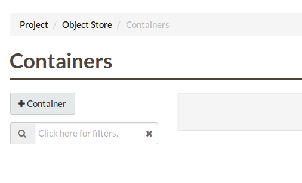
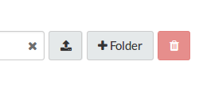
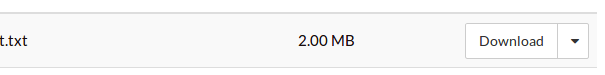
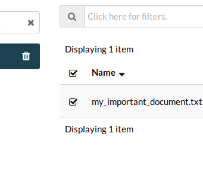
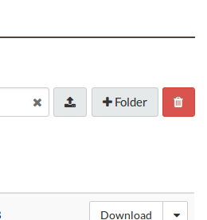
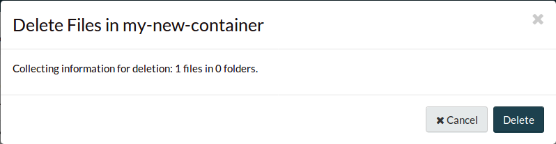
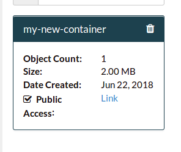
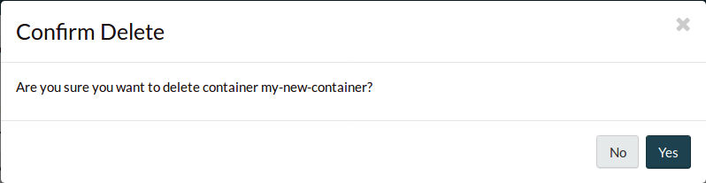

#################################
Object storage from the dashboard
#################################

********************
Creating a container
********************

Data must be stored in a container (also referred to as a bucket) so we need to
create at least one container prior to uploading data, IE: our objects. To
create a new container, navigate to the ``Containers`` window and select ``+
Container``.

Provide a name for the container, select the appropriate access level, and
select ``Create``.

.. note::

  Setting ``Public`` level access on a container means that anyone
  with the container's URL can access the content of that container.

.. image:: assets/create_container.png

You should now see the newly created container. As this is a new container, it
currently does not contain any data.

.. image:: assets/new_container.png

*****************
Uploading objects
*****************

To upload an object, select the ``Upload`` button. To upload an entire folder,
select the ``+ Folder`` button.

Click on the ``Browse...`` button to select the file you wish to upload, rename
the file if you wish, and select ``Upload File``.

.. image:: assets/doing_upload.png

In the Containers view the Object Count has gone up to one and the size of
the container is now 1 Megabyte.

.. image:: assets/uploaded_file.png

*******************
Downloading objects
*******************

To download an object, select the ``Download`` button on the object you want to
download. To perform more complex download operations, such as mass downloading,
or automated downloading, we recommend the :ref:`CLI <command-line-interface>`
or an appropriate automation tool.

.. _dashboard-delete-object:

****************
Deleting objects
****************

To delete an object, or multiple objects, select the check boxes of the objects
you'd like to delete.

Now select the trash button...

... and confirm the action.

****************
Deleting buckets
****************

Before deleting a bucket, you must first delete all objects contained within it.
This is to reduce the chance of accidental deletion. Follow the :ref:`deleting
objects guide <dashboard-delete-object>` to delete all the objects within the
container you'd like to delete.

Once that is done, select the container's trash button...

... and confirm the action.

