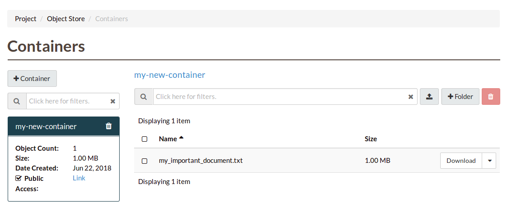

#################
Via the dashboard
#################

===================
Using the dashboard
===================

Data must be stored in a container (also referred to as a bucket) so we need
to create at least one container prior to uploading data. To create a new
container, navigate to the "Containers" section and click "Create Container".

.. image:: assets/containers_ui.png
   :align: center

Provide a name for the container and select the appropriate access level and
click "Create".

.. note::

  Setting "Public" level access on a container means that anyone
  with the container's URL can access the content of that container.

.. image:: assets/create_container.png
  :align: center

You should now see the newly created container. As this is a new container, it
currently does not contain any data. Click on "Upload Object" to add some
content.

.. image:: assets/new_container.png
   :align: center

Click on the "Browse" button to select the file you wish to upload and click
"Upload File".

.. image:: assets/doing_upload.png
   :align: center

In the Containers view the Object Count has gone up to one and the size of
the container is now 314 Bytes.

