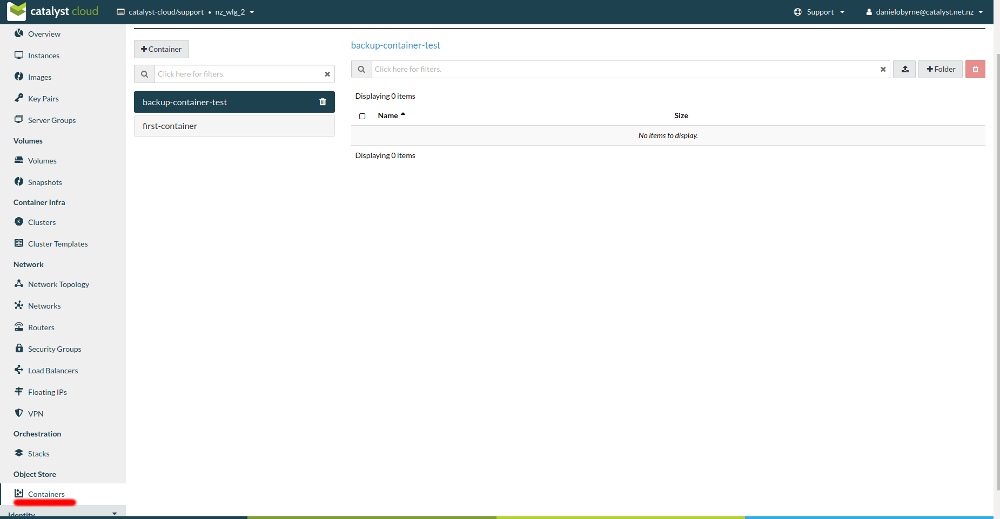
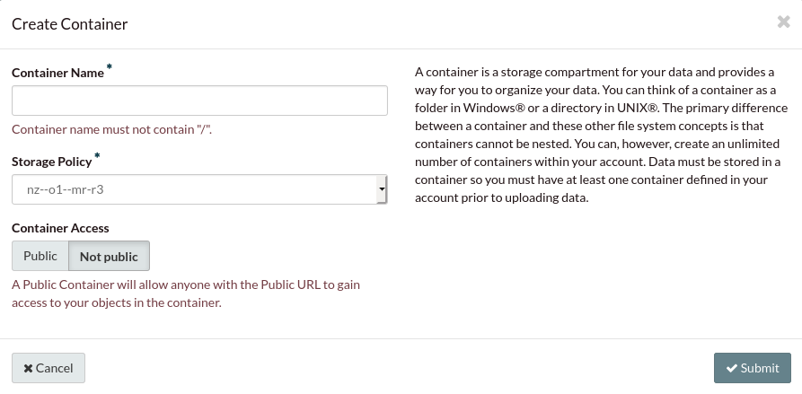
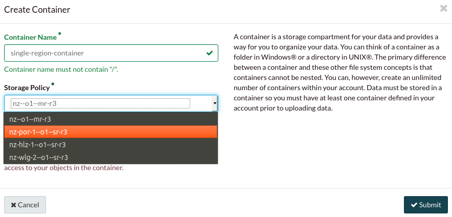
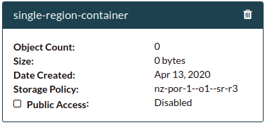

##################
Replication Policy
##################

When you create a container through the use of the object storage service, that
container will have a replication policy applied to it. The default policy
ensures that the container is replicated across all three regions of
the Catalyst Cloud. This is done as a means to provide geographic diversity and
security to your data in the event of a disaster affecting one of our regions.

However, there are some scenarios where you may not need your data to be
replicated across regions or you wish to save money on a cheaper policy. In
this case you can choose a replication policy that keeps three replicas of your
data in a single region instead of having them spread across all of them.

*****************************
What are the storage policies
*****************************

The following are the storage policies available, each of these (as their names
suggest) are related to one of the regions on the Catalyst cloud:

+--------------------------+------------------+------------------------+
| Storage class            | Failure-domain   | Replicas               |
+==========================+==================+========================+
| nz--o1--mr-r3 (default)  | Multi-region     | 3 (one in each region) |
+--------------------------+------------------+------------------------+
| nz-wlg-2--o1--sr-r3      | Single-region    | 3 (all in one region)  |
+--------------------------+------------------+------------------------+
| nz-por-1--o1--sr-r3      | Single-region    | 3 (all in one region)  |
+--------------------------+------------------+------------------------+
| nz-hlz-1--o1--sr-r3      | Single-region    | 3 (all in one region)  |
+--------------------------+------------------+------------------------+

.. Warning::
  You cannot change the storage policy of an already existing container. The
  only way to change the policy of a container is during it's creation.

There are multiple ways to create containers that use a single region policy.
You can create your container via the Dashboard, by making use of the openstack
CLI or by making calls to the object storage API directly. All of which are
detailed below.

****************
Dashboard method
****************

It is now a required field when creating a container, to choose a replication
policy. The following will go through the process of creating a new container
via the dashboard and show you how to choose your replication policy.
Firstly, navigate to the 'containers' section under the object storage tab.

Once here, we're going to make a new container by clicking on the "+ container"
button. The button will open up a new window that should look like this:

We'll give our container a name and in the storage policy tab below, we select
the region that we want our replicas to be created in. As you can see, by
default the multi-region option is selected, but for this example we'll choose
policy for the Porirua region and then click submit. Something important to
mention is even though the policy we have chosen uses the Porirua region for
storing the replicas, you are still able to access this container from any of
our regions.

After you've created your container, it will function as normal. You should be
able to see the policy that your container has when selecting it from the
dashboard as seen below

********************
Programmatic methods
********************

.. tabs::

  .. tab:: Openstack CLI

    .. include:: tutorial-scripts/replication-openstack.rst

  .. tab:: API method

    .. include:: tutorial-scripts/replication-api.rst

