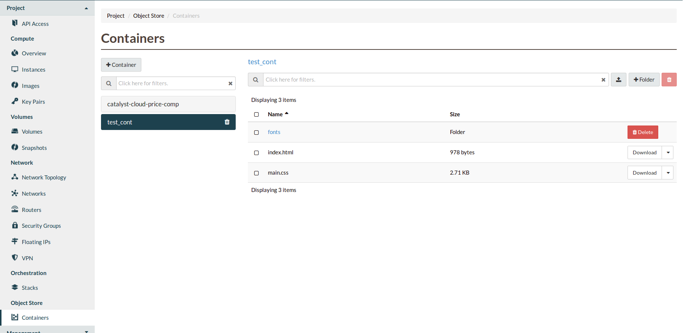
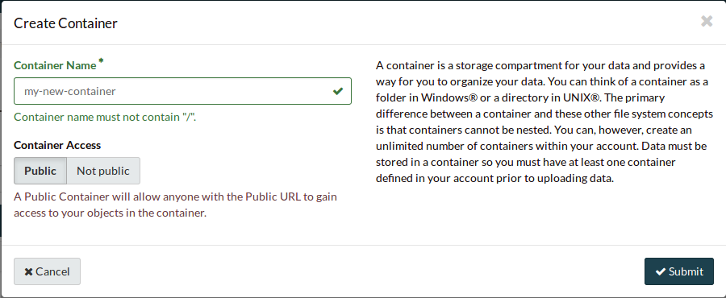
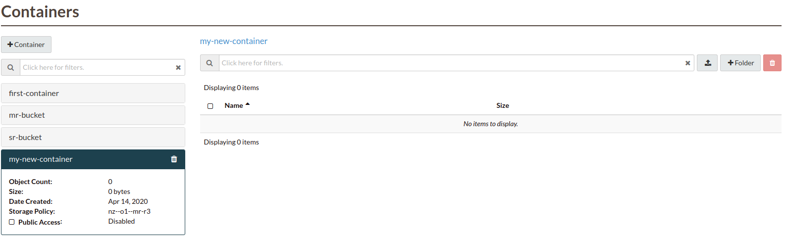
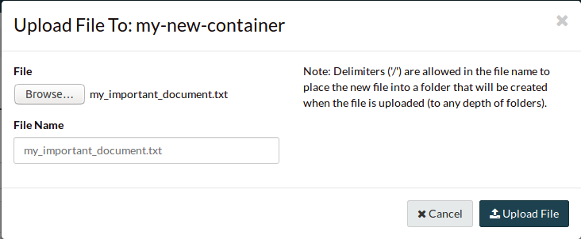

##################################
Using containers
##################################

There are several different methods available to you for interacting with the
object storage service. The following sections cover the most common tools that
people use. Each of these examples shows some of the basic commands that you
can use to create and edit your object storage containers.

*****************
Via the dashboard
*****************

When using the object storage service, your data must be stored in a container
(also referred to as a bucket.) So our first step is to create at least one
container prior to uploading any data. To create a new container, navigate to
the "Containers" section on the dashboard and click "Create Container".

Provide a name for the container and select the appropriate access level and
click "Create".

.. note::

  Setting "Public" level access on a container means that anyone
  with the container's URL can access the contents of that container.

You should now see the newly created container. As this is a new container, it
currently does not contain any data. Click on the upload button next to
"Folder" to add some content.

Click on the "Browse" button to select the file you wish to upload and once
selected click "Upload File".

In the containers view the Object Count has gone up to one and the size of
the container is now 5 Bytes.

************************
Via programmatic methods
************************

Prerequisites
=============

For several of the methods detailed below, you will have to prepare your
command line environment before continuing with the examples. The key things
that you have to prepare before continuing are:

* You must :ref:`Source an OpenRC file <command-line-interface>`.
* You must ensure that you have the correct role for using object storage on
  your cloud project. See :ref:`here<access_control>` for more details.

Once you have met these requirements, you can continue with whichever
method you choose:

.. warning::

  Please do not use an underscore "``_``" when naming your containers. This will
  cause an error with the S3 api and you will receive errors through your CLI
  when using this method. As a general practice we recommend avoiding
  the use of an underscore regardless of the method you choose below.

|

.. _s3-api-documentation:

.. tabs::

    .. tab:: Openstack CLI

      .. include:: tutorial-scripts/openstackCLI.rst

    .. tab:: Swift API

      .. include:: tutorial-scripts/swiftAPI.rst

    .. tab:: S3 API

      .. include:: tutorial-scripts/s3api.rst

    .. tab:: cURL

      .. include:: tutorial-scripts/curl.rst

    .. tab:: Heat Orchestration

      .. include:: tutorial-scripts/heat.rst

    .. tab:: Terraform

      .. include:: tutorial-scripts/terraform.rst
