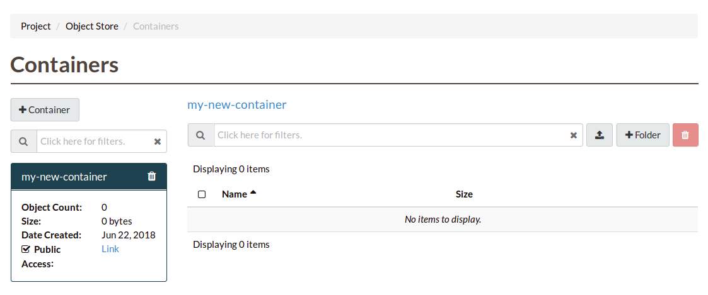

.. _object-storage-using-containers:

################
Using Containers
################

There are several different methods available to you for interacting with the
object storage service. The following sections cover the most common tools that
people use. Each of these examples shows some of the basic commands that you
can use to create and edit your object storage containers.

*******************
Using the dashboard
*******************

When using the object storage service, your data must be stored in a container
(also referred to as a bucket.) So our first step is to create at least one
container prior to uploading any data. To create a new container, navigate to
the "Containers" section on the dashboard and click "Create Container".

.. image:: assets/containers_ui.png
   :align: center

You will need to provide a name for the container as well as select the
appropriate access level and replication policy type before clicking "Submit".

.. note::

  Setting "Public" level access on a container means that anyone
  with the container's URL can access the contents of that container.

.. image:: assets/create_container.png
  :align: center

You should now see the newly created container. As this is a new container, it
currently does not contain any data. Click on the upload button next to
"Folder" to add some content.

Click on the "Browse" button to select the file you wish to upload and once
selected click "Upload File".

.. image:: assets/doing_upload.png
   :align: center

In the containers view the Object Count has gone up to one and the size of
the container is now 5 Bytes.

.. image:: assets/uploaded_file.png
   :align: center

.. _object-storage-programmatic-methods:

*************
Using the CLI
*************

The Object Storage service is usable from the CLI using a number of different applications.

Documentation for the following applications are provided:

* The Catalyst Cloud Client provides both an easy to use and flexible
  interface for using Object Storage, that requires no additional configuration
  once you have authenticated your terminal session.
* `Swift Client`_ is the official API client library for Swift,
  the system powering Catalyst Cloud's Object Storage service.
  It also provides a command-line interface that can be used
  as an alternative to the ``openstack container``
  and ``openstack object`` series of commands provided by
  Catalyst Cloud Client. Swift Client is more complicated to use,
  but provides the most flexible set of commands for interacting
  with Object Storage.
* The AWS CLI, with some configuration, can be used to interact with the Object Storage S3 API,
  making the wide ecosystem of applications that use AWS CLI available with Catalyst Cloud.
* cURL can be used to directly interact with the Swift API, for full control over API requests.

.. _`Swift Client`: https://docs.openstack.org/python-swiftclient/latest/introduction.html

Prerequisites
=============

.. TODO(callumdickinson): Update the below with the new Catalyst Cloud Client documentation link.

First, make sure that you have installed the Catalyst Cloud Client
to your system and sourced your OpenRC file in your terminal session,
as shown in the :ref:`CLI Configuration <source-rc-file>` documentation.

In addition, you will need to ensure that you have the correct role
for using the Object Storage service on your Catalyst Cloud project.
For more information, see :ref:`access_control`.

The following steps are specific to the API client you will be using.

.. tabs::

  .. group-tab:: Catalyst Cloud Client

    .. include:: cli/catalystcloud-client/prerequisites.rst

  .. group-tab:: Swift Client

    .. include:: cli/swift-client/prerequisites.rst

  .. group-tab:: AWS CLI

    .. include:: cli/aws-cli/prerequisites.rst

  .. group-tab:: cURL

    .. include:: cli/curl/prerequisites.rst

Listing containers
==================

.. tabs::

  .. group-tab:: Catalyst Cloud Client

    .. include:: cli/catalystcloud-client/container-list.rst

  .. group-tab:: Swift Client

    .. include:: cli/swift-client/container-list.rst

  .. group-tab:: AWS CLI

    .. include:: cli/aws-cli/container-list.rst

  .. group-tab:: cURL

    .. include:: cli/curl/container-list.rst

Get container details
=====================

.. tabs::

  .. group-tab:: Catalyst Cloud Client

    .. include:: cli/catalystcloud-client/container-show.rst

  .. group-tab:: Swift Client

    .. include:: cli/swift-client/container-show.rst

  .. group-tab:: AWS CLI

    .. include:: cli/aws-cli/container-show.rst

  .. group-tab:: cURL

    .. include:: cli/curl/container-show.rst

Creating containers
===================

.. tabs::

  .. group-tab:: Catalyst Cloud Client

    .. include:: cli/catalystcloud-client/container-create.rst

  .. group-tab:: Swift Client

    .. include:: cli/swift-client/container-create.rst

  .. group-tab:: AWS CLI

    .. include:: cli/aws-cli/container-create.rst

  .. group-tab:: cURL

    .. include:: cli/curl/container-create.rst

Deleting containers
===================

.. tabs::

  .. group-tab:: Catalyst Cloud Client

    .. include:: cli/catalystcloud-client/container-delete.rst

  .. group-tab:: Swift Client

    .. include:: cli/swift-client/container-delete.rst

  .. group-tab:: AWS CLI

    .. include:: cli/aws-cli/container-delete.rst

  .. group-tab:: cURL

    .. include:: cli/curl/container-delete.rst

Listing objects
===============

.. tabs::

  .. group-tab:: Catalyst Cloud Client

    .. include:: cli/catalystcloud-client/object-list.rst

  .. group-tab:: Swift Client

    .. include:: cli/swift-client/object-list.rst

  .. group-tab:: AWS CLI

    .. include:: cli/aws-cli/object-list.rst

  .. group-tab:: cURL

    .. include:: cli/curl/object-list.rst

Get object details
==================

.. tabs::

  .. group-tab:: Catalyst Cloud Client

    .. include:: cli/catalystcloud-client/object-show.rst

  .. group-tab:: Swift Client

    .. include:: cli/swift-client/object-show.rst

  .. group-tab:: AWS CLI

    .. include:: cli/aws-cli/object-show.rst

  .. group-tab:: cURL

    .. include:: cli/curl/object-show.rst

Downloading objects
===================

.. tabs::

  .. group-tab:: Catalyst Cloud Client

    .. include:: cli/catalystcloud-client/object-save.rst

  .. group-tab:: Swift Client

    .. include:: cli/swift-client/object-save.rst

  .. group-tab:: AWS CLI

    .. include:: cli/aws-cli/object-save.rst

  .. group-tab:: cURL

    .. include:: cli/curl/object-save.rst

Uploading objects
=================

.. tabs::

  .. group-tab:: Catalyst Cloud Client

    .. include:: cli/catalystcloud-client/object-create.rst

  .. group-tab:: Swift Client

    .. include:: cli/swift-client/object-create.rst

  .. group-tab:: AWS CLI

    .. include:: cli/aws-cli/object-create.rst

  .. group-tab:: cURL

    .. include:: cli/curl/object-create.rst

Deleting objects
================

.. tabs::

  .. group-tab:: Catalyst Cloud Client

    .. include:: cli/catalystcloud-client/object-delete.rst

  .. group-tab:: Swift Client

    .. include:: cli/swift-client/object-delete.rst

  .. group-tab:: AWS CLI

    .. include:: cli/aws-cli/object-delete.rst

  .. group-tab:: cURL

    .. include:: cli/curl/object-delete.rst

.. _s3-api-documentation:

**************
Using the APIs
**************

Catalyst Cloud provides two APIs which can be used to interact
with the Object Storage service:

* `Object Storage API`_ (also known as Swift API), the native object storage API
  for OpenStack-based clouds.
* S3 API, the API for Amazon's Simple Storage Service (S3). We provide enough functionality
  to make our Object Storage service usable with most applications that only support S3.
  For more information on API compatibility, see the `API Comparison Matrix`_.

Below are some useful instructions for using the respective Python-based API client libraries
for interacting with Catalyst Cloud Object Storage.

.. tabs::

  .. tab:: Swift API

    .. include:: tutorial-scripts/swiftAPI.rst

  .. tab:: S3 API

    .. include:: tutorial-scripts/s3api.rst

.. _`Object Storage API`: https://docs.openstack.org/api-ref/object-store
.. _`API Comparison Matrix`: https://docs.openstack.org/swift/latest/s3_compat.html

**********************************************
Using orchestration / configuration management
**********************************************

A number of orchestration and configuration management tools
can be used to automatically create and manage Catalyst Cloud
Object Storage containers and objects.

.. tabs::

  .. tab:: Orchestration

    .. include:: tutorial-scripts/heat.rst

  .. tab:: Terraform

    .. include:: tutorial-scripts/terraform.rst
