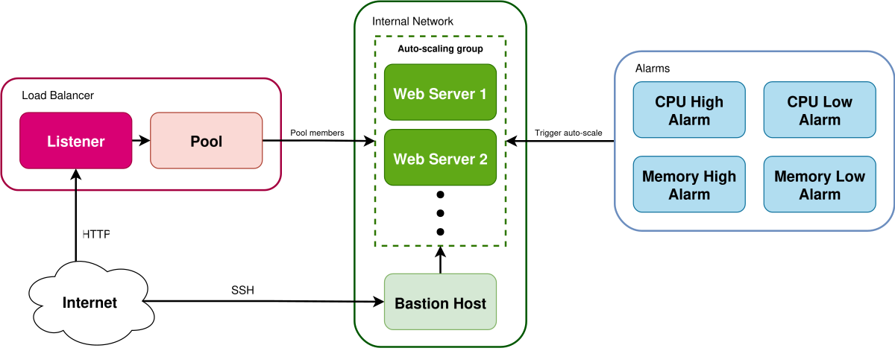

.. _autoscaling-on-catalyst-cloud:

############
Auto-scaling
############

Auto-scaling is the process of dynamically adjusting the number of
workers in a service cluster according to the current demand, without
any direct input from an administrator.

The Catalyst Cloud Orchestration Service supports **auto-scaling groups**
that can be used to **scale out** (increase the size of) or **scale in**
(reduce the size of) a cluster of instances running in a stack.

.. contents::
    :local:
    :depth: 3
    :backlinks: none

************
How it works
************

The diagram below shows the layout and workflow of a
typical orchestration stack with auto-scaling.

In this example, the Orchestration Service is managing
a highly available web application with a load balancer.

An **auto-scaling group** is used to automatically launch and destroy
web servers. The auto-scaling group also manages load balancer pool
memberships, so once new instances come online they automatically
start serving requests.

.. note::

  A load balancer is not required to implement auto-scaling.
  Auto-scaling groups can be created for just a group of instances,
  allowing any kind of workload to be auto-scaled, not just web services.

The :ref:`Alarm Service <alarm>` is used to monitor the state of the
instances in the auto-scaling group. If CPU or memory usage exceeds
the configured thresholds the relevant alarm will trigger, notifying
the auto-scaling group to add more instances to the cluster. Likewise,
when demand goes back down the relevant alarm will trigger, and the
auto-scaling group will reduce the number of running instances until
the load falls back into the desired ranges.

*******
Example
*******

In this section we show how to create an orchestration stack
with auto-scaling enabled from a set of example templates.

We will go through some of the details of the templates themselves,
send requests to the load balanced web application, and test scaling
instances in the cluster to make sure everything works correctly.

Prerequisites
=============

.. note::

  Before getting started, make sure you have your Catalyst Cloud user and system environment setup so that
  :ref:`you can access the Orchestration Service <orchestration-prerequisites>` using the OpenStack CLI.

This orchestration stack in this example will create everything needed to
run the workloads themselves.

The only thing you need to create manually beforehand is an SSH keypair
to assign to the instances; to learn how to do this, see the documentation
for :ref:`creating a new keypair <creating-keypair>` or
:ref:`importing an existing keypair <importing-keypair>`.
Once you have your keypair, keep a record of the name of the keypair
as it will be used to configure the stack.

Get the templates
=================

First, clone the repository containing our `Orchestration Service examples`_
from GitHub, and navigate to the ``hot/autoscaling`` directory containing
the auto-scaling example templates.

.. _Orchestration Service examples: https://github.com/catalyst-cloud/catalystcloud-orchestration

.. code-block:: console

  $ git clone https://github.com/catalyst-cloud/catalystcloud-orchestration.git
  $ cd catalystcloud-orchestration/hot/autoscaling

Template details
================

.. note::

  This section goes in depth on how auto-scaling is configured in the stack templates.

  To skip the explanation and go straight to creating an auto-scaling stack,
  see :ref:`orchestration-autoscaling-creation`.

In this example stack, the following resources are created:

* An internal network and subnet for the instances
* A security group for controlling access to/from the internal network
* A router for the internal network, to allow Internet access
* A bastion host with a floating IP, to allow SSH access into the cluster
* A load balancer with another floating IP, to expose the web servers
  to the Internet as a highly available cluster from a single address
* An auto-scaling group that adds and removes web server instances,
  and load balancer pool memberships, as needed
* A set of alarms that monitor the state of the instances in the auto-scaling group,
  and notify the auto-scaling group to scale out or scale in the cluster when
  load exceeds the configured thresholds
* (Optional) Another alarm that monitors the health of auto-scaling group
  members, and automatically replaces them if they stop serving requests
  (see :ref: `auto-healing <orchestration-autohealing>`)

The stack templates consist of the following files:

* ``autoscaling.yaml`` - The master template for the cluster,
  containing all common resource definitions such as the network,
  the bastion host, the load balancer and the auto-scaling group configuration.
* ``webserver.yaml`` - The template used to manage per-member resources
  for the web servers in the auto-scaling group, such as the instance
  definition and the load balancer pool membership.
* ``env.yaml`` - The environment configuration, used in this case
  to define ``webserver.yaml`` as the ``OS::Autoscaling::Webserver``
  resource type to be referenced in the master template.
* ``user_data.sh`` - The shell script run on startup on the web server instances.

Most of this uses the standard resource definitions as you would see
in other templates, but there are a number of special resource definitions
used to control the auto-scaling functionality.

Auto-scaling group
------------------

The first resource to create is the **auto-scaling group**,
defined using the ``OS::Heat::AutoScalingGroup``
`resource type <https://docs.openstack.org/heat/latest/template_guide/openstack.html#OS::Heat::AutoScalingGroup>`__.

.. code-block:: yaml

  # The auto-scaling group for provisioning web servers.
  autoscaling_group:
    type: OS::Heat::AutoScalingGroup
    properties:
      min_size: {get_param: autoscaling_min_size}
      max_size: {get_param: autoscaling_max_size}
      resource:
        type: OS::Autoscaling::Webserver
        properties:
          keypair: {get_param: keypair}
          flavor: {get_param: webserver_flavor}
          image: {get_param: webserver_image}
          network: {get_resource: network}
          security_groups:
            - {get_resource: internal_security_group}
          group: {get_resource: webserver_group}
          loadbalancer_pool: {get_resource: loadbalancer_pool}

The auto-scaling group defines the type of resource to create in a cluster,
the minimum and maximum size of the cluster, and other optional parameters
that configure how rolling updates of resources are performed. By using a
custom resource type as shown above, multiple child resources can be created
per auto-scaling group member.

Server group
------------

All instances in an auto-scaling group should also be added to a **server group**,
defined using the ``OS::Nova::ServerGroup``
`resource type <https://docs.openstack.org/heat/latest/template_guide/openstack.html#OS::Nova::ServerGroup>`__.

.. code-block:: yaml

  # The server group for the cluster of web servers.
  webserver_group:
    type: OS::Nova::ServerGroup
    properties:
      policies:
        - {get_param: webserver_group_policy}

Server groups have two purposes here:

* By setting a hard or soft anti-affinity policy on the server group,
  it ensures that no two auto-scaling group members end up on the same
  physical machine, protecting against hypervisor failures (for more info,
  see :ref:`anti-affinity`).
* The alarms that monitor load across the auto-scaling group query metrics
  by server group, as a way to associate the auto-scaling group members with
  each other.

In the instance definition for the auto-scaling group members, the ``group``
scheduler hint and the ``metering.server_group`` metadata attribute are used
to correctly configure the server group on the instances.

.. code-block:: yaml

  # An instance to be managed by an auto-scaling group.
  # Define as the resource property of an OS::Heat::AutoScalingGroup resource,
  # or inside a custom resource type along with other required per-member resources
  # (e.g. load balancer pool memberships).
  webserver:
    type: OS::Nova::Server
    properties:
      image: {get_param: image}
      flavor: {get_param: flavor}
      networks:
        - network: {get_param: network}
      key_name: {get_param: keypair}
      security_groups: {get_param: security_groups}
      scheduler_hints:
        group: {get_param: group}
      metadata:
        metering.server_group: {get_param: group}
      config_drive: true
      user_data_format: RAW
      user_data: {get_file: user_data.sh}

Scaling policies
----------------

Now that we have the auto-scaling group and the underlying instances correctly
configured, we need to define exactly how instances should be scaled.

**Scaling policies** are defined for the auto-scaling group
using the ``OS::Heat::ScalingPolicy``
`resource type <https://docs.openstack.org/heat/latest/template_guide/openstack.html#OS::Heat::ScalingPolicy>`__.

.. code-block:: yaml

  # The policy for scaling out web servers when load is high.
  autoscaling_up_policy:
    type: OS::Heat::ScalingPolicy
    properties:
      adjustment_type: change_in_capacity
      auto_scaling_group_id: {get_resource: autoscaling_group}
      scaling_adjustment: 1
      cooldown: {get_param: autoscaling_granularity}

  # The policy for scaling in web servers when load is low.
  autoscaling_down_policy:
    type: OS::Heat::ScalingPolicy
    properties:
      adjustment_type: change_in_capacity
      auto_scaling_group_id: {get_resource: autoscaling_group}
      scaling_adjustment: -1
      cooldown: {get_param: autoscaling_granularity}

These configure exactly what happens when a scaling action is triggered
for the auto-scaling group, such as the amount of instances to scale
at one time, or required cooldown time between scaling actions.
Separate policies are required for each type of scaling action,
in this case scaling out (up policy) and scaling in (down policy).

Alarms
------

The final piece of the puzzle is automating the scaling actions,
which is implemented using specially configured **alarms**.

:ref:`Resource metric aggregate threshold alarms <alarm-resource-metric-aggregate-threshold>`,
managed using the ``OS::Aodh::GnocchiAggregationByResourcesAlarm``
`resource type <https://docs.openstack.org/heat/latest/template_guide/openstack.html#OS::Aodh::GnocchiAggregationByResourcesAlarm>`__,
can be used to monitor the state of metrics across all active instances
in the auto-scaling group.

.. code-block:: yaml

  # The alarm that triggers a scale out when CPU usage exceeds the threshold.
  autoscaling_cpu_high_alarm:
    type: OS::Aodh::GnocchiAggregationByResourcesAlarm
    properties:
      description:
        str_replace:
          template: Scale out if average CPU usage exceeds threshold%
          params:
            threshold: {get_param: autoscaling_cpu_high_threshold}
      resource_type: instance
      metric: cpu
      aggregation_method: "rate:mean"
      granularity: {get_param: autoscaling_granularity}
      threshold:
        yaql:
          # 10^9 nanoseconds * number of vCPUs * granularity in seconds * (threshold in percent / 100)
          expression: >-
            1000000000
            * int(regex("^c[^.]\.c([0-9]+).*$").replace($.data.flavor, "\g<1>"))
            * $.data.granularity
            * (float($.data.threshold) / 100)
          data:
            flavor: {get_param: webserver_flavor}
            granularity: {get_param: autoscaling_granularity}
            threshold: {get_param: autoscaling_cpu_high_threshold}
      query:
        str_replace:
          template: '{"and": [{"=": {"server_group": "group_id"}}, {"=": {"ended_at": null}}]}'
          params:
            group_id: {get_resource: webserver_group}
      comparison_operator: gt
      evaluation_periods: 1
      alarm_actions:
        - {get_attr: [autoscaling_up_policy, alarm_url]}
        - str_replace:
            template: trust+url
            params:
              url: {get_attr: [autoscaling_up_policy, signal_url]}
      repeat_actions: true

  # The alarm that triggers a scale in when CPU usage goes below the threshold.
  autoscaling_cpu_low_alarm:
    type: OS::Aodh::GnocchiAggregationByResourcesAlarm
    properties:
      description:
        str_replace:
          template: Scale in if average CPU usage goes below threshold%
          params:
            threshold: {get_param: autoscaling_cpu_low_threshold}
      resource_type: instance
      metric: cpu
      aggregation_method: "rate:mean"
      granularity: {get_param: autoscaling_granularity}
      threshold:
        yaql:
          # 10^9 nanoseconds * number of vCPUs * granularity in seconds * (threshold in percent / 100)
          expression: >-
            1000000000
            * int(regex("^c[^.]\.c([0-9]+).*$").replace($.data.flavor, "\g<1>"))
            * $.data.granularity
            * (float($.data.threshold) / 100)
          data:
            flavor: {get_param: webserver_flavor}
            granularity: {get_param: autoscaling_granularity}
            threshold: {get_param: autoscaling_cpu_low_threshold}
      query:
        str_replace:
          template: '{"and": [{"=": {"server_group": "group_id"}}, {"=": {"ended_at": null}}]}'
          params:
            group_id: {get_resource: webserver_group}
      comparison_operator: lt
      evaluation_periods: 1
      alarm_actions:
        - {get_attr: [autoscaling_down_policy, alarm_url]}
        - str_replace:
            template: trust+url
            params:
              url: {get_attr: [autoscaling_down_policy, signal_url]}
      repeat_actions: true

  # The alarm that triggers a scale out when memory usage exceeds the threshold.
  autoscaling_memory_high_alarm:
    type: OS::Aodh::GnocchiAggregationByResourcesAlarm
    properties:
      description:
        str_replace:
          template: Scale out if average memory usage exceeds threshold%
          params:
            threshold: {get_param: autoscaling_memory_high_threshold}
      resource_type: instance
      metric: memory.usage
      aggregation_method: mean
      granularity: {get_param: autoscaling_granularity}
      threshold:
        yaql:
          # RAM in GiB * 1024 to convert to MiB * (threshold in percent / 100)
          expression: >-
            int(regex("^c[^.]\.c[0-9]+r([0-9]+).*$").replace($.data.flavor, "\g<1>"))
            * 1024
            * (float($.data.threshold) / 100)
          data:
            flavor: {get_param: webserver_flavor}
            threshold: {get_param: autoscaling_memory_high_threshold}
      query:
        str_replace:
          template: '{"and": [{"=": {"server_group": "group_id"}}, {"=": {"ended_at": null}}]}'
          params:
            group_id: {get_resource: webserver_group}
      comparison_operator: gt
      evaluation_periods: 1
      alarm_actions:
        - {get_attr: [autoscaling_up_policy, alarm_url]}
        - str_replace:
            template: trust+url
            params:
              url: {get_attr: [autoscaling_up_policy, signal_url]}
      repeat_actions: true

  # The alarm that triggers a scale in when memory usage goes below the threshold.
  autoscaling_memory_low_alarm:
    type: OS::Aodh::GnocchiAggregationByResourcesAlarm
    properties:
      description:
        str_replace:
          template: Scale in if average memory usage goes below threshold%
          params:
            threshold: {get_param: autoscaling_memory_low_threshold}
      resource_type: instance
      metric: memory.usage
      aggregation_method: mean
      granularity: {get_param: autoscaling_granularity}
      threshold:
        yaql:
          # RAM in GiB * 1024 to convert to MiB * (threshold in percent / 100)
          expression: >-
            int(regex("^c[^.]\.c[0-9]+r([0-9]+).*$").replace($.data.flavor, "\g<1>"))
            * 1024
            * (float($.data.threshold) / 100)
          data:
            flavor: {get_param: webserver_flavor}
            threshold: {get_param: autoscaling_memory_low_threshold}
      query:
        str_replace:
          template: '{"and": [{"=": {"server_group": "group_id"}}, {"=": {"ended_at": null}}]}'
          params:
            group_id: {get_resource: webserver_group}
      comparison_operator: lt
      evaluation_periods: 1
      alarm_actions:
        - {get_attr: [autoscaling_down_policy, alarm_url]}
        - str_replace:
            template: trust+url
            params:
              url: {get_attr: [autoscaling_down_policy, signal_url]}
      repeat_actions: true

In the above example, **CPU usage** and the **memory usage** are both monitored for load.
Two alarms are required for each monitored metric - one that triggers when the high threshold
is exceeded, and another one that triggers when load goes below the low threshold. This results
in 4 alarms being created for the auto-scaling group.

The example templates allow you to configure the load thresholds as a percentage,
which is very convenient since there is no need to  manually configure the number of
vCPUs or available RAM in the monitoring. But since the monitored metrics are not
available in the :ref:`Catalyst Cloud Metrics Service <metrics>` as a percentage,
some complex templating is performed to convert the percentage into the correct
threshold figures, based on the :ref:`flavour <instance-types>` used by the
instances and the granularity of the performed queries.

**Alarm actions** are configured on the alarms to notify the appropriate auto-scaling
policy, which runs the scaling action. Once load is better distributed across the cluster,
the alarms will recover and the cluster will run with the same number of workers until
changes in demand cause the alarms to trigger again.

And that's it! With the above resources added to your stack,
you should have a functioning auto-scaling cluster.

.. _orchestration-autoscaling-creation:

Creating the stack
==================

Let's create a new stack and get our example resources up and running.

A number of parameters are available in the example templates
(for more info see ``autoscaling.yaml``), but the only required one
is ``keypair``, which sets the SSH keypair used to login to the instances.

The below command will create a new stack called ``autoscaling-example``
(we will refer to the stack using this name from now on).
Run this command, setting ``keypair`` to the name of the keypair you'd
like the use.

.. code-block:: bash

  openstack stack create autoscaling-example --template autoscaling.yaml \
                                             --environment env.yaml \
                                             --parameter "keypair=<NAME>"

The Orchestration Service will start creating the resources in the background.

.. code-block:: console

  $ openstack stack create autoscaling-example --template autoscaling.yaml --environment env.yaml --parameter "keypair=example-keypair"
  +---------------------+-----------------------------------------------------------------------+
  | Field               | Value                                                                 |
  +---------------------+-----------------------------------------------------------------------+
  | id                  | 80f2488f-4b45-44d3-8bf2-72b61bf09d25                                  |
  | stack_name          | autoscaling-example                                                   |
  | description         | An example Catalyst Cloud Orchestration Service template              |
  |                     | for building a cluster of web servers with auto-scaling               |
  |                     | and optional auto-healing.                                            |
  |                     |                                                                       |
  |                     | This provisions the following cloud resources:                        |
  |                     |                                                                       |
  |                     | * Security groups to control access to/from instances.                |
  |                     | * An internal network for all instances.                              |
  |                     | * A bastion host with its own floating IP to allow SSH access         |
  |                     |   into the cluster.                                                   |
  |                     | * A load balancer to allow highly available access to the web servers |
  |                     |   from the Internet, with its own floating IP.                        |
  |                     | * An auto-scaling group that launches, monitors and scales            |
  |                     |   a cluster of web server instances depending on the configured       |
  |                     |   load thresholds.                                                    |
  |                     | * (Optional) Another alarm that monitors the health of auto-scaling   |
  |                     |   group members, and automatically replaces them if they stop serving |
  |                     |   requests.                                                           |
  | creation_time       | 2026-02-13T04:50:00Z                                                  |
  | updated_time        | None                                                                  |
  | stack_status        | CREATE_IN_PROGRESS                                                    |
  | stack_status_reason | Stack CREATE started                                                  |
  +---------------------+-----------------------------------------------------------------------+

Checking created resources
==========================

To monitor resource creation in real time, you can use the ``watch`` command
to continuously report the status of all created resources.

.. code-block:: console

  watch openstack stack resource list autoscaling-example

It will take a few minutes for all resources in the stack to reach ``CREATE_COMPLETE`` state.

.. code-block:: text

  +-----------------------------------+-------------------------------------------------------------------------------------+----------------------------------------------+-----------------+----------------------+
  | resource_name                     | physical_resource_id                                                                | resource_type                                | resource_status | updated_time         |
  +-----------------------------------+-------------------------------------------------------------------------------------+----------------------------------------------+-----------------+----------------------+
  | autoscaling_memory_high_alarm     | 66397ec7-a3d9-4e19-9eee-9a47c596be55                                                | OS::Aodh::GnocchiAggregationByResourcesAlarm | CREATE_COMPLETE | 2026-02-13T04:50:01Z |
  | loadbalancer_healthmonitor        | 0ea7e070-ca71-49c9-98ec-ae82ba2cd336                                                | OS::Octavia::HealthMonitor                   | CREATE_COMPLETE | 2026-02-13T04:50:01Z |
  | router_interface                  | bc584bcf-6881-47fb-aece-555d1e3c7727:subnet_id=4fe1686d-d2fd-4929-a779-5aab069122c0 | OS::Neutron::RouterInterface                 | CREATE_COMPLETE | 2026-02-13T04:50:01Z |
  | internal_security_group_rule_ssh  | 5449d154-7b7b-4e35-bc2a-b84eb9aa93b9                                                | OS::Neutron::SecurityGroupRule               | CREATE_COMPLETE | 2026-02-13T04:50:01Z |
  | autoscaling_cpu_high_alarm        | beb24143-f4dc-4986-8967-9791bb8a6454                                                | OS::Aodh::GnocchiAggregationByResourcesAlarm | CREATE_COMPLETE | 2026-02-13T04:50:01Z |
  | autoscaling_up_policy             | e43acac39e804d7e8bc14a7a28f2462d                                                    | OS::Heat::ScalingPolicy                      | CREATE_COMPLETE | 2026-02-13T04:50:01Z |
  | autoscaling_cpu_low_alarm         | 267881e3-c727-461a-a6b3-0b3a69bcdb18                                                | OS::Aodh::GnocchiAggregationByResourcesAlarm | CREATE_COMPLETE | 2026-02-13T04:50:01Z |
  | loadbalancer_floating_ip          | b2500fee-5897-4a19-9050-dd652b51de1c                                                | OS::Neutron::FloatingIP                      | CREATE_COMPLETE | 2026-02-13T04:50:01Z |
  | autoscaling_memory_low_alarm      | d053c77c-0982-4cba-a4ed-ae49abc7e9c3                                                | OS::Aodh::GnocchiAggregationByResourcesAlarm | CREATE_COMPLETE | 2026-02-13T04:50:01Z |
  | autoscaling_down_policy           | 7fb8cff6ce3e44138d8374e727728b88                                                    | OS::Heat::ScalingPolicy                      | CREATE_COMPLETE | 2026-02-13T04:50:01Z |
  | autoscaling_group                 | a45fd5ee-ec09-4de9-a219-be9d75d9cda9                                                | OS::Heat::AutoScalingGroup                   | CREATE_COMPLETE | 2026-02-13T04:50:01Z |
  | webserver_group                   | 328e5c69-c8a1-4cfa-a136-75554c4ade0b                                                | OS::Nova::ServerGroup                        | CREATE_COMPLETE | 2026-02-13T04:50:01Z |
  | loadbalancer_pool                 | ddb8e780-a694-4613-8bd0-5e9e285beb0e                                                | OS::Octavia::Pool                            | CREATE_COMPLETE | 2026-02-13T04:50:01Z |
  | loadbalancer_listener             | 1045b9a0-8caa-4fd2-88e1-d044a31cc681                                                | OS::Octavia::Listener                        | CREATE_COMPLETE | 2026-02-13T04:50:01Z |
  | loadbalancer                      | 39601dbd-0e4d-4ccd-815b-5bf86ee980d4                                                | OS::Octavia::LoadBalancer                    | CREATE_COMPLETE | 2026-02-13T04:50:01Z |
  | internal_security_group_rule_http | a43610e5-90ba-4e39-97bf-61666dbdc2e0                                                | OS::Neutron::SecurityGroupRule               | CREATE_COMPLETE | 2026-02-13T04:50:01Z |
  | bastion_floating_ip               | 93efe3a5-5d04-4a1e-9088-19e05b618c92                                                | OS::Neutron::FloatingIP                      | CREATE_COMPLETE | 2026-02-13T04:50:01Z |
  | router                            | bc584bcf-6881-47fb-aece-555d1e3c7727                                                | OS::Neutron::Router                          | CREATE_COMPLETE | 2026-02-13T04:50:01Z |
  | bastion_server                    | 18ffa2f1-7801-4390-90b6-77ca8f47a766                                                | OS::Nova::Server                             | CREATE_COMPLETE | 2026-02-13T04:50:01Z |
  | internal_security_group           | 1a9c4f43-14f0-4176-b2ea-d6098d0d019d                                                | OS::Neutron::SecurityGroup                   | CREATE_COMPLETE | 2026-02-13T04:50:01Z |
  | subnet                            | 4fe1686d-d2fd-4929-a779-5aab069122c0                                                | OS::Neutron::Subnet                          | CREATE_COMPLETE | 2026-02-13T04:50:01Z |
  | network                           | 09ebe892-b43e-43c7-99df-5accb8794f6e                                                | OS::Neutron::Net                             | CREATE_COMPLETE | 2026-02-13T04:50:01Z |
  +-----------------------------------+-------------------------------------------------------------------------------------+----------------------------------------------+-----------------+----------------------+

.. note::

  If any resources end up in ``CREATE_FAILED`` state, you can find out
  the cause using the following command:

  .. code-block:: bash

    openstack stack failures list autoscaling-example

  A common reason for resource creation failing is exceeding your
  project quota while attempting to create the stack. Free up some
  resources in your project, and try again by deleting and recreating
  the stack.

  .. code-block::

    openstack stack delete autoscaling-example

If all resources were created successfully, the cluster should now be
up and running, so let's test connectivity to everything.

First, we'll try to login to the bastion host. Fetch the floating IP
address of the bastion host, and then use SSH to login to the host.
You should be able to access the console on the bastion host.

.. code-block:: console

  $ openstack stack output show autoscaling-example bastion_floating_ip -c output_value -f value
  192.0.2.1
  $ ssh -i ~/.ssh/keypair_private_key.pem ubuntu@192.0.2.1
  The authenticity of host '192.0.2.1 (192.0.2.1)' can't be established.
  ED25519 key fingerprint is SHA256:p+3UXWE0tFEIMUPMif6e0+n9gSHLwjveIvmcuugC3Rc.
  This key is not known by any other names.
  Are you sure you want to continue connecting (yes/no/[fingerprint])? yes
  Warning: Permanently added '192.0.2.1' (ED25519) to the list of known hosts.
  Welcome to Ubuntu 24.04.2 LTS (GNU/Linux 6.8.0-59-generic x86_64)

  * Documentation:  https://help.ubuntu.com
  * Management:     https://landscape.canonical.com
  * Support:        https://ubuntu.com/pro

  System information as of Fri Oct 10 22:23:03 UTC 2025

    System load:  0.14              Processes:             96
    Usage of /:   18.2% of 8.65GB   Users logged in:       0
    Memory usage: 17%               IPv4 address for ens3: 10.0.0.102
    Swap usage:   0%

  Expanded Security Maintenance for Applications is not enabled.

  0 updates can be applied immediately.

  Enable ESM Apps to receive additional future security updates.
  See https://ubuntu.com/esm or run: sudo pro status

  The list of available updates is more than a week old.
  To check for new updates run: sudo apt update

  The programs included with the Ubuntu system are free software;
  the exact distribution terms for each program are described in the
  individual files in /usr/share/doc/*/copyright.

  Ubuntu comes with ABSOLUTELY NO WARRANTY, to the extent permitted by
  applicable law.

  To run a command as administrator (user "root"), use "sudo <command>".
  See "man sudo_root" for details.

  ubuntu@autoscaling-example-bastion-server-radhlpt36blw:~$

If this works, you can use SSH from the bastion host to login to the web server instances as needed.

Next, let's check that the web application is working. Run the
following command to get the floating IP address of the load balancer.

.. code-block:: console

  $ openstack stack output show autoscaling-example loadbalancer_floating_ip -c output_value -f value
  192.0.2.2

The web application is served via unencrypted HTTP on port 80, so simply use
``curl`` to make a request.

.. code-block:: console

  $ curl http://192.0.2.2
  Hello, world! This request was served by au-x-u6thgn62eec6-ev65hjmjcmss-webserver-vdq2wg3l2mcv (10.0.0.151).

If you receive a response similar to the one above, congratulations!
Your highly available web application is now up and running.

This cluster runs with a minimum of 2 web servers. Keep running the
command until you have received a response from all running instances.

.. code-block:: console

  $ curl http://192.0.2.2
  Hello, world! This request was served by au-x-u6thgn62eec6-ev65hjmjcmss-webserver-vdq2wg3l2mcv (10.0.0.151).
  $ curl http://192.0.2.2
  Hello, world! This request was served by au-x-k2va3k4min64-kgypkpgxo2t3-webserver-goiwpb5kbnil (10.0.0.215).

Scaling instances
=================

Let's take a deeper dive into the auto-scaling aspect of the cluster.

We can check how many instances are running at the moment
by getting the currently active server group members.

.. code-block:: console

  $ openstack stack resource show autoscaling-example webserver_group -c attributes -f json | jq '.attributes.members'
  [
    "40a126ee-f900-49f1-9865-276c23398c3c",
    "f14716f4-5b55-40eb-82f4-1e475dd9f7f4"
  ]

There are 4 auto-scaling alarms created in this example,
with the following stack resource names:

* ``autoscaling_cpu_high_alarm``
* ``autoscaling_cpu_low_alarm``
* ``autoscaling_memory_high_alarm``
* ``autoscaling_memory_low_alarm``

Check the state of the alarms to see if any are calling for scaling actions to be run.

.. code-block:: console

  $ openstack stack resource show autoscaling-example autoscaling_cpu_high_alarm -c attributes -f json | jq '.attributes'
  {
    "alarm_id": "beb24143-f4dc-4986-8967-9791bb8a6454",
    "name": "autoscaling-example-autoscaling_cpu_high_alarm-t2fjccaljgkk",
    "description": "Scale out if average CPU usage exceeds 20%",
    "enabled": true,
    "ok_actions": [],
    "alarm_actions": [
      "https://api.nz-por-1.catalystcloud.io:8000/v1/signal/arn%3Aopenstack%3Aheat%3A%3A9864e20f92ef47238becfe06b869d2ac%3Astacks/autoscaling-example/80f2488f-4b45-44d3-8bf2-72b61bf09d25/resources/autoscaling_up_policy?SignatureMethod=HmacSHA256&SignatureVersion=2&AWSAccessKeyId=...&Signature=puZRYF1Q%2FMXYz%2Fhi5Ng8lmY1g6xrcHvkKmPF0Sc3j6Y%3D",
      "trust+https://api.nz-por-1.catalystcloud.io:8004/v1/9864e20f92ef47238becfe06b869d2ac/stacks/autoscaling-example/80f2488f-4b45-44d3-8bf2-72b61bf09d25/resources/autoscaling_up_policy/signal"
    ],
    "insufficient_data_actions": [],
    "repeat_actions": true,
    "type": "gnocchi_aggregation_by_resources_threshold",
    "time_constraints": [],
    "project_id": "9864e20f92ef47238becfe06b869d2ac",
    "user_id": "517bcd700274432d96f43616ac1e37ea",
    "timestamp": "2026-02-13T04:52:34.646667",
    "state": "insufficient data",
    "state_timestamp": "2026-02-13T04:52:34.646667",
    "state_reason": "Not evaluated yet",
    "severity": "low",
    "evaluate_timestamp": "2026-02-13T04:52:35",
    "gnocchi_aggregation_by_resources_threshold_rule": {
      "metric": "cpu",
      "query": "{\"and\": [{\"or\": [{\"=\": {\"created_by_project_id\": \"9864e20f92ef47238becfe06b869d2ac\"}}, {\"and\": [{\"=\": {\"created_by_project_id\": \"ceecc421f7994cc397380fae5e495179\"}}, {\"=\": {\"project_id\": \"9864e20f92ef47238becfe06b869d2ac\"}}]}]}, {\"and\": [{\"=\": {\"server_group\": \"328e5c69-c8a1-4cfa-a136-75554c4ade0b\"}}, {\"=\": {\"ended_at\": null}}]}]}",
      "resource_type": "instance",
      "comparison_operator": "gt",
      "threshold": 120000000000.0,
      "aggregation_method": "rate:mean",
      "evaluation_periods": 1,
      "granularity": 600
    }
  }

Note that the alarm is in ``insufficient data`` state. This is normal for
newly created clusters; the Metrics Service collects compute metrics every
10 minutes, so it can take up to 20 minutes before there are enough metrics
for the alarms to be evaluated correctly.

Once some time has passed, the alarm should transition into ``ok`` state.

.. code-block:: console

  $ openstack stack resource show autoscaling-example autoscaling_cpu_high_alarm -c attributes -f json | jq '.attributes'
  {
    "alarm_id": "beb24143-f4dc-4986-8967-9791bb8a6454",
    "name": "autoscaling-example-autoscaling_cpu_high_alarm-t2fjccaljgkk",
    "description": "Scale out if average CPU usage exceeds 20%",
    "enabled": true,
    "ok_actions": [],
    "alarm_actions": [
      "https://api.nz-por-1.catalystcloud.io:8000/v1/signal/arn%3Aopenstack%3Aheat%3A%3A9864e20f92ef47238becfe06b869d2ac%3Astacks/autoscaling-example/80f2488f-4b45-44d3-8bf2-72b61bf09d25/resources/autoscaling_up_policy?SignatureMethod=HmacSHA256&SignatureVersion=2&AWSAccessKeyId=...&Signature=puZRYF1Q%2FMXYz%2Fhi5Ng8lmY1g6xrcHvkKmPF0Sc3j6Y%3D",
      "trust+https://api.nz-por-1.catalystcloud.io:8004/v1/9864e20f92ef47238becfe06b869d2ac/stacks/autoscaling-example/80f2488f-4b45-44d3-8bf2-72b61bf09d25/resources/autoscaling_up_policy/signal"
    ],
    "insufficient_data_actions": [],
    "repeat_actions": true,
    "type": "gnocchi_aggregation_by_resources_threshold",
    "time_constraints": [],
    "project_id": "9864e20f92ef47238becfe06b869d2ac",
    "user_id": "517bcd700274432d96f43616ac1e37ea",
    "timestamp": "2026-02-13T04:52:34.646667",
    "state": "ok",
    "state_timestamp": "2026-02-13T04:52:34.646667",
    "state_reason": "Transition to ok due to 1 samples inside threshold, most recent: 5445000000.0",
    "severity": "low",
    "evaluate_timestamp": "2026-02-13T04:52:35",
    "gnocchi_aggregation_by_resources_threshold_rule": {
      "metric": "cpu",
      "query": "{\"and\": [{\"or\": [{\"=\": {\"created_by_project_id\": \"9864e20f92ef47238becfe06b869d2ac\"}}, {\"and\": [{\"=\": {\"created_by_project_id\": \"ceecc421f7994cc397380fae5e495179\"}}, {\"=\": {\"project_id\": \"9864e20f92ef47238becfe06b869d2ac\"}}]}]}, {\"and\": [{\"=\": {\"server_group\": \"328e5c69-c8a1-4cfa-a136-75554c4ade0b\"}}, {\"=\": {\"ended_at\": null}}]}]}",
      "resource_type": "instance",
      "comparison_operator": "gt",
      "threshold": 120000000000.0,
      "aggregation_method": "rate:mean",
      "evaluation_periods": 1,
      "granularity": 600
    }
  }

.. note::

  You may find that the "low" threshold alarms are always in ``alarm`` state
  due to the load on the instances being lower than the configured thresholds.

  Normally this would result in a scale in, but because we are already at the
  configured minimum number of instances in the cluster (2), nothing happens.
  Similarly, when load exceeds the "high" thresholds and the cluster is already
  running the maximum number of instances, no scale outs are performed despite
  the alarms being triggered.

  This is normal behaviour, and there are no negative side effects
  from the alarms constantly being in a triggered state.

We can now test that auto-scaling actually works as intended
by inducing a load on one of the web servers.

First, fetch the internal IP address of one of the web server instances
using the IDs we fetched earlier.

.. code-block:: console

  $ openstack server show 40a126ee-f900-49f1-9865-276c23398c3c -c addresses -f json | jq --raw-output '.addresses | to_entries | [first][0].value[0]'
  10.0.0.215

With this, we can login to the web server via the jump host.

.. note::

  Open a new terminal tab or window for interacting with the web server,
  as we will be coming back to the OpenStack CLI afterwards to keep an
  eye on the status of the cluster.

The easiest way of doing this is to start an SSH agent in your
terminal, add the SSH key to it, and use the ``ssh -J`` option
when logging in to configure the bastion host as the proxy jump host.

.. code-block:: console

  $ eval $(ssh-agent -s)
  Agent pid 1281681
  $ ssh-add ~/.ssh/keypair_private_key.pem
  Identity added: ~/.ssh/keypair_private_key.pem (example@example.com)
  $ ssh -J ubuntu@192.0.2.1 ubuntu@10.0.0.215
  Warning: Permanently added '10.0.0.215' (ED25519) to the list of known hosts.
  Welcome to Ubuntu 24.04.2 LTS (GNU/Linux 6.8.0-59-generic x86_64)

  * Documentation:  https://help.ubuntu.com
  * Management:     https://landscape.canonical.com
  * Support:        https://ubuntu.com/pro

  System information as of Sat Oct 11 01:09:45 UTC 2025

    System load:  0.0               Processes:             101
    Usage of /:   18.5% of 8.65GB   Users logged in:       0
    Memory usage: 20%               IPv4 address for ens3: 10.0.0.215
    Swap usage:   0%

  Expanded Security Maintenance for Applications is not enabled.

  0 updates can be applied immediately.

  Enable ESM Apps to receive additional future security updates.
  See https://ubuntu.com/esm or run: sudo pro status

  The list of available updates is more than a week old.
  To check for new updates run: sudo apt update

  The programs included with the Ubuntu system are free software;
  the exact distribution terms for each program are described in the
  individual files in /usr/share/doc/*/copyright.

  Ubuntu comes with ABSOLUTELY NO WARRANTY, to the extent permitted by
  applicable law.

  To run a command as administrator (user "root"), use "sudo <command>".
  See "man sudo_root" for details.

  ubuntu@au-x-k2va3k4min64-kgypkpgxo2t3-webserver-goiwpb5kbnil:~$

Next, update the system, and then use APT to install the ``stress`` package.

.. code-block:: console

  $ sudo apt update
  $ sudo apt upgrade
  $ sudo apt install stress

Finally, run the ``stress`` command in the background
to induce a load on the web server at full utilisation.

The load can then be verified with the ``htop`` command.

.. code-block:: bash

  $ stress --cpu 2 --timeout 1800s &
  $ htop

Go back to your original terminal with the OpenStack CLI active.
If you check the state of the CPU high alarm again, you should
see that it has now been triggered.

.. note::

  Due to compute metrics being collected by the Metrics Service
  every 10 minutes (as noted above), it will take up to 20 minutes
  for the alarms to register the increase in load.

.. code-block:: console

  $ openstack stack resource show autoscaling-example autoscaling_cpu_high_alarm -c attributes -f json | jq '.attributes'
  {
    "alarm_id": "beb24143-f4dc-4986-8967-9791bb8a6454",
    "name": "autoscaling-example-autoscaling_cpu_high_alarm-t2fjccaljgkk",
    "description": "Scale out if average CPU usage exceeds 20%",
    "enabled": true,
    "ok_actions": [],
    "alarm_actions": [
      "https://api.nz-por-1.catalystcloud.io:8000/v1/signal/arn%3Aopenstack%3Aheat%3A%3A9864e20f92ef47238becfe06b869d2ac%3Astacks/autoscaling-example/80f2488f-4b45-44d3-8bf2-72b61bf09d25/resources/autoscaling_up_policy?SignatureMethod=HmacSHA256&SignatureVersion=2&AWSAccessKeyId=...&Signature=puZRYF1Q%2FMXYz%2Fhi5Ng8lmY1g6xrcHvkKmPF0Sc3j6Y%3D",
      "trust+https://api.nz-por-1.catalystcloud.io:8004/v1/9864e20f92ef47238becfe06b869d2ac/stacks/autoscaling-example/80f2488f-4b45-44d3-8bf2-72b61bf09d25/resources/autoscaling_up_policy/signal"
    ],
    "insufficient_data_actions": [],
    "repeat_actions": true,
    "type": "gnocchi_aggregation_by_resources_threshold",
    "time_constraints": [],
    "project_id": "9864e20f92ef47238becfe06b869d2ac",
    "user_id": "517bcd700274432d96f43616ac1e37ea",
    "timestamp": "2026-02-13T04:52:34.646667",
    "state": "alarm",
    "state_timestamp": "2026-02-13T04:55:35.079592",
    "state_reason": "Transition to alarm due to 1 samples outside threshold, most recent: 54450000000.0",
    "severity": "low",
    "evaluate_timestamp": "2026-02-13T04:55:35",
    "gnocchi_aggregation_by_resources_threshold_rule": {
      "metric": "cpu",
      "query": "{\"and\": [{\"or\": [{\"=\": {\"created_by_project_id\": \"9864e20f92ef47238becfe06b869d2ac\"}}, {\"and\": [{\"=\": {\"created_by_project_id\": \"ceecc421f7994cc397380fae5e495179\"}}, {\"=\": {\"project_id\": \"9864e20f92ef47238becfe06b869d2ac\"}}]}]}, {\"and\": [{\"=\": {\"server_group\": \"328e5c69-c8a1-4cfa-a136-75554c4ade0b\"}}, {\"=\": {\"ended_at\": null}}]}]}",
      "resource_type": "instance",
      "comparison_operator": "gt",
      "threshold": 120000000000.0,
      "aggregation_method": "rate:mean",
      "evaluation_periods": 1,
      "granularity": 600
    }
  }

The alarm has now notified the auto-scaling group that a scale out should occur.

If we re-run the command we used earlier to check the number of running instances,
we now see that a third instance has joined the cluster!

.. code-block:: console

  $ openstack stack resource show autoscaling-example webserver_group -c attributes -f json | jq '.attributes.members'
  [
    "40a126ee-f900-49f1-9865-276c23398c3c",
    "f14716f4-5b55-40eb-82f4-1e475dd9f7f4",
    "c3bd7529-0140-4d7a-9bb3-ea8286e13dc5"
  ]

With a third instance now running, we should check that it has joined the
load balancer pool. Using the same ``curl`` command we used earlier,
the third instance should have started responding to requests.

.. code-block:: console

  $ curl http://192.0.2.2
  Hello, world! This request was served by au-x-u6thgn62eec6-ev65hjmjcmss-webserver-vdq2wg3l2mcv (10.0.0.151).
  $ curl http://192.0.2.2
  Hello, world! This request was served by au-x-k2va3k4min64-kgypkpgxo2t3-webserver-goiwpb5kbnil (10.0.0.215).
  $ curl http://192.0.2.2
  Hello, world! This request was served by au-x-f6tup25k7exn-jackdd47dc6k-webserver-7rzds4ycexj6 (10.0.0.105).

Conclusion
==========

We have covered all of the necessary tools to create an auto-scaling,
highly available cluster managed by the Catalyst Cloud Orchestration Service.

The following sections cover additional functionality for further improving
the reliability of your cluster. Read on to learn about this functionality,
or if you no longer need your example stack, see :ref:`Deleting a stack <orchestration-stack-delete>`
for instructions on how to delete your example stack.

.. _orchestration-autohealing:
.. _orchestration-autoscaling-autohealing:

************
Auto-healing
************

The Catalyst Cloud Orchestration Service allows you to configure
**auto-healing** of load balancer members in an auto-scaling group.

How it works
============

Auto-healing periodically checks the ability to connect to load balancer members
using the combination of a :ref:`health monitor <loadbalancer-healthmonitor>` on
the load balancer pool, and a :ref:`special type of alarm <alarm-load-balancer-member>`.
If the alarm detects that any member (web server) has stopped serving requests,
the unhealthy members will be automatically replaced to restore high availability.

.. note::

  A health monitor can be added to a load balancer pool even if auto-healing is not used.
  When added to a regular load balancer, or a load balanced auto-scaling group **without**
  auto-healing, it simply monitors the status of members, and takes them out of the pool
  if they become unhealthy.

  When using auto-healing, a health monitor is required.

The first step is to add a health monitor to the load balancer pool, using the ``OS::Octavia::HealthMonitor``
`resource type <https://docs.openstack.org/heat/latest/template_guide/openstack.html#OS::Octavia::HealthMonitor>`__.

.. code-block:: yaml

  loadbalancer_healthmonitor:
    type: OS::Octavia::HealthMonitor
    properties:
      pool: {get_resource: loadbalancer_pool}
      type: HTTP
      timeout: {get_param: loadbalancer_healthmonitor_timeout}
      max_retries: {get_param: loadbalancer_healthmonitor_max_retries}
      delay: {get_param: loadbalancer_healthmonitor_delay}

Next, create the load balancer member health alarm used to trigger member placements,
using the ``OS::Aodh::LBMemberHealthAlarm``
`resource type <https://docs.openstack.org/heat/latest/template_guide/openstack.html#OS::Aodh::LBMemberHealthAlarm>`__.

.. code-block:: yaml

  autoscaling_member_health_alarm:
    type: OS::Aodh::LBMemberHealthAlarm
    properties:
      description: Replace members that have stopped serving requests
      stack: {get_param: OS::stack_id}  # Automatically generated, does not need to be defined.
      pool: {get_resource: loadbalancer_pool}
      autoscaling_group_id: {get_resource: autoscaling_group}
      alarm_actions:
        - trust+heat://
      repeat_actions: false

.. note::

  Auto-healing of auto-scaling group members without a load balancer is not supported.
  Likewise, an auto-scaling group must be used when configuring auto-healing for
  load balancer members.

.. _orchestration-autoscaling-autohealing-enable:

Enabling auto-healing
=====================

.. note::

  This section assumes you have a functioning example auto-scaling stack
  already up and running, named ``autoscaling-example``.

  See :ref:`Creating the stack <orchestration-autoscaling-creation>`
  to build an orchestration stack using our example templates.

To enable auto-healing on your example stack, use the following command
to set the ``autoscaling_autohealing_enable`` parameter to ``true``.

.. code-block:: bash

  openstack stack update autoscaling-example --existing --parameter "autoscaling_autohealing_enable=true"

The status of the stack will change to ``UPDATE_IN_PROGRESS``, and the resource changes will start to be made.

.. code-block:: console

  $ openstack stack update autoscaling-example --existing --parameter "autoscaling_autohealing_enable=true"
  +---------------------+-----------------------------------------------------------------------+
  | Field               | Value                                                                 |
  +---------------------+-----------------------------------------------------------------------+
  | id                  | 80f2488f-4b45-44d3-8bf2-72b61bf09d25                                  |
  | stack_name          | autoscaling-example                                                   |
  | description         | An example Catalyst Cloud Orchestration Service template              |
  |                     | for building a cluster of web servers with auto-scaling               |
  |                     | and optional auto-healing.                                            |
  |                     |                                                                       |
  |                     | This provisions the following cloud resources:                        |
  |                     |                                                                       |
  |                     | * Security groups to control access to/from instances.                |
  |                     | * An internal network for all instances.                              |
  |                     | * A bastion host with its own floating IP to allow SSH access         |
  |                     |   into the cluster.                                                   |
  |                     | * A load balancer to allow highly available access to the web servers |
  |                     |   from the Internet, with its own floating IP.                        |
  |                     | * An auto-scaling group that launches, monitors and scales            |
  |                     |   a cluster of web server instances depending on the configured       |
  |                     |   load thresholds.                                                    |
  |                     | * (Optional) Another alarm that monitors the health of auto-scaling   |
  |                     |   group members, and automatically replaces them if they stop serving |
  |                     |   requests.                                                           |
  | creation_time       | 2026-02-13T04:50:00Z                                                  |
  | updated_time        | 2026-02-13T05:14:07Z                                                  |
  | stack_status        | UPDATE_IN_PROGRESS                                                    |
  | stack_status_reason | Stack UPDATE started                                                  |
  +---------------------+-----------------------------------------------------------------------+

Use the same command we used previously to see the result of the changes made.

.. code-block:: bash

  openstack stack resource list autoscaling-example

The auto-scaling group will be updated with the new configuration,
and a new load balancer member health alarm should have been created.

.. code-block:: text

  +-----------------------------------+-------------------------------------------------------------------------------------+----------------------------------------------+-----------------+----------------------+
  | resource_name                     | physical_resource_id                                                                | resource_type                                | resource_status | updated_time         |
  +-----------------------------------+-------------------------------------------------------------------------------------+----------------------------------------------+-----------------+----------------------+
  | autoscaling_memory_high_alarm     | 66397ec7-a3d9-4e19-9eee-9a47c596be55                                                | OS::Aodh::GnocchiAggregationByResourcesAlarm | CREATE_COMPLETE | 2026-02-13T04:50:01Z |
  | loadbalancer_healthmonitor        | 0ea7e070-ca71-49c9-98ec-ae82ba2cd336                                                | OS::Octavia::HealthMonitor                   | CREATE_COMPLETE | 2026-02-13T04:50:01Z |
  | router_interface                  | bc584bcf-6881-47fb-aece-555d1e3c7727:subnet_id=4fe1686d-d2fd-4929-a779-5aab069122c0 | OS::Neutron::RouterInterface                 | CREATE_COMPLETE | 2026-02-13T04:50:01Z |
  | internal_security_group_rule_ssh  | 5449d154-7b7b-4e35-bc2a-b84eb9aa93b9                                                | OS::Neutron::SecurityGroupRule               | CREATE_COMPLETE | 2026-02-13T04:50:01Z |
  | autoscaling_cpu_high_alarm        | beb24143-f4dc-4986-8967-9791bb8a6454                                                | OS::Aodh::GnocchiAggregationByResourcesAlarm | CREATE_COMPLETE | 2026-02-13T04:50:01Z |
  | autoscaling_up_policy             | e43acac39e804d7e8bc14a7a28f2462d                                                    | OS::Heat::ScalingPolicy                      | CREATE_COMPLETE | 2026-02-13T04:50:01Z |
  | autoscaling_cpu_low_alarm         | 267881e3-c727-461a-a6b3-0b3a69bcdb18                                                | OS::Aodh::GnocchiAggregationByResourcesAlarm | CREATE_COMPLETE | 2026-02-13T04:50:01Z |
  | loadbalancer_floating_ip          | b2500fee-5897-4a19-9050-dd652b51de1c                                                | OS::Neutron::FloatingIP                      | CREATE_COMPLETE | 2026-02-13T04:50:01Z |
  | autoscaling_memory_low_alarm      | d053c77c-0982-4cba-a4ed-ae49abc7e9c3                                                | OS::Aodh::GnocchiAggregationByResourcesAlarm | CREATE_COMPLETE | 2026-02-13T04:50:01Z |
  | autoscaling_down_policy           | 7fb8cff6ce3e44138d8374e727728b88                                                    | OS::Heat::ScalingPolicy                      | CREATE_COMPLETE | 2026-02-13T04:50:01Z |
  | autoscaling_group                 | a45fd5ee-ec09-4de9-a219-be9d75d9cda9                                                | OS::Heat::AutoScalingGroup                   | UPDATE_COMPLETE | 2026-02-13T05:14:11Z |
  | webserver_group                   | 328e5c69-c8a1-4cfa-a136-75554c4ade0b                                                | OS::Nova::ServerGroup                        | CREATE_COMPLETE | 2026-02-13T04:50:01Z |
  | loadbalancer_pool                 | ddb8e780-a694-4613-8bd0-5e9e285beb0e                                                | OS::Octavia::Pool                            | CREATE_COMPLETE | 2026-02-13T04:50:01Z |
  | loadbalancer_listener             | 1045b9a0-8caa-4fd2-88e1-d044a31cc681                                                | OS::Octavia::Listener                        | CREATE_COMPLETE | 2026-02-13T04:50:01Z |
  | loadbalancer                      | 39601dbd-0e4d-4ccd-815b-5bf86ee980d4                                                | OS::Octavia::LoadBalancer                    | CREATE_COMPLETE | 2026-02-13T04:50:01Z |
  | internal_security_group_rule_http | a43610e5-90ba-4e39-97bf-61666dbdc2e0                                                | OS::Neutron::SecurityGroupRule               | CREATE_COMPLETE | 2026-02-13T04:50:01Z |
  | bastion_floating_ip               | 93efe3a5-5d04-4a1e-9088-19e05b618c92                                                | OS::Neutron::FloatingIP                      | CREATE_COMPLETE | 2026-02-13T04:50:01Z |
  | router                            | bc584bcf-6881-47fb-aece-555d1e3c7727                                                | OS::Neutron::Router                          | CREATE_COMPLETE | 2026-02-13T04:50:01Z |
  | bastion_server                    | 18ffa2f1-7801-4390-90b6-77ca8f47a766                                                | OS::Nova::Server                             | CREATE_COMPLETE | 2026-02-13T04:50:01Z |
  | internal_security_group           | 1a9c4f43-14f0-4176-b2ea-d6098d0d019d                                                | OS::Neutron::SecurityGroup                   | CREATE_COMPLETE | 2026-02-13T04:50:01Z |
  | subnet                            | 4fe1686d-d2fd-4929-a779-5aab069122c0                                                | OS::Neutron::Subnet                          | CREATE_COMPLETE | 2026-02-13T04:50:01Z |
  | network                           | 09ebe892-b43e-43c7-99df-5accb8794f6e                                                | OS::Neutron::Net                             | CREATE_COMPLETE | 2026-02-13T04:50:01Z |
  | autoscaling_member_health_alarm   | 65a4074f-3172-4dd0-a2f2-641dd64c5619                                                | OS::Aodh::LBMemberHealthAlarm                | CREATE_COMPLETE | 2026-02-13T05:14:07Z |
  +-----------------------------------+-------------------------------------------------------------------------------------+----------------------------------------------+-----------------+----------------------+

Testing
=======

Now that auto-healing has been enabled, let's simulate a member failure to make sure that it works.

First, confirm that all load balancer members in the pool are healthy:

.. code-block:: bash

  openstack loadbalancer member list $(openstack stack resource show autoscaling-example loadbalancer_pool -c physical_resource_id -f value)

All pool members should have an ``operating_status`` value of ``ONLINE``.

.. code-block:: console

  $ openstack loadbalancer member list $(openstack stack resource show autoscaling-example loadbalancer_pool -c physical_resource_id -f value)
  +--------------------------------------+------+----------------------------------+---------------------+------------+---------------+------------------+--------+
  | id                                   | name | project_id                       | provisioning_status | address    | protocol_port | operating_status | weight |
  +--------------------------------------+------+----------------------------------+---------------------+------------+---------------+------------------+--------+
  | 3aa1675b-748a-4558-bd53-4e15c434fc14 |      | 9864e20f92ef47238becfe06b869d2ac | ACTIVE              | 10.0.0.132 |            80 | ONLINE           |      1 |
  | 66673bf2-b4e9-4f95-ba05-b787e66389d1 |      | 9864e20f92ef47238becfe06b869d2ac | ACTIVE              | 10.0.0.53  |            80 | ONLINE           |      1 |
  +--------------------------------------+------+----------------------------------+---------------------+------------+---------------+------------------+--------+

The easiest way to simulate a failure is to simply shut down one of the running instances.

First, get a list of IDs for the currently running instances:

.. code-block:: console

  $ openstack stack resource show autoscaling-example webserver_group -c attributes -f json | jq '.attributes.members'
  [
    "40a126ee-f900-49f1-9865-276c23398c3c",
    "f14716f4-5b55-40eb-82f4-1e475dd9f7f4"
  ]

Pick an ID and run ``openstack server stop`` to shut down the instance:

.. code-block:: bash

  openstack server stop 40a126ee-f900-49f1-9865-276c23398c3c

Depending on the health monitor configuration it can take a few seconds for the
pool member to be declared unhealthy, and up to a couple of minutes for the alarm
to trigger the auto-healing process.

To confirm that the alarm triggered, look at the history of the member health alarm:

.. code-block:: bash

  openstack alarm-history show $(openstack stack resource show autoscaling-example autoscaling_member_health_alarm -c physical_resource_id -f value)

As you can see in the output below, the alarm triggered, and has now recovered after replacing the failed member.

.. code-block:: console

  $ openstack alarm-history show $(openstack stack resource show autoscaling-example autoscaling_member_health_alarm -c physical_resource_id -f value)
  +----------------------------+------------------+---------------------------------------------------------------------------------------------------------------------------------------------------------------0+--------------------------------------+
  | timestamp                  | type             | detail                                                                                                                                                         | event_id                             |
  +----------------------------+------------------+----------------------------------------------------------------------------------------------------------------------------------------------------------------+--------------------------------------+
  | 2026-02-13T05:40:22.862453 | state transition | {"state": "ok", "transition_reason": "Transition to ok due to 0 members unhealthy, most recent: None"}                                                         | 391907ce-e37d-4c08-9609-523f62796a92 |
  | 2026-02-13T05:39:23.120092 | state transition | {"state": "alarm", "transition_reason": "Transition to alarm due to 1 members unhealthy, most recent: {'id': 'c10cce5c-5af0-48f6-96e7-a52b5ce638ea', 'name':   | aff7c6fc-28db-4067-8beb-e76823ef2e63 |
  |                            |                  | '', 'operating_status': 'ERROR', 'provisioning_status': 'ACTIVE', 'admin_state_up': True, 'address': '10.0.0.215', 'protocol_port': 80, 'weight': 1, 'backup': |                                      |
  |                            |                  | False, 'subnet_id': None, 'project_id': '9864e20f92ef47238becfe06b869d2ac', 'created_at': '2026-02-13T04:52:23', 'updated_at': '2026-02-13T05:38:49',          |                                      |
  |                            |                  | 'monitor_address': None, 'monitor_port': None, 'tags': [], 'tenant_id': '9864e20f92ef47238becfe06b869d2ac'}"}                                                  |                                      |
  | 2026-02-13T05:15:24.183390 | state transition | {"state": "ok", "transition_reason": "Transition to ok due to 0 members unhealthy, most recent: None"}                                                         | 34fc1fa8-89df-4337-afa1-359b25a3ad8e |
  | 2026-02-13T05:14:18.991393 | creation         | {"alarm_id": "65a4074f-3172-4dd0-a2f2-641dd64c5619", "type": "loadbalancer_member_health", "enabled": true, "name": "autoscaling-example-                      | 3d6d092a-22d4-4c15-9ff7-4137eee76f6f |
  |                            |                  | autoscaling_member_health_alarm-w56dmoffsgzw", "description": "Replace members that have stopped serving requests", "timestamp":                               |                                      |
  |                            |                  | "2026-02-13T05:14:18.991393", "user_id": "517bcd700274432d96f43616ac1e37ea", "project_id": "9864e20f92ef47238becfe06b869d2ac", "state": "insufficient data",   |                                      |
  |                            |                  | "state_timestamp": "2026-02-13T05:14:18.991393", "state_reason": "Not evaluated yet", "ok_actions": [], "alarm_actions":                                       |                                      |
  |                            |                  | ["trust+heat://...:delete@"], "insufficient_data_actions": [], "repeat_actions": false, "time_constraints": [], "severity":                                    |                                      |
  |                            |                  | "low", "rule": {"pool_id": "ddb8e780-a694-4613-8bd0-5e9e285beb0e", "stack_id": "80f2488f-4b45-44d3-8bf2-72b61bf09d25", "autoscaling_group_id": "autoscaling-   |                                      |
  |                            |                  | example-autoscaling_group-omxlucf733w6"}}                                                                                                                      |                                      |
  +----------------------------+------------------+----------------------------------------------------------------------------------------------------------------------------------------------------------------+--------------------------------------+

The ID of one of the instances in the auto-scaling server group has changed accordingly.

.. code-block:: console

  $ openstack stack resource show autoscaling-example webserver_group -c attributes -f json | jq '.attributes.members'
  [
    "322a1e4c-8998-4eab-b04d-65b87f156bd7",
    "f14716f4-5b55-40eb-82f4-1e475dd9f7f4"
  ]

All load balancer members are now back to a healthy state following the replacement
of the failed instance.

.. code-block:: console

  $ openstack loadbalancer member list $(openstack stack resource show autoscaling-example loadbalancer_pool -c physical_resource_id -f value)
  +--------------------------------------+------+----------------------------------+---------------------+------------+---------------+------------------+--------+
  | id                                   | name | project_id                       | provisioning_status | address    | protocol_port | operating_status | weight |
  +--------------------------------------+------+----------------------------------+---------------------+------------+---------------+------------------+--------+
  | 3aa1675b-748a-4558-bd53-4e15c434fc14 |      | 9864e20f92ef47238becfe06b869d2ac | ACTIVE              | 10.0.0.132 |            80 | ONLINE           |      1 |
  | 66673bf2-b4e9-4f95-ba05-b787e66389d1 |      | 9864e20f92ef47238becfe06b869d2ac | ACTIVE              | 10.0.0.53  |            80 | ONLINE           |      1 |
  +--------------------------------------+------+----------------------------------+---------------------+------------+---------------+------------------+--------+

Conclusion
==========

We have successfully implemented an auto-scaling, auto-healing,
highly available web application on the Catalyst Cloud Orchestration Service.

If you no longer need your example stack, see :ref:`Deleting a stack <orchestration-stack-delete>`
for instructions on how to delete your example stack.
