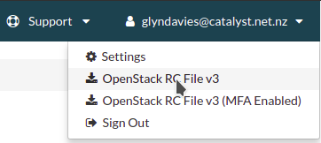

.. _configuring-the-cli:

###################
Configuring the CLI
###################

Prior to using the CLI, ensure you are working from a whitelisted IP address.
More information can be found under :ref:`here <access-and-whitelist>`

.. _source-rc-file:

***************************
Source an OpenStack RC file
***************************

When no configuration arguments are passed, the OpenStack client tools will try
to obtain their configuration from environment variables. To help you define
these variables, the cloud dashboard allows you to download an OpenStack RC
file from which you can easily source the required configuration.

To download an OpenStack RC file from the dashboard:

* Log in to your project on the dashboard and select your preferred region.

* From the left hand menu select "API Access" and click on

  "Download OpenStack RC File v3.0". Save this file on the host where the
  client tools are going to be used from.

* Source the configuration from the OpenStack RC file:

  .. code-block:: bash

    source projectname-openrc.sh

* When prompted for a password, enter the password of the user who downloaded
  the file. Note that your password is not displayed on the screen as you type
  it in.

  .. warning::

    You should never type in your password on the command line (or pass it as
    an argument to the client tools), because the password will be stored in
    plain text in the shell history file. This is unsafe and could allow a
    potential attacker to compromise your credentials.

* You can confirm the configuration works by running a simple command, such as
  ``openstack network list`` and ensuring it returns no errors.

.. Note::

  You are also able to download the Openstack RC file from the top-right
  corner where your login details are display as shown below:

Difference between OpenRC with or without MFA
=============================================

You will notice that when you go to download the OpenRC file from the
dashboard there are 2 version available. One that says OpenStackRC v3
and one that says OpenStackRC v3 (MFA Enabled)

Of course if you have MFA enabled then you will want to download the MFA
enabled file; However, this file can be used on accounts without multi-factor
authentication. The difference between the two is that the normal
OpenstackRC file keeps a copy of your Username and Password and uses those for
authentication against the cloud. Where as the MFA uses a token that gets
passed to the API's for confirmation.

You do not need to have MFA enabled to use the MFA RC file. You can just
enter nothing when prompted for it, and the system will create a token from
your username and password and authenticate it that way.
This is useful for those that care more about Security than convenience. The
trade off is that the Token has a lifespan. After 14 hours the token will
expire and you will have to re-authenticate your credentials to continue
working on your project via the CLI.

Setting up the command line environment on Windows
==================================================

As the standard OpenStack RC file will not work in its current form, it is
necessary to take a different approach.

To do this we will need to create the equivalent script using PowerShell. Add
the following lines, replacing the place holder entries with the appropriate
details from your OpenStack RC file which can be obtained following the steps
above.

.. code-block:: bash

  $env:OS_AUTH_URL = "https://api.cloud.catalyst.net.nz:5000/v3"
  $env:OS_TENANT_NAME = "<tenant-name>"
  $env:OS_TENANT_ID = "<tenant-id>"
  $env:OS_USERNAME = "<username>"

  $password = Read-Host 'Please enter your OpenStack Password' -AsSecureString
  $env:OS_PASSWORD = [Runtime.InteropServices.Marshal]::PtrToStringAuto([Runtime.InteropServices.Marshal]::SecureStringToBSTR($password))

Save the file as a '.ps1' file and run it from a PowerShell session. To confirm
if the variables were set correctly, run the following command:

.. code-block:: bash

  Get-ChildItem Env: | Where-Object {$_.name -match "OS_"}

The output should show the following 5 variables

.. image:: ../../_static/powershell_env.png
   :align: center
