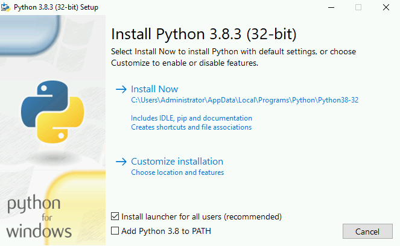
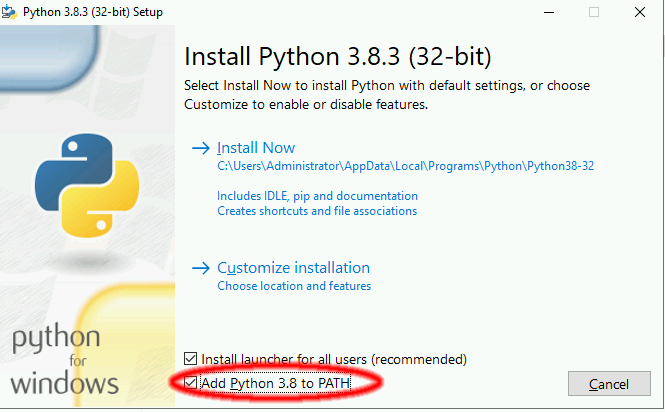
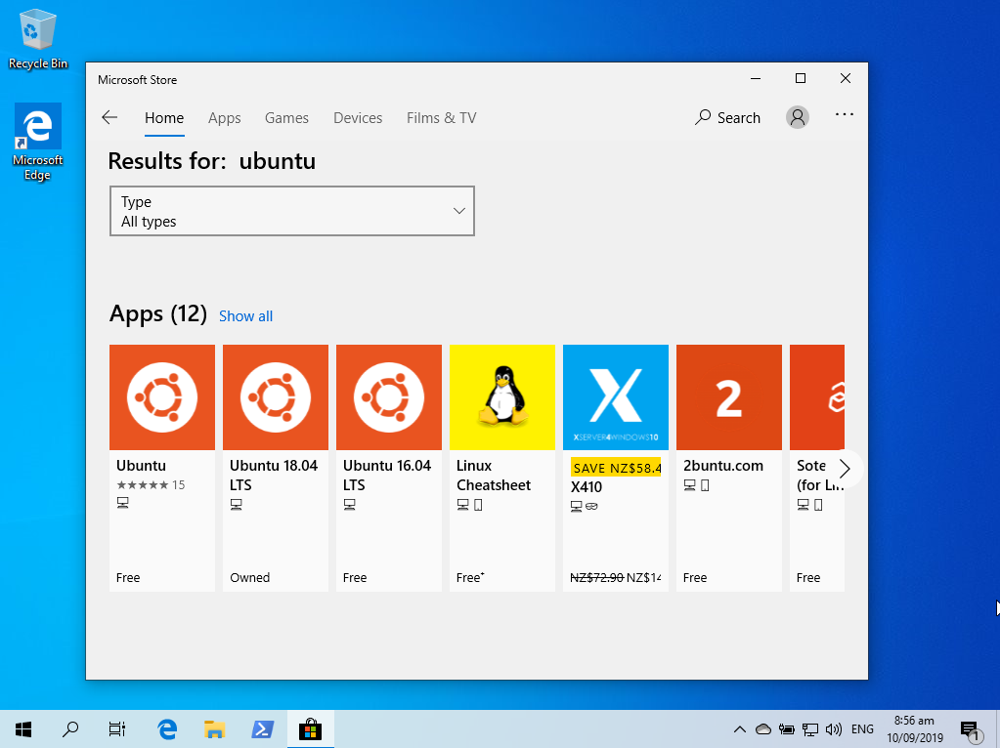
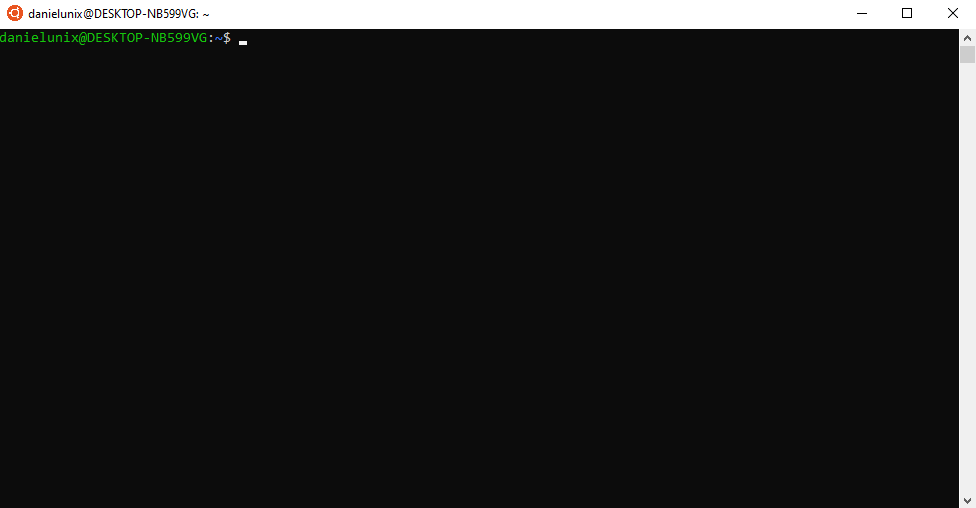
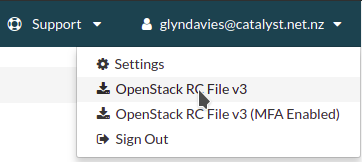

.. _installing-the-cli:

##################
Installing the CLI
##################

*********************
Using pip (recommend)
*********************

When installing the CLI using pip, it is recommended to use a python virtual
environment to contain the required dependencies. The examples below all make
reference to the use of a virtual environment. If you require more information
on the basic functions of the python virtual environment, please refer to the
:ref:`python-virtual-env` tutorial.

The following provides the basics of manually installing the OpenStack command
line tools on common operating systems.

.. _installing_cli_os:

Operating system specific steps
===============================

Here is an outline for installing the Openstack command line tools on the
common Linux/Unix based systems. This includes OSX as it runs a BSD based
system.

.. tabs::

    .. tab:: Ubuntu 20.04

        .. code-block:: bash

          # Make sure the package cache is up to date and ensure you have
          # Python3 installed
          sudo apt update
          sudo apt install -y python3-venv python3-dev

          # create a virtual environment using the Python3 virtual environment module
          python3 -m venv venv

          # activate the virtual environment
          source venv/bin/activate

          # install the Openstack commandline tools into the virtual environment
          pip install -U pip \
          wheel \
          python-openstackclient \
          python-ceilometerclient \
          python-heatclient \
          python-neutronclient \
          python-swiftclient \
          python-octaviaclient \
          python-magnumclient \
          aodhclient

    .. tab:: Debian 9

        .. code-block:: bash

          # Make sure the package cache is up to date and ensure you have
          # Python3 installed
          sudo apt update
          sudo apt install -y python3-venv

          # create a virtual environment using the Python3 virtual environment module
          python3 -m venv venv

          # activate the virtual environment
          source venv/bin/activate

          # install the Openstack commandline tools into the virtual environment
          pip install -U pip \
          python-openstackclient \
          python-ceilometerclient \
          python-heatclient \
          python-neutronclient \
          python-swiftclient \
          python-octaviaclient \
          python-magnumclient \
          aodhclient

    .. tab:: Centos 8

        .. code-block:: bash

          # Make sure the package cache is up to date and ensure you have
          # Python3 installed
          sudo yum update -y
          sudo yum install -y python3

          # create a virtual environment using the Python3 virtual environment module
          python3 -m venv venv

          # activate the virtual environment
          source venv/bin/activate

          # install the Openstack commandline tools into the virtual environment
          pip install -U pip \
          python-openstackclient \
          python-ceilometerclient \
          python-heatclient \
          python-neutronclient \
          python-swiftclient \
          python-octaviaclient \
          python-magnumclient \
          aodhclient

    .. tab:: Mac OSX

        .. code-block:: bash

          # from a terminal session install pip and virtualenv
          sudo easy_install pip
          sudo pip install virtualenv

          # Create a new virtual environment and activate it
          virtualenv venv
          source venv/bin/activate

          # Install the Python openstack client libraries into your virtual environment
                    pip install -U pip \
          python-openstackclient \
          python-ceilometerclient \
          python-heatclient \
          python-neutronclient \
          python-swiftclient \
          python-octaviaclient \
          python-magnumclient \
          aodhclient

.. _installing_windows_powershell_cli:

Windows (Powershell)
--------------------

The following guide will take you through the process, from beginning to end of
installing python3 and all other dependencies that are needed for your command
line to function correctly when interacting with the Catalyst Cloud.
The process also includes installing visual studio, installing pip and creating
a python virtual environment on your command line.

First, we need to install python3 onto our windows machine. We can find the
download for `python3 here`_. The downloads page looks like this:

.. image:: assets/python-download-screen.png

Under *Stable releases* select *Windows x86 executable installer* if you are
using a 32 bit system or *Windows x86-64 executable installer* if you have a
64 bit system. Once the file is downloaded we need to run the installer, which
will open up a wizard:

Before progressing any further, you need to make sure that you select the box
at the bottom of this screen. This will add python to your powershell's path,
meaning we can access it further on in this tutorial.

Once that is selected we click on custom installation and are brought to this
screen:

.. image:: assets/python-advanced-install.png

This screen lists all the additional options for your installation. It is
recommended that you do not change these and for the purposes of this tutorial,
you will need both **pip** and the **python test suite** going forward.

After this screen you have some additional configuration options. You can
specify where you are installing the python binaries and if you want them to
be preconfigured in a certain way. For now, select the ones displayed below
and then hit install.

.. image:: assets/config-options.png

Once the installation is done, if you load up a powershell window and type
**python** you should be met with this sort of message; indicating that our
installation has been a success:

.. image:: assets/python-command-line.png

Now that we have python3 installed, we can move on to installing
`microsoft visual studio`_ version 14 or higher. The reason we do this is
because some of the commands later on require certain packages from this
software. Once you click on the link, follow the prompt on screen to download
the visual studio installer.

Once the installer is downloaded, we start it up and we hit the continue
button. After some automated configuration is done we are met with the
following:

.. image:: assets/visualstudio-install.png

The real thing we are concerned about here is the **C++ Build tools** So select
those and then hit install.

.. _microsoft visual studio: https://visualstudio.microsoft.com/visual-cpp-build-tools/
.. _python3 here: https://www.python.org/downloads/windows/

Now that we have our prerequisite tools sorted, we can move on to preparing the
actual powershell command line. You will need to open windows powershell and
navigate to a directory that you want to hold your virtual environment and
various other files in. We then install the python virtual environment package
using pip and create our new virtual environment. In this example, we call our
virtual environment "ccloud" but this name is arbitrary and you can use
whichever name you find easy to remember.

.. code-block:: powershell

  # Create your new folder and navigate to it
  $ mkdir CLI-folder
  $ cd .\CLI-folder\

  #Now we install the python virtualenv using pip and create a new virtual environment
  $ pip install virtualenv
  $ python -m venv ccloud

Once we have created our new virtual environment, we are going to activate it
and install our command line tools.

.. code-block:: powershell

  # From a PowerShell session started with administration rights activate your virtual environment
  $ .\ccloud\scripts\activate

  # Now we install the Python openstack client libraries into our virtual environment
  $ pip install python-openstackclient python-ceilometerclient python-heatclient python-neutronclient python-swiftclient python-octaviaclient python-magnumclient

Once you have installed the required libraries to work with the Catalyst
Cloud onto your virtual environment; You have to make sure that whenever you
use powershell to interact with the cloud, you work on your Virtual
Environment. It may save time to make a short python script that runs the
activation command for you when you start powershell up.

.. _installing_windows_linux_subsystem_cli:

Windows (Linux Subsystem)
-------------------------
This is a much easier method to using the Command Line Interface on a windows
machine. It allows you to create a virtual instance of a linux operating
system of your choice, then complete the rest of this tutorial as if you were
running said operating system.
For this example we will be using Ubuntu 18.04

.. Note::
 This method is only available if you currently run a 64bit version of windows.

First, you will need to open PowerShell as an Administrator and run:

.. code-block:: powershell

 # Running as Administrator
 Enable-WindowsOptionalFeature -Online -FeatureName Microsoft-Windows-Subsystem-Linux

You will then need to download a version of Ubuntu from either the Microsoft
store, from a command line script, or manually unpack and install it from
their release website. For our purposes we will be using the Microsoft Store.

I've chosen to use Ubuntu 18.04. Once installed, you open the application
and set up an Unix account. An Unix account is only relevant on your machine
and once set up you won't need to use your login details again (but hold on to
them for security purposes) Once that is done you will be met with a screen
somewhat like this:

Once you have this up and running, you'll need to change directory to be
able to find files you download onto your windows machine.
The following code should get you to your root folder, aka 'My Computer'

.. code-block:: bash

  $ cd /mnt/c

Then you simply need to follow the guide on how to install the CLI on ubuntu
detailed :ref:`earlier on this page.<installing_cli_os>`

.. _installing_docker_cli:

***************************
Using Docker (experimental)
***************************

The Catalyst Cloud CLI is available as a Docker container that is easy to use,
packaging the command line interface and all its dependencies.

This tool requires Docker to be installed to function. You can find
`instructions on how to install and configure Docker here`_. You can run the
``docker ps`` command to confirm Docker has been successfully installed.

Run the following command to install the Catalyst Cloud CLI:

.. code-block:: bash

  bash <(wget -qO - https://raw.githubusercontent.com/catalyst-cloud/openstackclient-container/master/fetch-installer.sh) -a ccloud -u https://api.cloud.catalyst.net.nz:5000/v3

.. Note::

  Our documentation currently refers to the CLI command as ``openstack``. When
  using the containerised version of the CLI, this command must be replaced with
  ``ccloud`` in the provided examples.

If you are intending to use the containerised tools you will need to obtain the
non MFA enabled openrc file for authentication.To get a copy of the non MFA
enabled openrc file, select the dropdown in the upper right corner of the dash
board and click on ``OpenStack RC File v3``. Select ``Save As`` when prompted to
select the location on your machine to save this file to.

If you need more information on using the file see :ref:`source-rc-file`.

.. _instructions on how to install and configure Docker here: https://docs.docker.com/install/
.. _CLI docker container: https://github.com/catalyst-cloud/openstackclient-container

.. _upgrading-the-cli:

******************
Upgrading the CLI
******************

Using pip
=========

To keep the command line tools up to date, you will need to perform upgrades
on them after changes have come out. The following code snippet will upgrade
all of the tools listed above;
make sure that you have activated your virtual environment before running the
command below:

.. code-block:: bash

  pip install --upgrade pip \
  python-openstackclient \
  python-ceilometerclient \
  python-heatclient \
  python-neutronclient \
  python-swiftclient \
  python-octaviaclient \
  python-magnumclient \
  aodhclient
