###############################
Windows CLI
###############################

*****************************
Installation on Windows
*****************************

.. _installing_windows_powershell_cli:

Windows (Powershell)
====================

The following guide will take you through the process, from beginning to end of
installing python3 and all other dependencies that are needed for your command
line to function correctly when interacting with Catalyst Cloud.
The process also includes installing visual studio, installing pip and creating
a python virtual environment on your command line.

First, we need to install python3 onto our windows machine. We can find the
download for `python3 here`_. The downloads page looks like this:

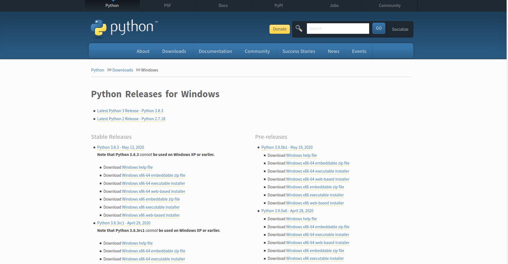

Under *Stable releases* select *Windows x86 executable installer* if you are
using a 32 bit system or *Windows x86-64 executable installer* if you have a
64 bit system. Once the file is downloaded we need to run the installer, which
will open up a wizard:

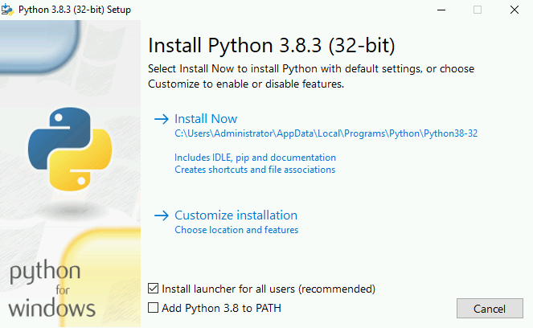

Before progressing any further, you need to make sure that you select the box
at the bottom of this screen. This will add python to your powershell's path,
meaning we can access it further on in this tutorial.

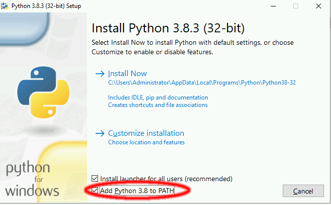

Once that is selected we click on custom installation and are brought to this
screen:

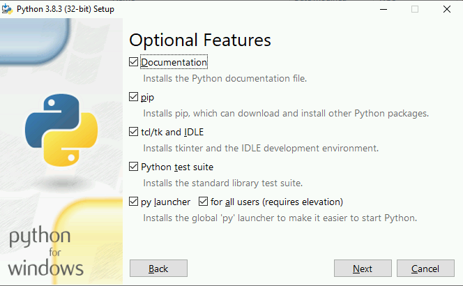

This screen lists all the additional options for your installation. It is
recommended that you do not change these and for the purposes of this tutorial,
you will need both **pip** and the **python test suite** going forward.

After this screen you have some additional configuration options. You can
specify where you are installing the python binaries and if you want them to
be preconfigured in a certain way. For now, select the ones displayed below
and then hit install.

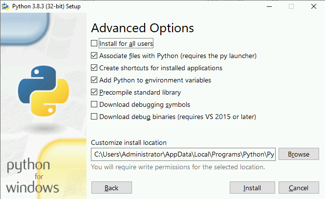

Once the installation is done, if you load up a powershell window and type
**python** you should be met with this sort of message; indicating that our
installation has been a success:

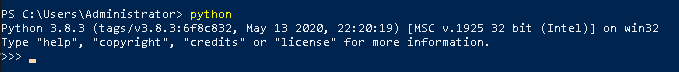

Now that we have python3 installed, we can move on to installing
`microsoft visual studio`_ version 14 or higher. The reason we do this is
because some of the commands later on require certain packages from this
software. Once you click on the link, follow the prompt on screen to download
the visual studio installer.

Once the installer is downloaded, we start it up and we hit the continue
button. After some automated configuration is done we are met with the
following:

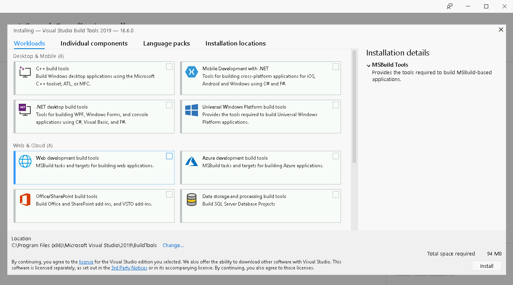

The real thing we are concerned about here is the **C++ Build tools** So select
those and then hit install.

.. _microsoft visual studio: https://visualstudio.microsoft.com/visual-cpp-build-tools/
.. _python3 here: https://www.python.org/downloads/windows/

Now that we have our prerequisite tools sorted, we can move on to preparing the
actual powershell command line. You will need to open windows powershell and
navigate to a directory that you want to hold your virtual environment and
various other files in. We then install the python virtual environment package
using pip and create our new virtual environment. In this example, we call our
virtual environment "ccloud" but this name is arbitrary and you can use
whichever name you find easy to remember.

.. code-block:: powershell

  # Create your new folder and navigate to it
  $ mkdir CLI-folder
  $ cd .\CLI-folder\

  #Now we install the python virtualenv using pip and create a new virtual environment
  $ pip install virtualenv
  $ python -m venv ccloud

Once we have created our new virtual environment, we are going to activate it
and install our command line tools.

.. code-block:: powershell

  # From a PowerShell session started with administration rights activate your
  virtual environment
    $ .\ccloud\scripts\activate

  # Now we install the Python OpenStack client libraries into our virtual environment
  $ pip install python-openstackclient python-ceilometerclient python-heatclient python-neutronclient python-swiftclient python-octaviaclient python-magnumclient

Once you have installed the required libraries to work with Catalyst
Cloud onto your virtual environment; You have to make sure that whenever you
use powershell to interact with the cloud, you work on your Virtual
Environment. It may save time to make a short python script that runs the
activation command for you when you start powershell up.

.. _installing_windows_linux_subsystem_cli:

Windows (Linux Subsystem)
=========================
This is a much easier method to using the Command Line Interface on a windows
machine. It allows you to create a virtual instance of a linux operating
system of your choice, then complete the rest of this tutorial as if you were
running said operating system.
For this example we will be using Ubuntu 18.04

.. Note::
 This method is only available if you currently run a 64bit version of windows.

First, you will need to open PowerShell as an Administrator and run:

.. code-block:: powershell

 # Running as Administrator
 Enable-WindowsOptionalFeature -Online -FeatureName Microsoft-Windows-Subsystem-Linux

You will then need to download a version of Ubuntu from either the Microsoft
store, from a command line script, or manually unpack and install it from
their release website. For our purposes we will be using the Microsoft Store.

.. image:: assets/windows-store.png

I've chosen to use Ubuntu 18.04. Once installed, you open the application
and set up an Unix account. An Unix account is only relevant on your machine
and once set up you won't need to use your login details again (but hold on to
them for security purposes) Once that is done you will be met with a screen
somewhat like this:

.. image:: assets/unix-shell.png

Once you have this up and running, you'll need to change directory to be
able to find files you download onto your windows machine.
The following code should get you to your root folder, aka 'My Computer'

.. code-block:: bash

  $ cd /mnt/c

Then you simply need to follow the guide on how to install the CLI on ubuntu
detailed :ref:`earlier on this page.<installing_cli_os>`

.. _installing_docker_cli:

.. _upgrading-the-cli-windows:

Upgrading the CLI
==================

To keep the command line tools up to date, you will need to perform upgrades
on them after changes have come out. The following code snippet will upgrade
all of the tools listed above;
make sure that you have activated your virtual environment before running the
command below:

.. code-block:: bash

  pip install --upgrade pip \
  python-openstackclient \
  python-ceilometerclient \
  python-heatclient \
  python-neutronclient \
  python-swiftclient \
  python-octaviaclient \
  python-magnumclient \
  aodhclient

******************************
Configuration on Windows
******************************

.. _windows-configuration:

Setting up the command line environment on Windows
==================================================

Much like the Mac and Linux approach, we are going to use a RC file to source
our environment variables. There are two different ways to source your
environment variables from this RC file, they depend on whether you have set up
MFA or not.

Before we continue with either method, we have to download the correct RC file
from the dashboard:

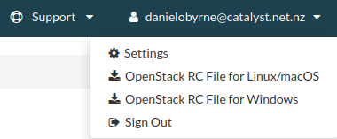

Sourcing your environment with MFA
----------------------------------

First, open powershell and navigate to the directory that has our file:

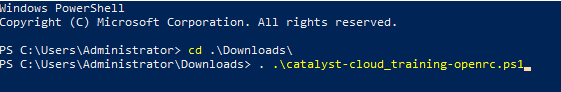

Next, we source our file. You will be prompted for your password and your MFA
code; after you have supplied these, your environment variables should be
sourced:

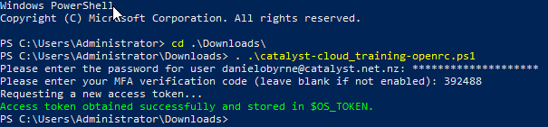

You will be able to test that your environment variables have been sourced
using the ``Get-OpenstackEnv`` command:

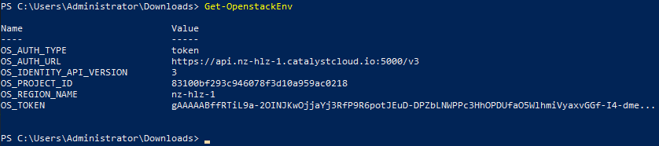

Sourcing your environment without MFA
-------------------------------------

If you have not set up MFA for your account, you will have to add ``-NoToken``
to the end of your command when sourcing your RC file, then continue with
inputting your password:

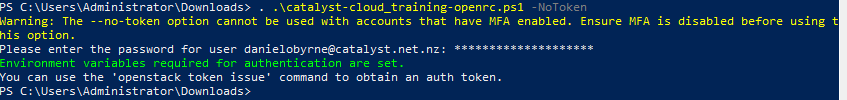

To view more information about the source command and the RC file itself, you
can add ``-h`` or ``-help`` to the end of the source command:

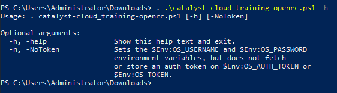

******************************
Using the CLI on Windows
******************************

Using the CLI
=============

Once you have your command line set up and configured as per the previous steps
of this documentation, you can proceed with using the command line to issue
commands to your project on Catalyst Cloud. The steps below show you
how to initialize and set up your command line to function correctly in this
manner.

**If you installed the CLI using pip:**

1. Activate your virtual environment.
2. :ref:`Source an OpenStack RC file<windows-configuration>`
3. Invoke the CLI with the ``openstack`` command

For a reference of all commands supported by the CLI, refer to the `OpenStack
Client documentation <https://docs.openstack.org/python-openstackclient/latest/>`_.

The next step
=============

We highly recommend that if you are going to be using the CLI often that you
take the time to go through the documentation section on :ref:`setting up your
first instance <using-the-command-line-interface>`, using the CLI method. It
gives you a great step-by-step process to how to create an instance but also
teaches you the common commands found in OpenStack and the CLI.
