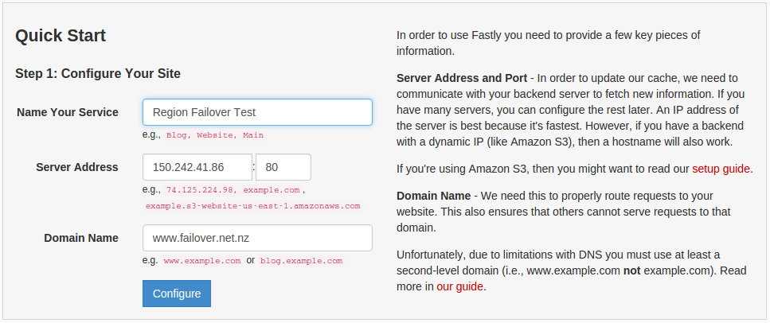
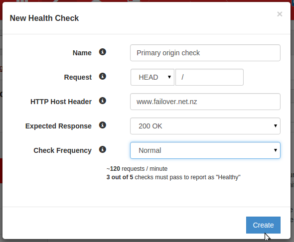
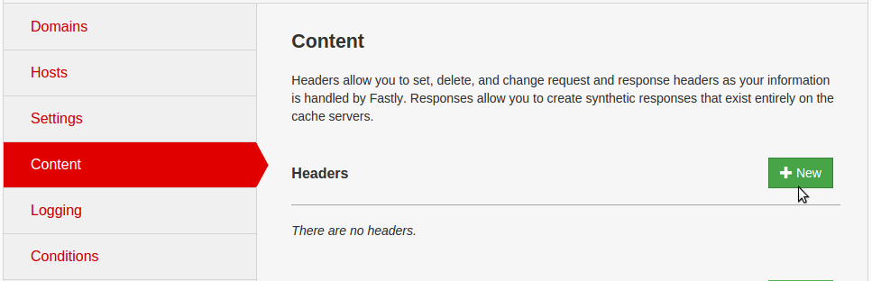
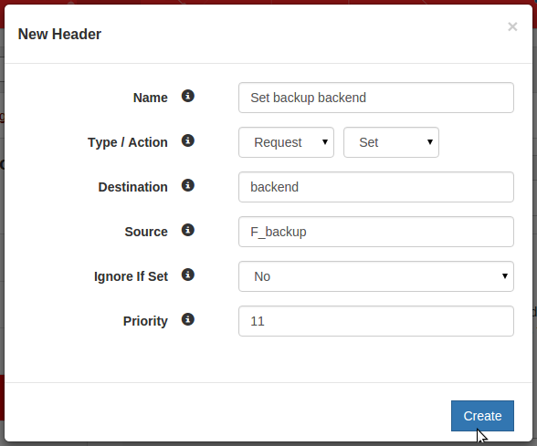
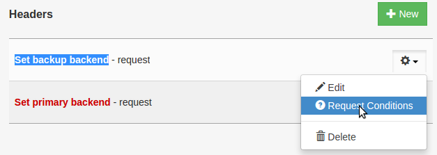
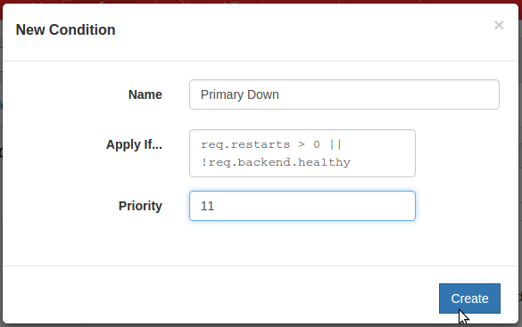
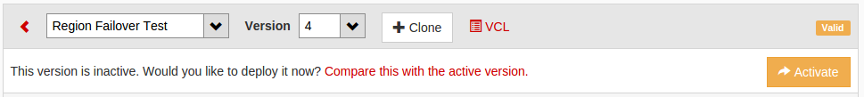

#########
Tutorials
#########

****************************************
Downloading compute instance's volume(s)
****************************************

Volumes can be copied from the block storage service to the image service and
downloaded using the glance client.

This tutorial assumes you have installed the OpenStack command line tools and
sourced an openrc file, as explained on :ref:`command-line-tools`.

Identifying the volume(s)
=========================

The ``cinder list`` command can be used to list all volumes available.

The ``nova show`` command can be used to identity the volumes that are attached
to a given compute instance:

.. code-block:: bash

  nova show <instance-name-or-id> | grep "volumes_attached"

Uploading the volume
====================

The procedure to upload a volume will vary depending on whether the volume is
attached to an instance (active) or not.

Uploading a detached (inactive) volume
--------------------------------------

A detached volume can be uploaded to the image service using the following
command:

.. code-block:: bash

  cinder upload-to-image <volume-name-or-id> <image-name>

Uploading an attached (active) volume
-------------------------------------

To upload an active volume (a volume that is currently attached to a compute
instance and in use), you must first take a snapshot of the volume using the
``cinder volume-snapshot`` command and then create a new (inactive) volume from
it using the ``cinder volume-create`` command.

To take a snapshot of an active volume:

.. code-block:: bash

  cinder snapshot-create <volume-name-or-id> --display-name <snapshot-name> --force True

To show a list of all snapshots:

.. code-block:: bash

  cinder snapshot-list

The command below can be used to create a new volume based on a snapshot.
Please note that the volume size should match the snapshot size.

.. code-block:: bash

  cinder create --snapshot-id <snapshot-id> --display-name <new-volume-name> <size>

A detached volume can be uploaded to the image service using the command below:

.. code-block:: bash

  cinder upload-to-image <volume-name-or-id> <image-name>

Downloading the image
=====================

Copying a volume from the block storage service to the image service can take
some time (depending on volume size). First, you should confirm that the upload
has finished (status shown as active), using the command below:

.. code-block:: bash

  glance image-show <image-name-or-id>

If the status of the image is active, you can download the image using the
following command:

.. code-block:: bash

  glance image-download <image-name-or-id> --file <file-name> --progress

The downloaded file is the raw image (a bare container) that can be uploaded
back to other cloud regions, other clouds or imported into a hypervisor for
local use.

*****************************
Deploying a HPC SLURM cluster
*****************************

Introduction
============

In this tutorial you will learn how to deploy a high performance computing
(HPC) cluster on the Catalyst Cloud using elasticluster and SLURM.

Elasticluster is an open source tool to create and manage compute clusters on
cloud infrastructures. The project has been originally created by the Grid
Computing Competence Center from the University of Zurich.

SLURM is a highly scalable cluster management and resource manager, used by
many of the world's supercomputers and computer clusters (it is the workload
manager on about 60% of the TOP500 supercomputers).

The following video outlines what you will learn in this tutorial. It shows a
SLURM HPC cluster being deployed automatically by Elasticluster on the Catalyst
Cloud, a data set being uploaded, the cluster being scaled on demand from 2 to
10 nodes, the execution of an embarrassingly parallel job, the results being
downloaded, and finally, the cluster being destroyed.

.. raw:: html

  <iframe width="560" height="315" src="https://www.youtube.com/embed/gkXkcHDd588?html5=1" frameborder="0" allowfullscreen></iframe>

.. warning::

  This tutorial assumes you are starting with a blank tenant and using your VPC
  only for elasticluster. You may need to adjust things (eg: create a dedicated
  elasticluster security group), if you are doing this in a shared VPC.

Pre-requisites
==============

Install Python development tools:

.. code-block:: bash

  sudo apt-get install python-dev

Create a virtual environment to install the software:

.. code-block:: bash

  cd ~
  virtualenv elasticluster
  source elasticluster/bin/activate

Install Elasticluster on the virtual environment:

.. code-block:: bash

  pip install elasticluster pyopenssl ndg-httpsclient pyasn1 ecdsa

Install the Catalyst Cloud OpenStack client tools:

.. code-block:: bash

  pip install python-keystoneclient python-novaclient python-cinderclient python-glanceclient python-ceilometerclient python-heatclient python-neutronclient python-swiftclient

Configuring Elasticluster
=========================

Create template configuration files for elasticluster:

.. code-block:: bash

  elasticluster list-templates 1> /dev/null 2>&1

Edit the elasticluster configuration file (~/.elasticluster/config). A sample
configuration file compatible with the Catalyst Cloud is provided below:

.. code-block:: ini

  [cloud/catalyst]
  provider=openstack
  auth_url=https://api.cloud.catalyst.net.nz:5000/v2.0
  username=username
  password=password
  project_name=tenantname
  region_name=nz-por-1
  request_floating_ip=True

  [login/ubuntu]
  image_user=ubuntu
  image_user_sudo=root
  image_sudo=True
  user_key_name=elasticluster
  user_key_private=~/elasticluster/id_rsa
  user_key_public=~/elasticluster/id_rsa.pub

  [setup/ansible-slurm]
  provider=ansible
  frontend_groups=slurm_master
  compute_groups=slurm_clients

  [cluster/slurm]
  cloud=catalyst
  login=ubuntu
  setup_provider=ansible-slurm
  security_group=default
  # Ubuntu image
  image_id=fe2a52bd-1881-45a6-8c16-d0a1005a1a4e
  flavor=c1.c1r1
  frontend_nodes=1
  compute_nodes=2
  ssh_to=frontend

Configuring the cloud
=====================

Create SSH keys for elasticluster (no passphrase):

.. code-block:: bash

  ssh-keygen -t rsa -b 4096 -f ~/elasticluster/id_rsa

Source your openrc file, as explained on :ref:`command-line-tools`.

Allow elasticluster to connect to instances over SSH:

.. code-block:: bash

  nova secgroup-add-group-rule default default tcp 22 22

Using elasticluster
===================

The following commands are provided as examples on how to use elasticluster to
create and interact with a simple SLURM cluster. For more information on
elasticluster, please refer to https://elasticluster.readthedocs.org/.

Deploy a SLURM cluster on the cloud using the configuration provided:

.. code-block:: bash

  elasticluster start slurm -n cluster

List information about the cluster:

.. code-block:: bash

  elasticluster list-nodes cluster

Connect to the front-end node of the SLURM cluster over SSH:

.. code-block:: bash

  elasticluster ssh cluster

Connect to the front-end node of the SLURM cluster over SFTP, to upload (put
file-name) or download (get file-name) data sets:

.. code-block:: bash

  elasticluster sftp cluster

Grow the cluster to 10 nodes (add another 8 nodes):

.. code-block:: bash

  elasticluster resize cluster -a 8:compute

Terminate (destroy) the cluster:

.. code-block:: bash

  elasticluster stop cluster

Using SLURM
===========

Connect to the front-end node of the SLURM cluster over SSH as described on the
previous section.

The following example demonstrates how to create a simple embarrassingly
parallel workload job that will trigger four tasks and write its output to
results.txt.

.. code-block:: bash

 #!/bin/bash
 #
 #SBATCH --job-name=test
 #SBATCH --output=results.txt
 #
 #SBATCH --ntasks=4
 #SBATCH --time=10:00
 #SBATCH --mem-per-cpu=100

 srun hostname
 srun printenv SLURM_PROCID
 srun sleep 15

Submit a job:

.. code-block:: bash

  sbatch job.sh

List the jobs in the queue:

.. code-block:: bash

  squeue

****************************************************
Deploying Highly Available instances with Keepalived
****************************************************

This tutorial assumes you have installed the OpenStack command line tools and
sourced an openrc file, as explained at :ref:`command-line-tools`. We also
assume that you have uploaded a ssh key as explained at
:ref:`uploading-an-ssh-key`.

Introduction
============

In this tutorial you will learn how to deploy a highly available instance pair
using VRRP. This tutorial is largely based from a `blog post`_ by Aaron O'Rosen
with modifications appropriate for Catalysts cloud. Networks and names have
been kept largely compatible with the source material. Additionally information
about configuring ``allowed_address_pairs`` in heat was sourced from this
`post`_.

.. _blog post: http://blog.aaronorosen.com/implementing-high-availability-instances-with-neutron-using-vrrp/

.. _post: https://www.hastexo.com/blogs/syed/2014/08/05/orchestrating-highly-available-load-balancers-openstack-heat

We will be using two different methods to setup this stack. Initially we will
use the ``neutron`` and ``nova``  command line tools to complete the setup
manually. We will then replicate the manual configuration using a ``heat``
template to instantiate the same stack automatically.

Virtual Router Redundancy Protocol
==================================
`VRRP`_ provides hardware redundancy and automatic failover for routers. It
allows specifying a virtual router which maps to two or more physical routers.
Individual VRRP router instances share an IP address but at any time, only one
of the instances is the master (active), the other instances are backups and
will not respond using the virtual address. If the master fails, one of the
backups is elected as the new master and will begin to respond on the virtual
address.

Instances use priorities from 1 (lowest) through 255 (highest), devices running
VRRP dynamically elect master and backup routers based on their respective
priorities. Only the router that is acting as the master sends out VRRP
advertisements at any given point in time. The master router sends
advertisements to backup routers at regular intervals (default 1 second). If a
backup router does not receive an advertisement for a set period, the backup
router with the next highest priority takes over as master and begins
forwarding packets.

VRRP instances communicate using packets with multicast IP address 224.0.0.18
and IP protocol number 112. The protocol is defined in `RFC3768`_.

.. _VRRP: https://en.wikipedia.org/wiki/Virtual_Router_Redundancy_Protocol

.. _RFC3768: https://en.wikipedia.org/wiki/Virtual_Router_Redundancy_Protocol

.. note::

 There is an extension to VRRP that uses IPSEC-AH (IP protocol 51) for
 integrity (see http://www.keepalived.org/draft-ietf-vrrp-ipsecah-spec-00.txt).
 This tutorial will demostrate using standard VRRP. See this `article`_ for
 more information on securing VRRP.

.. _article: http://louwrentius.com/configuring-attacking-and-securing-vrrp-on-linux.html

Allowed Address Pairs
=====================

Allowed Address Pairs is a Neutron Extension that extends the port attribute to
enable you to specify arbitrary ``mac_address/ip_address(cidr)`` pairs that are
allowed to pass through a port regardless of the subnet associated with the
network.

Let's double check that this extension is available on the Catalyst Cloud:

.. code-block:: bash

 $ neutron ext-list
 +-----------------------+-----------------------------------------------+
 | alias                 | name                                          |
 +-----------------------+-----------------------------------------------+
 | service-type          | Neutron Service Type Management               |
 | security-group        | security-group                                |
 | l3_agent_scheduler    | L3 Agent Scheduler                            |
 | ext-gw-mode           | Neutron L3 Configurable external gateway mode |
 | binding               | Port Binding                                  |
 | metering              | Neutron Metering                              |
 | agent                 | agent                                         |
 | quotas                | Quota management support                      |
 | dhcp_agent_scheduler  | DHCP Agent Scheduler                          |
 | multi-provider        | Multi Provider Network                        |
 | external-net          | Neutron external network                      |
 | router                | Neutron L3 Router                             |
 | allowed-address-pairs | Allowed Address Pairs                         |
 | vpnaas                | VPN service                                   |
 | extra_dhcp_opt        | Neutron Extra DHCP opts                       |
 | provider              | Provider Network                              |
 | extraroute            | Neutron Extra Route                           |
 +-----------------------+-----------------------------------------------+

As you can see, the Allowed Address Pairs extension is available.

.. _clone-orchestration-repo:

Clone Orchestration Git Repository
==================================

Before we start let's checkout the
https://github.com/catalyst/catalystcloud-orchestration git repository. We will
be using some scripts and heat templates from this repository in this tutorial.

.. code-block:: bash

 $ git clone https://github.com/catalyst/catalystcloud-orchestration.git && ORCHESTRATION_DIR="$(pwd)/catalystcloud-orchestration" && echo $ORCHESTRATION_DIR

Network Setup
=============

Let's create a network called ``vrrp-net`` where we can run our highly
available hosts:

.. code-block:: bash

 $ neutron net-create vrrp-net
 Created a new network:
 +----------------+--------------------------------------+
 | Field          | Value                                |
 +----------------+--------------------------------------+
 | admin_state_up | True                                 |
 | id             | 617ff618-9da6-4c47-ab3f-527fe5413ea8 |
 | name           | vrrp-net                             |
 | shared         | False                                |
 | status         | ACTIVE                               |
 | subnets        |                                      |
 | tenant_id      | 0cb6b9b744594a619b0b7340f424858b     |
 +----------------+--------------------------------------+

Now let's set up a subnet of the network we have just created. We are going to
do this so we can use part of the ``vrrp-net`` as a dynamically assigned pool
of addresses and reserve the rest of the addresses for manual assignment. In
this case the pool addresses are in the range 2-200 while the remainder of the
``/24`` will be statically assigned.

.. code-block:: bash

 $ neutron subnet-create --name vrrp-subnet --allocation-pool \
   start=10.0.0.2,end=10.0.0.200 vrrp-net 10.0.0.0/24
 Created a new subnet:
 +------------------+--------------------------------------------+
 | Field            | Value                                      |
 +------------------+--------------------------------------------+
 | allocation_pools | {"start": "10.0.0.2", "end": "10.0.0.200"} |
 | cidr             | 10.0.0.0/24                                |
 | dns_nameservers  |                                            |
 | enable_dhcp      | True                                       |
 | gateway_ip       | 10.0.0.1                                   |
 | host_routes      |                                            |
 | id               | 7c3ca3d4-70a2-4fdd-be9e-4b6bd1eef537       |
 | ip_version       | 4                                          |
 | name             | vrrp-subnet                                |
 | network_id       | 617ff618-9da6-4c47-ab3f-527fe5413ea8       |
 | tenant_id        | 0cb6b9b744594a619b0b7340f424858b           |
 +------------------+--------------------------------------------+

Next we will create a router, we will give this router an interface on our new
subnet and we will set its gateway as our public network:

.. code-block:: bash

 $ neutron router-create vrrp-router
 Created a new router:
 +-----------------------+--------------------------------------+
 | Field                 | Value                                |
 +-----------------------+--------------------------------------+
 | admin_state_up        | True                                 |
 | external_gateway_info |                                      |
 | id                    | 8e9df7a5-0d5a-4574-bbbe-b4db35616efa |
 | name                  | vrrp-router                          |
 | status                | ACTIVE                               |
 | tenant_id             | 0cb6b9b744594a619b0b7340f424858b     |
 +-----------------------+--------------------------------------+

 $ neutron router-interface-add vrrp-router vrrp-subnet
 Added interface 7e11450c-b605-4931-a304-0d864e205ed2 to router vrrp-router.

 $ neutron router-gateway-set vrrp-router public-net
 Set gateway for router vrrp-router

.. note::

 If you look at the ports created at this point using the ``neutron port-list`` command you will notice three interfaces have been created. The ip 10.0.0.1 is the gateway address while 10.0.0.2 and 10.0.0.3 provide DHCP for this network.

Security Group Setup
====================

Now we will create the ``vrrp-sec-group`` security group with rules to
allow http, ssh and icmp ingres:

.. code-block:: bash

 $ neutron security-group-create vrrp-sec-group
 Created a new security_group:
 +----------------------+-------------------------------------------------------------------------------------------------------------------------------------------------------------------------------------------------------------------------------------------------------------------------------------------------------------------------------+
 | Field                | Value                                                                                                                                                                                                                                                                                                                         |
 +----------------------+-------------------------------------------------------------------------------------------------------------------------------------------------------------------------------------------------------------------------------------------------------------------------------------------------------------------------------+
 | description          |                                                                                                                                                                                                                                                                                                                               |
 | id                   | 3d50882c-c8b8-4c39-9758-390593a5774b                                                                                                                                                                                                                                                                                          |
 | name                 | vrrp-sec-group                                                                                                                                                                                                                                                                                                                |
 | security_group_rules | {"remote_group_id": null, "direction": "egress", "remote_ip_prefix": null, "protocol": null, "tenant_id": "0cb6b9b744594a619b0b7340f424858b", "port_range_max": null, "security_group_id": "3d50882c-c8b8-4c39-9758-390593a5774b", "port_range_min": null, "ethertype": "IPv4", "id": "33d9bf4b-03a2-4169-a47d-1116345d9e1d"} |
 |                      | {"remote_group_id": null, "direction": "egress", "remote_ip_prefix": null, "protocol": null, "tenant_id": "0cb6b9b744594a619b0b7340f424858b", "port_range_max": null, "security_group_id": "3d50882c-c8b8-4c39-9758-390593a5774b", "port_range_min": null, "ethertype": "IPv6", "id": "2e192759-871c-449f-ab67-cc9f03ed2f35"} |
 | tenant_id            | 0cb6b9b744594a619b0b7340f424858b                                                                                                                                                                                                                                                                                              |
 +----------------------+-------------------------------------------------------------------------------------------------------------------------------------------------------------------------------------------------------------------------------------------------------------------------------------------------------------------------------+

 $ neutron security-group-rule-create --protocol icmp vrrp-sec-group
 Created a new security_group_rule:
 +-------------------+--------------------------------------+
 | Field             | Value                                |
 +-------------------+--------------------------------------+
 | direction         | ingress                              |
 | ethertype         | IPv4                                 |
 | id                | 9ddcc056-0915-4365-a303-a5a1d691c87e |
 | port_range_max    |                                      |
 | port_range_min    |                                      |
 | protocol          | icmp                                 |
 | remote_group_id   |                                      |
 | remote_ip_prefix  |                                      |
 | security_group_id | 3d50882c-c8b8-4c39-9758-390593a5774b |
 | tenant_id         | 0cb6b9b744594a619b0b7340f424858b     |
 +-------------------+--------------------------------------+

 $ neutron security-group-rule-create --protocol tcp --port-range-min 80 --port-range-max 80 vrrp-sec-group
 Created a new security_group_rule:
 +-------------------+--------------------------------------+
 | Field             | Value                                |
 +-------------------+--------------------------------------+
 | direction         | ingress                              |
 | ethertype         | IPv4                                 |
 | id                | 55cbfd57-03c5-4ed8-a760-33453b447669 |
 | port_range_max    | 80                                   |
 | port_range_min    | 80                                   |
 | protocol          | tcp                                  |
 | remote_group_id   |                                      |
 | remote_ip_prefix  |                                      |
 | security_group_id | 3d50882c-c8b8-4c39-9758-390593a5774b |
 | tenant_id         | 0cb6b9b744594a619b0b7340f424858b     |
 +-------------------+--------------------------------------+

 $ neutron security-group-rule-create --protocol tcp --port-range-min 22 --port-range-max 22 vrrp-sec-group
 Created a new security_group_rule:
 +-------------------+--------------------------------------+
 | Field             | Value                                |
 +-------------------+--------------------------------------+
 | direction         | ingress                              |
 | ethertype         | IPv4                                 |
 | id                | e9c0d635-e1bb-498d-8bd2-64e4a4d553c3 |
 | port_range_max    | 22                                   |
 | port_range_min    | 22                                   |
 | protocol          | tcp                                  |
 | remote_group_id   |                                      |
 | remote_ip_prefix  |                                      |
 | security_group_id | 3d50882c-c8b8-4c39-9758-390593a5774b |
 | tenant_id         | 0cb6b9b744594a619b0b7340f424858b     |
 +-------------------+--------------------------------------+

Next we will add a rule to allow our Keepalived instances to communicate with
each other via VRRP broadcasts:

.. code-block:: bash

 $ neutron security-group-rule-create --protocol 112 --remote-group-id vrrp-sec-group vrrp-sec-group
 Created a new security_group_rule:
 +-------------------+--------------------------------------+
 | Field             | Value                                |
 +-------------------+--------------------------------------+
 | direction         | ingress                              |
 | ethertype         | IPv4                                 |
 | id                | 2c10b6fd-5729-480d-a4f8-88fe1286dceb |
 | port_range_max    |                                      |
 | port_range_min    |                                      |
 | protocol          | 112                                  |
 | remote_group_id   | 3d50882c-c8b8-4c39-9758-390593a5774b |
 | remote_ip_prefix  |                                      |
 | security_group_id | 3d50882c-c8b8-4c39-9758-390593a5774b |
 | tenant_id         | 0cb6b9b744594a619b0b7340f424858b     |
 +-------------------+--------------------------------------+

Instance Creation
=================

The next step is to boot two instances where we will run Keepalived and Apache.
We will be using the Ubuntu 14.04 image and ``c1.c1r1`` flavour. We will assign
these instances to the ``vrrp-sec-group`` security group. We will also provide
the name of our SSH key so we can login to these machines via SSH once they are
created:

.. note::
 You will need to substitute the name of your SSH key.

To find the correct IDs you can use the following commands:

.. code-block:: bash

 $ VRRP_IMAGE_ID=$(glance image-show ubuntu-14.04-x86_64 | grep ' id '| awk '{ print $4 }') && echo $VRRP_IMAGE_ID
 9eab2d64-818c-4548-980d-535412d16249

 $ VRRP_FLAVOR_ID=$(nova flavor-list | grep 'c1.c1r1' | awk '{ print $2 }') && echo $VRRP_FLAVOR_ID
 28153197-6690-4485-9dbc-fc24489b0683

 $ VRRP_NET_ID=$(neutron net-show vrrp-net | grep ' id '| awk '{ print $4 }') && echo $VRRP_NET_ID
 617ff618-9da6-4c47-ab3f-527fe5413ea8

 $ nova keypair-list
 +------------------+-------------------------------------------------+
 | Name             | Fingerprint                                     |
 +------------------+-------------------------------------------------+
 | vrrp-demo-key    | 9a:17:a8:1f:48:a4:f4:0d:c8:1b:ee:de:d4:a1:60:0b |
 +------------------+-------------------------------------------------+

We will be passing a script to our instance boot command using the
``--user-data`` flag. This script sets up Keepalived and Apache on our master
and backup instances. This saves us having to execute these commands manually.
This script is located in the git repository you cloned previously at
:ref:`clone-orchestration-repo`.

.. code-block:: bash

 $ cat "$ORCHESTRATION_DIR/hot/ubuntu-14.04/vrrp-basic/vrrp-setup.sh"
 #!/bin/bash

 HOSTNAME=$(hostname)

 if [ "$HOSTNAME" == "vrrp-master" ]; then
     KEEPALIVED_STATE='MASTER'
     KEEPALIVED_PRIORITY=100
 elif [ "$HOSTNAME" == "vrrp-backup" ]; then
     KEEPALIVED_STATE='BACKUP'
     KEEPALIVED_PRIORITY=50
 else
     echo "invalid hostname $HOSTNAME for install script $0";
     exit 1;
 fi

 IP=$(ip addr | grep inet | grep eth0 | grep -v secondary | awk '{ print $2 }' | awk -F'/' '{ print $1 }')

 echo "$IP $HOSTNAME" >> /etc/hosts

 apt-get update
 apt-get -y install keepalived

 echo "vrrp_instance vrrp_group_1 {
     state $KEEPALIVED_STATE
     interface eth0
     virtual_router_id 1
     priority $KEEPALIVED_PRIORITY
     authentication {
         auth_type PASS
         auth_pass password
     }
     virtual_ipaddress {
         10.0.0.201/24 brd 10.0.0.255 dev eth0
     }
 }" > /etc/keepalived/keepalived.conf

 apt-get -y install apache2
 echo "$HOSTNAME" > /var/www/html/index.html
 service keepalived restart

Let's run the boot command (you will need to substitute your SSH key name and
path to the ``vrrp-setup.sh`` script):

.. code-block:: bash

 $ nova boot --image $VRRP_IMAGE_ID --flavor $VRRP_FLAVOR_ID --nic net-id=$VRRP_NET_ID --security_groups \
   vrrp-sec-group --user-data vrrp-setup.sh --key_name vrrp-demo-key vrrp-master

 +--------------------------------------+------------------------------------------------------------+
 | Property                             | Value                                                      |
 +--------------------------------------+------------------------------------------------------------+
 | OS-DCF:diskConfig                    | MANUAL                                                     |
 | OS-EXT-AZ:availability_zone          | nz-por-1a                                                  |
 | OS-EXT-STS:power_state               | 0                                                          |
 | OS-EXT-STS:task_state                | scheduling                                                 |
 | OS-EXT-STS:vm_state                  | building                                                   |
 | OS-SRV-USG:launched_at               | -                                                          |
 | OS-SRV-USG:terminated_at             | -                                                          |
 | accessIPv4                           |                                                            |
 | accessIPv6                           |                                                            |
 | adminPass                            | p7GmoGyK2HDP                                               |
 | config_drive                         |                                                            |
 | created                              | 2015-08-26T03:57:15Z                                       |
 | flavor                               | c1.c1r1 (28153197-6690-4485-9dbc-fc24489b0683)             |
 | hostId                               |                                                            |
 | id                                   | ebd4b72f-6fcf-4e1d-ad7d-507b944f86df                       |
 | image                                | ubuntu-14.04-x86_64 (9eab2d64-818c-4548-980d-535412d16249) |
 | key_name                             | vrrp-demo-key                                              |
 | metadata                             | {}                                                         |
 | name                                 | vrrp-master                                                |
 | os-extended-volumes:volumes_attached | []                                                         |
 | progress                             | 0                                                          |
 | security_groups                      | vrrp-sec-group                                             |
 | status                               | BUILD                                                      |
 | tenant_id                            | 0cb6b9b744594a619b0b7340f424858b                           |
 | updated                              | 2015-08-26T03:57:15Z                                       |
 | user_id                              | 8c1914eda99d406195674864f2846d45                           |
 +--------------------------------------+------------------------------------------------------------+

 $ nova boot --image $VRRP_IMAGE_ID --flavor $VRRP_FLAVOR_ID --nic net-id=$VRRP_NET_ID --security_groups \
   vrrp-sec-group --user-data vrrp-setup.sh --key_name vrrp-demo-key vrrp-backup

Let's check the instances have been created:

.. code-block:: bash

 $ nova list
 +--------------------------------------+-------------+--------+------------+-------------+-------------------+
 | ID                                   | Name        | Status | Task State | Power State | Networks          |
 +--------------------------------------+-------------+--------+------------+-------------+-------------------+
 | ebd4b72f-6fcf-4e1d-ad7d-507b944f86df | vrrp-master | ACTIVE | -          | Running     | vrrp-net=10.0.0.4 |
 | f980dc30-9d3e-4e47-adf5-8f6715be6a8a | vrrp-backup | ACTIVE | -          | Running     | vrrp-net=10.0.0.5 |
 +--------------------------------------+-------------+--------+------------+-------------+-------------------+

Virtual Address Setup
=====================

The next step is to create the IP address that will be used by our virtual
router:

.. code-block:: bash

 $ neutron port-create --fixed-ip ip_address=10.0.0.201 --security-group vrrp-sec-group vrrp-net
 Created a new port:
 +-----------------------+-----------------------------------------------------------------------------------+
 | Field                 | Value                                                                             |
 +-----------------------+-----------------------------------------------------------------------------------+
 | admin_state_up        | True                                                                              |
 | allowed_address_pairs |                                                                                   |
 | binding:vnic_type     | normal                                                                            |
 | device_id             |                                                                                   |
 | device_owner          |                                                                                   |
 | fixed_ips             | {"subnet_id": "7c3ca3d4-70a2-4fdd-be9e-4b6bd1eef537", "ip_address": "10.0.0.201"} |
 | id                    | 40aa1a50-4a96-4103-beaf-89bdb0b49327                                              |
 | mac_address           | fa:16:3e:40:69:5f                                                                 |
 | name                  |                                                                                   |
 | network_id            | 617ff618-9da6-4c47-ab3f-527fe5413ea8                                              |
 | security_groups       | 3d50882c-c8b8-4c39-9758-390593a5774b                                              |
 | status                | DOWN                                                                              |
 | tenant_id             | 0cb6b9b744594a619b0b7340f424858b                                                  |
 +-----------------------+-----------------------------------------------------------------------------------+

Now we need to create a floating IP and point it to our virtual router IP using
its port ID:

.. code-block:: bash

 $ VRRP_VR_PORT_ID=$(neutron port-list | grep '10.0.0.201' | awk '{ print $2 }') && echo $VRRP_VR_PORT_ID
 40aa1a50-4a96-4103-beaf-89bdb0b49327

 $ neutron floatingip-create --port-id=$VRRP_VR_PORT_ID public-net
 Created a new floatingip:
 +---------------------+--------------------------------------+
 | Field               | Value                                |
 +---------------------+--------------------------------------+
 | fixed_ip_address    | 10.0.0.201                           |
 | floating_ip_address | 150.242.40.102                       |
 | floating_network_id | 849ab1e9-7ac5-4618-8801-e6176fbbcf30 |
 | id                  | 1247fd9d-af4b-448b-9635-51b7a71f56ad |
 | port_id             | 40aa1a50-4a96-4103-beaf-89bdb0b49327 |
 | router_id           | 8e9df7a5-0d5a-4574-bbbe-b4db35616efa |
 | status              | DOWN                                 |
 | tenant_id           | 0cb6b9b744594a619b0b7340f424858b     |
 +---------------------+--------------------------------------+

Next up we update the ports associated with each instance to allow the virtual
router IP as an ``allowed-address-pair``. This will allow them to send traffic
using this address.

.. code-block:: bash

 $ VRRP_MASTER_PORT=$(neutron port-list -- --network_id=$VRRP_NET_ID | grep '10.0.0.4' | awk '{ print $2 }') && echo $VRRP_MASTER_PORT
 8f1997e4-fd12-41df-9fb9-d4605e5157d8

 $ VRRP_BACKUP_PORT=$(neutron port-list -- --network_id=$VRRP_NET_ID | grep '10.0.0.5' | awk '{ print $2 }') && echo $VRRP_BACKUP_PORT
 1736183d-8beb-4131-bb60-eb447bcb18f4

 $ neutron port-update $VRRP_MASTER_PORT --allowed_address_pairs list=true type=dict ip_address=10.0.0.201
 Updated port: 8f1997e4-fd12-41df-9fb9-d4605e5157d8

 $ neutron port-update $VRRP_BACKUP_PORT --allowed_address_pairs list=true type=dict ip_address=10.0.0.201
 Updated port: 1736183d-8beb-4131-bb60-eb447bcb18f4

Check that the virtual router address is associated with this port under
``allowed_address_pairs``:

.. code-block:: bash

 $ neutron port-show $VRRP_MASTER_PORT
 +-----------------------+---------------------------------------------------------------------------------+
 | Field                 | Value                                                                           |
 +-----------------------+---------------------------------------------------------------------------------+
 | admin_state_up        | True                                                                            |
 | allowed_address_pairs | {"ip_address": "10.0.0.201", "mac_address": "fa:16:3e:f7:af:bf"}                |
 | binding:vnic_type     | normal                                                                          |
 | device_id             | ebd4b72f-6fcf-4e1d-ad7d-507b944f86df                                            |
 | device_owner          | compute:nz-por-1a                                                               |
 | extra_dhcp_opts       |                                                                                 |
 | fixed_ips             | {"subnet_id": "7c3ca3d4-70a2-4fdd-be9e-4b6bd1eef537", "ip_address": "10.0.0.4"} |
 | id                    | 8f1997e4-fd12-41df-9fb9-d4605e5157d8                                            |
 | mac_address           | fa:16:3e:f7:af:bf                                                               |
 | name                  |                                                                                 |
 | network_id            | 617ff618-9da6-4c47-ab3f-527fe5413ea8                                            |
 | security_groups       | 3d50882c-c8b8-4c39-9758-390593a5774b                                            |
 | status                | ACTIVE                                                                          |
 | tenant_id             | 0cb6b9b744594a619b0b7340f424858b                                                |
 +-----------------------+---------------------------------------------------------------------------------+

We should now have a stack that looks something like this:

.. image:: _static/vrrp-network.png
   :align: center

.. _vrrp-testing:

VRRP Testing
============

We should now have a working VRRP setup so let's try it out! We should be able
to curl the floating IP associated with our virtual router:

.. code-block:: bash

 $ VRRP_FLOATING_IP=$(neutron floatingip-list | grep 10.0.0.201 | awk '{ print $6 }') && echo $VRRP_FLOATING_IP
 150.242.40.121
 $ curl $VRRP_FLOATING_IP
 vrrp-master

As you can see we are hitting the master instance. Let's take down the port the
virtual router address is configured on on the master to test that we failover
to the backup:

.. code-block:: bash

 $ neutron port-update $VRRP_MASTER_PORT --admin_state_up=False
 Updated port: 8f1997e4-fd12-41df-9fb9-d4605e5157d8

Curl again:

.. code-block:: bash

 $ curl $VRRP_FLOATING_IP
 vrrp-backup

.. _instance-access:

Instance Access
===============

If we want to take a closer look at what is happening when we switch between
VRRP hosts we need to SSH to the instances. We won't use the floating IP
associated with our virtual router, as that will be switching between instances
which will make our SSH client unhappy. Consequently, we will assign a floating
IP to each instance for SSH access.

.. code-block:: bash

 $ neutron floatingip-create --port-id=$VRRP_MASTER_PORT public-net
 Created a new floatingip:
 +---------------------+--------------------------------------+
 | Field               | Value                                |
 +---------------------+--------------------------------------+
 | fixed_ip_address    | 10.0.0.4                             |
 | floating_ip_address | 150.242.40.110                       |
 | floating_network_id | 849ab1e9-7ac5-4618-8801-e6176fbbcf30 |
 | id                  | e411608f-7548-45a5-98e5-d1f55b92a350 |
 | port_id             | 8f1997e4-fd12-41df-9fb9-d4605e5157d8 |
 | router_id           | 8e9df7a5-0d5a-4574-bbbe-b4db35616efa |
 | status              | DOWN                                 |
 | tenant_id           | 0cb6b9b744594a619b0b7340f424858b     |
 +---------------------+--------------------------------------+

 $ neutron floatingip-create --port-id=$VRRP_BACKUP_PORT public-net
 Created a new floatingip:
 +---------------------+--------------------------------------+
 | Field               | Value                                |
 +---------------------+--------------------------------------+
 | fixed_ip_address    | 10.0.0.5                             |
 | floating_ip_address | 150.242.40.112                       |
 | floating_network_id | 849ab1e9-7ac5-4618-8801-e6176fbbcf30 |
 | id                  | 72e3d549-b3e8-432d-b8af-f48c32268082 |
 | port_id             | 1736183d-8beb-4131-bb60-eb447bcb18f4 |
 | router_id           | 8e9df7a5-0d5a-4574-bbbe-b4db35616efa |
 | status              | DOWN                                 |
 | tenant_id           | 0cb6b9b744594a619b0b7340f424858b     |
 +---------------------+--------------------------------------+

Now we can SSH to our instances. We will connect using the default ``ubuntu``
user that is configured on Ubuntu cloud images. You will need to substitute the
correct floating IP address.

You can tail syslog in order to see what keepalived is doing. For example, here
we can see the backup instance switch from backup to master state:

.. code-block:: bash

 $ tail -f /var/log/syslog
 Aug 26 05:17:47 vrrp-backup kernel: [ 4807.732605] IPVS: ipvs loaded.
 Aug 26 05:17:47 vrrp-backup Keepalived_vrrp[2980]: Opening file '/etc/keepalived/keepalived.conf'.
 Aug 26 05:17:47 vrrp-backup Keepalived_vrrp[2980]: Configuration is using : 60109 Bytes
 Aug 26 05:17:47 vrrp-backup Keepalived_healthcheckers[2979]: Opening file '/etc/keepalived/keepalived.conf'.
 Aug 26 05:17:47 vrrp-backup Keepalived_healthcheckers[2979]: Configuration is using : 4408 Bytes
 Aug 26 05:17:47 vrrp-backup Keepalived_vrrp[2980]: Using LinkWatch kernel netlink reflector...
 Aug 26 05:17:47 vrrp-backup Keepalived_vrrp[2980]: VRRP_Instance(vrrp_group_1) Entering BACKUP STATE
 Aug 26 05:17:47 vrrp-backup Keepalived_healthcheckers[2979]: Using LinkWatch kernel netlink reflector...
 Aug 26 05:22:21 vrrp-backup Keepalived_vrrp[2980]: VRRP_Instance(vrrp_group_1) Transition to MASTER STATE
 Aug 26 05:22:22 vrrp-backup Keepalived_vrrp[2980]: VRRP_Instance(vrrp_group_1) Entering MASTER STATE

You can also watch the VRRP traffic on the wire with this command:

.. code-block:: bash

 $ sudo tcpdump -n -i eth0 proto 112
 05:28:23.651795 IP 10.0.0.5 > 224.0.0.18: VRRPv2, Advertisement, vrid 1, prio 50, authtype simple, intvl 1s, length 20
 05:28:24.652909 IP 10.0.0.5 > 224.0.0.18: VRRPv2, Advertisement, vrid 1, prio 50, authtype simple, intvl 1s, length 20

You can see the VRRP advertisements every second.

If you bring the master port back up at this point you will be able to see the
master node switch from the backup instance to the master instance:

.. code-block:: bash

 $ neutron port-update $VRRP_MASTER_PORT --admin_state_up=True
 Updated port: 8f1997e4-fd12-41df-9fb9-d4605e5157d8

on ``vrrp-backup``:

.. code-block:: bash

 $ sudo tcpdump -n -i eth0 proto 112
 05:30:11.773655 IP 10.0.0.5 > 224.0.0.18: VRRPv2, Advertisement, vrid 1, prio 50, authtype simple, intvl 1s, length 20
 05:30:11.774311 IP 10.0.0.4 > 224.0.0.18: VRRPv2, Advertisement, vrid 1, prio 100, authtype simple, intvl 1s, length 20
 05:30:12.775156 IP 10.0.0.4 > 224.0.0.18: VRRPv2, Advertisement, vrid 1, prio 100, authtype simple, intvl 1s, length 20

At this point we have successfully setup Keepalived with automatic failover
between instances. If this is all that you require for your setup so you can
stop here.

Resource Cleanup
================

At this point many people will want to cleanup the OpenStack resources we have
been using in this tutorial. Running the following commands should remove all
networks, routers, ports, security groups and instances. Note that the order
you delete resources is important.

.. code-block:: bash

 # delete the instances
 $ nova delete vrrp-master
 $ nova delete vrrp-backup

 # delete instance ports
 $ for port_id in $(neutron port-list | grep 10.0.0 | grep -v 10.0.0.1 | awk '{ print $2 }'); do neutron port-delete $port_id; done

 # delete router interface
 $ neutron router-interface-delete vrrp-router $(neutron subnet-list | grep vrrp-subnet | awk '{ print $2 }')
 Removed interface from router vrrp-router.

 # delete router
 $ neutron router-delete vrrp-router
 Deleted router: vrrp-router

 # delete subnet
 $ neutron subnet-delete vrrp-subnet
 Deleted subnet: vrrp-subnet

 # delete network
 $ neutron net-delete vrrp-net
 Deleted network: vrrp-net

 # delete security group
 $ neutron security-group-delete vrrp-sec-group
 Deleted security_group: vrrp-sec-group

Setup Using HEAT Templates
==========================

Up to this point in this tutorial we have been using the Nova and Neutron
command line clients to setup our system. We have needed to run a large number
of different commands in the right order. It would be nice if we could define
the entire setup in one configuration file and ask OpenStack to create that
setup based on our blueprint.

OpenStack provides just such an orchestration system which is known as heat. In
this section we will run heat in order to recreate the stack we have created
manually using a single command.

It is beyond the scope of this tutorial to explain the syntax of writing heat
templates, thus we will make use of a predefined example from the
cloud-orchestration repository. For more information on writing heat templates
please consult the documentation at :ref:`cloud-orchestration`

That said, there are a number of parts of the heat template we should have a
look at in more detail. The template is located in the
``catalystcloud-orchestration`` repository we cloned earlier.

.. code-block:: bash

 $ cat "$ORCHESTRATION_DIR/hot/ubuntu-14.04/vrrp-basic/vrrp.yaml"

The first thing to note is the Security Group rule for VRRP traffic:

.. code-block:: yaml

 - direction: ingress
   protocol: 112
   remote_group_id:
   remote_mode: remote_group_id

Note that the ``remote_mode`` is set to ``remote_group_id`` and
``remote_group_id`` is not set. If no value is set then the rule uses the
current security group (`heat documentation`_).

.. _heat documentation: http://docs.openstack.org/developer/heat/template_guide/openstack.html#OS::Neutron::SecurityGroup-props

The next code block demonstrates how to configure the port and floating IP that
will be shared between the VRRP instances.

.. code-block:: yaml

 vrrp_shared_port:
   type: OS::Neutron::Port
   properties:
     network_id: { get_resource: private_net }
     fixed_ips:
       - ip_address: { get_param: vrrp_shared_ip }

 vrrp_shared_floating_ip:
   type: OS::Neutron::FloatingIP
   properties:
     floating_network_id: { get_param: public_net_id }
     port_id: { get_resource: vrrp_shared_port }
   depends_on: router_interface

Finally, let's take a look at the Server and Port definition for an instance:

.. code-block:: yaml

 vrrp_master_server:
   type: OS::Nova::Server
   properties:
     name: vrrp-master
     image: { get_param: image }
     flavor: { get_param: servers_flavor }
     key_name: { get_param: key_name }
     user_data_format: RAW
     networks:
       - port: { get_resource: vrrp_master_server_port }
     user_data:
       get_file: vrrp-setup.sh

 vrrp_master_server_port:
   type: OS::Neutron::Port
   properties:
     network_id: { get_resource: private_net }
     allowed_address_pairs:
       - ip_address: { get_param: vrrp_shared_ip }
     fixed_ips:
       - subnet_id: { get_resource: private_subnet }
         ip_address: 10.0.0.4
     security_groups:
        - { get_resource: vrrp_secgroup }

Note the line ``user_data_format: RAW`` in the server properties; this is
required so that cloud init will setup the ``ubuntu`` user correctly (see this
`blog post`__ for details).

__ http://blog.scottlowe.org/2015/04/23/ubuntu-openstack-heat-cloud-init/

The ``allowed_address_pairs`` section associates the shared VRRP address with
the instance port. We are explicitly setting the port IP address to
``10.0.0.4``. This is not required, we are doing it in order to stay consistent
with the manual configuration. If we do not set it we cannot control which IPs
are assigned to instances and which are assigned for DCHP. If we don't set
these the assigned addresses will be inconsistent across heat invocations.

This configuration is mirrored for the backup instance.

Building the VRRP Stack using HEAT Templates
============================================

Before we start, check that the template is valid:

.. code-block:: bash

 $ heat template-validate -f $ORCHESTRATION_DIR/hot/ubuntu-14.04/vrrp-basic/vrrp.yaml

This command will echo the yaml if it succeeds and will return an error if it
does not. Assuming the template validates let's build a stack

.. code-block:: bash

 $ heat stack-create vrrp-stack --template-file $ORCHESTRATION_DIR/hot/ubuntu-14.04/vrrp-basic/vrrp.yaml
 +--------------------------------------+------------+--------------------+----------------------+
 | id                                   | stack_name | stack_status       | creation_time        |
 +--------------------------------------+------------+--------------------+----------------------+
 | e38eab21-fbf5-4e85-bbad-153321bc1f5d | vrrp-stack | CREATE_IN_PROGRESS | 2015-09-01T03:23:38Z |
 +--------------------------------------+------------+--------------------+----------------------+

As you can see the creation is in progress. You can use the ``event-list``
command to check the progress of creation process:

.. code-block:: bash

 $ heat event-list vrrp-stack
 +--------------------------------+--------------------------------------+------------------------+--------------------+----------------------+
 | resource_name                  | id                                   | resource_status_reason | resource_status    | event_time           |
 +--------------------------------+--------------------------------------+------------------------+--------------------+----------------------+
 | vrrp_backup_server             | 40351139-008c-4d42-b4bb-89e761b4caf8 | state changed          | CREATE_COMPLETE    | 2015-09-01T03:24:17Z |
 | vrrp_backup_server             | 4b8b38db-1292-46db-8307-ef5e95c2a51b | state changed          | CREATE_IN_PROGRESS | 2015-09-01T03:24:00Z |
 | vrrp_master_server             | 1c48a5a9-bd92-4c05-8513-f02c1b1e4c8b | state changed          | CREATE_COMPLETE    | 2015-09-01T03:24:00Z |
 | vrrp_shared_floating_ip        | e8829f1e-ba73-4fad-b08e-6cc8e4cf9e59 | state changed          | CREATE_COMPLETE    | 2015-09-01T03:23:50Z |
 | vrrp_backup_server_floating_ip | 8bff5aa5-5b50-4619-86ed-eaa434f2f9f0 | state changed          | CREATE_COMPLETE    | 2015-09-01T03:23:50Z |
 | vrrp_master_server_floating_ip | 031949ea-45c8-4fc4-859d-9a1b13e37be3 | state changed          | CREATE_COMPLETE    | 2015-09-01T03:23:50Z |
 | vrrp_master_server_floating_ip | 0975e4f8-922d-41f3-b363-73d0b6d8e407 | state changed          | CREATE_IN_PROGRESS | 2015-09-01T03:23:49Z |
 | vrrp_shared_floating_ip        | 083c7c2b-4c0f-473b-a417-f6a12ea77f9e | state changed          | CREATE_IN_PROGRESS | 2015-09-01T03:23:48Z |
 | vrrp_master_server             | 0a72a874-7346-4df1-adfa-67ee262863c9 | state changed          | CREATE_IN_PROGRESS | 2015-09-01T03:23:47Z |
 | vrrp_backup_server_floating_ip | d157d7b3-c4e1-4e81-a61b-323aa59256bf | state changed          | CREATE_IN_PROGRESS | 2015-09-01T03:23:45Z |
 | router_interface               | 4468ad1c-a850-4145-91c0-ccb55bc51dc1 | state changed          | CREATE_COMPLETE    | 2015-09-01T03:23:45Z |
 | vrrp_shared_port               | 94d8d1f0-c38e-4831-b4f2-48a2d5172595 | state changed          | CREATE_COMPLETE    | 2015-09-01T03:23:45Z |
 | vrrp_master_server_port        | 4263d08f-99b4-43bc-b90f-d72fc125a9bf | state changed          | CREATE_COMPLETE    | 2015-09-01T03:23:45Z |
 | vrrp_backup_server_port        | 926342ac-e63a-4707-be56-de0a34d6276f | state changed          | CREATE_COMPLETE    | 2015-09-01T03:23:44Z |
 | router_interface               | 3a91b996-3eda-4425-a016-5ab93c503a7f | state changed          | CREATE_IN_PROGRESS | 2015-09-01T03:23:43Z |
 | vrrp_shared_port               | ee41a8c2-5451-4f23-861b-6cf74af666df | state changed          | CREATE_IN_PROGRESS | 2015-09-01T03:23:43Z |
 | vrrp_master_server_port        | c9fa1cd9-79fd-478b-9f0f-099cf341ced9 | state changed          | CREATE_IN_PROGRESS | 2015-09-01T03:23:42Z |
 | vrrp_backup_server_port        | 101a9a93-1600-47f7-8194-90b25c0405c7 | state changed          | CREATE_IN_PROGRESS | 2015-09-01T03:23:42Z |
 | private_subnet                 | eeb887aa-828d-4e87-b224-2f873de21061 | state changed          | CREATE_COMPLETE    | 2015-09-01T03:23:42Z |
 | private_subnet                 | 144d7c8f-9f0d-4a87-9d42-dc068f906caf | state changed          | CREATE_IN_PROGRESS | 2015-09-01T03:23:41Z |
 | private_net                    | c232f2bc-aac0-44aa-b615-9fd464d22d8d | state changed          | CREATE_COMPLETE    | 2015-09-01T03:23:41Z |
 | router                         | 2dd769d8-b44b-46c6-866a-5bf3f74de1c2 | state changed          | CREATE_COMPLETE    | 2015-09-01T03:23:41Z |
 | vrrp_secgroup                  | 89741526-6a38-4e64-95dd-b826c9921aff | state changed          | CREATE_COMPLETE    | 2015-09-01T03:23:41Z |
 | router                         | 39321e72-dcbf-4e22-805f-ad3e86abd8ef | state changed          | CREATE_IN_PROGRESS | 2015-09-01T03:23:39Z |
 | private_net                    | ac5a2e1b-42c1-4c73-b947-df47c6db23a1 | state changed          | CREATE_IN_PROGRESS | 2015-09-01T03:23:39Z |
 | vrrp_secgroup                  | 6d5229e7-2977-4286-9214-795c1fa2198a | state changed          | CREATE_IN_PROGRESS | 2015-09-01T03:23:38Z |
 +--------------------------------+--------------------------------------+------------------------+--------------------+----------------------+

If you prefer to create this stack in the Wellington region you
can modify the appropriate parameters on the command line:

.. code-block:: bash

 $ OS_REGION_NAME=nz_wlg_2
 $ heat stack-create vrrp-stack --template-file $ORCHESTRATION_DIR/hot/ubuntu-14.04/vrrp-basic/vrrp.yaml /
 --parameters "public_net_id=e0ba6b88-5360-492c-9c3d-119948356fd3;private_net_dns_servers=202.78.240.213,202.78.240.214,202.78.240.215"

The ``stack-show`` and ``resource-list`` commands are useful commands for
viewing the state of your stack. Give them a go:

.. code-block:: bash

 $ heat stack-show vrrp-stack
 $ heat resource-list vrrp-stack

Once all resources in your stack are in the ``CREATE_COMPLETE`` state you are
ready to re-run the tests as described under :ref:`vrrp-testing`. The neturon
``floatingip-list`` command will give you the IP addresses and port IDs you
need:

.. code-block:: bash

 $ neutron floatingip-list

If you wish you can SSH to the master and backup instances as described under
:ref:`instance-access`.

Once satisfied with the configuration we can cleanup and get back to
our original state:

.. code-block:: bash

 $ heat stack-delete vrrp-stack
 +--------------------------------------+------------+--------------------+----------------------+
 | id                                   | stack_name | stack_status       | creation_time        |
 +--------------------------------------+------------+--------------------+----------------------+
 | e38eab21-fbf5-4e85-bbad-153321bc1f5d | vrrp-stack | DELETE_IN_PROGRESS | 2015-09-01T03:23:38Z |
 +--------------------------------------+------------+--------------------+----------------------+

This ends the tutorial on setting up hot swap VRRP instances in the Catalyst
Cloud.

******************************************
Using Docker Machine on the Catalyst Cloud
******************************************

This tutorial shows you how to use Docker Machine with the OpenStack driver in
order to provision Docker Engines on Catalyst Cloud compute instances.

`Docker Engine`_ is the daemon at the core of the `Docker`_ platform. It is
responsible for providing the lightweight runtime on which containers are run.

.. _Docker: https://www.docker.com/

.. _Docker Engine: https://www.docker.com/docker-engine

`Docker Machine`_ is a tool that allows you to provision Docker Engines either
locally or hosted with a cloud provider. Docker Machine has a number of
different drivers to facilitate installing the Docker Engine on different cloud
providers. On the Catalyst Cloud we will be making use of the OpenStack
`driver`_.

.. _driver: https://docs.docker.com/machine/drivers/openstack/

.. _Docker Machine: https://www.docker.com/docker-machine

Once a Docker Engine has been provisioned on a VM instance the local docker
client can be configured to talk to the remote Docker Engine rather than
talking to the local Docker Engine. This is achieved using environment
variables.

Setup
=====

This tutorial assumes a number of things:

* You are familiar with Docker and its use case and wish to make use of
  Catalyst Cloud compute instances to run Docker Engines
* You already have Docker installed on your machine
* You are familiar with basic usage of the Catalyst Cloud (e.g. you have
  created your first instance as described at
  :ref:`launching-your-first-instance`)
* You have a single private network and subnet within your tenant
* You will be setting up a Ubuntu 14.04 instance
* You will be using the ubuntu user
* You will be letting the driver create an SSH keypair for you
* You have sourced an openrc file, as described at :ref:`source-rc-file`

Install Docker Machine
======================

The first thing we need to do is install Docker Machine locally:

.. code-block:: bash

 $ curl -L https://github.com/docker/machine/releases/download/v0.4.0/docker-machine_linux-amd64 \
   | sudo tee /usr/local/bin/docker-machine > /dev/null
 $ sudo chmod +x /usr/local/bin/docker-machine

Check that docker machine is working:

.. code-block:: bash

 $ docker-machine -v
 docker-machine version 0.4.0 (9d0dc7a)

Create a Security Group and rules
=================================

.. note::

 We are assuming that your tenent has a private network, subnet and router setup, please see consult :ref:`launching-your-first-instance` if you do not have this configured already. We are also assuming that you have spare floating IPs available in your quota.

The next step is to setup a security group for our docker host, we will use the
command line clients to achieve this. First create a security group:

.. code-block:: bash

 $ neutron security-group-create --description 'network access for docker' docker-security-group
 Created a new security_group:
 +----------------------+-------------------------------------------------------------------------------------------------------------------------------------------------------------------------------------------------------------------------------------------------------------------------------------------------------------------------------+
 | Field                | Value                                                                                                                                                                                                                                                                                                                         |
 +----------------------+-------------------------------------------------------------------------------------------------------------------------------------------------------------------------------------------------------------------------------------------------------------------------------------------------------------------------------+
 | description          | network access for docker                                                                                                                                                                                                                                                                                                     |
 | id                   | 2fc1b247-3b2d-4f2d-9270-0d164302ebb7                                                                                                                                                                                                                                                                                          |
 | name                 | docker-security-group                                                                                                                                                                                                                                                                                                         |
 | security_group_rules | {"remote_group_id": null, "direction": "egress", "remote_ip_prefix": null, "protocol": null, "tenant_id": "0cb6b9b744594a619b0b7340f424858b", "port_range_max": null, "security_group_id": "2fc1b247-3b2d-4f2d-9270-0d164302ebb7", "port_range_min": null, "ethertype": "IPv4", "id": "100a67fb-a4df-48fc-b42c-c383aac849fc"} |
 |                      | {"remote_group_id": null, "direction": "egress", "remote_ip_prefix": null, "protocol": null, "tenant_id": "0cb6b9b744594a619b0b7340f424858b", "port_range_max": null, "security_group_id": "2fc1b247-3b2d-4f2d-9270-0d164302ebb7", "port_range_min": null, "ethertype": "IPv6", "id": "3a9eaed9-ae56-4f80-8123-1bbc47aed57b"} |
 | tenant_id            | 0cb6b9b744594a619b0b7340f424858b                                                                                                                                                                                                                                                                                              |
 +----------------------+-------------------------------------------------------------------------------------------------------------------------------------------------------------------------------------------------------------------------------------------------------------------------------------------------------------------------------+

Now we need to create three rules:

* Inbound access to TCP port 22 for SSH access
* Inbound access to TCP port 80 for web access so we can demonstrate Nginx
  running inside a docker container
* Inbound access to TCP port 2376 so our local client can communicate with the
  Docker Engine daemon

You can issue the ``neutron security-group-list`` command to find your
``SECURITY_GROUP_ID``:

.. code-block:: bash

 $ neutron security-group-list
 +--------------------------------------+-----------------------+---------------------------+
 | id                                   | name                  | description               |
 +--------------------------------------+-----------------------+---------------------------+
 | 2fc1b247-3b2d-4f2d-9270-0d164302ebb7 | docker-security-group | network access for docker |
 | 687512ab-f197-4f07-ae51-788c559883b9 | default               | default                   |
 +--------------------------------------+-----------------------+---------------------------+

 $ for port in 22 80 2376; do echo neutron security-group-rule-create --direction ingress --protocol tcp \
   --port-range-min $port --port-range-max $port --remote-ip-prefix YOUR_CIDR_NETWORK SECURITY_GROUP_ID; done

If you are unsure of what YOUR_CIDR_NETWORK should be, ask your network admin,
or visit http://ifconfig.me and get your IP address.  Use "IP_ADDRESS/32" as
YOUR_CIDR_NETWORK to allow traffic only from your current effective IP.

Create an a Cloud VM using Docker Machine
=========================================

The next step is to provision a compute instance using Docker Machine. Docker
machine will instantiate a VM, get SSH access to this VM and will then install
the Docker Engine on this host. This process can take quite a while, we
recommend using the ``--debug`` flag so you can monitor the installation
progress and see any errors that may occur.

.. note::

 We are making use of OpenStack environment variables in this command, ensure you have followed the steps described at :ref:`source-rc-file`

.. code-block:: bash

 $ docker-machine --debug create --driver openstack --openstack-ssh-user ubuntu --openstack-image-name ubuntu-14.04-x86_64 --openstack-flavor-name c1.c1r1 \
   --openstack-floatingip-pool public-net --openstack-sec-groups docker-security-group docker-engine-host

Now we need to tell our local client how to connect to the remote Docker Engine
we have created:

.. code-block:: bash

 $ eval "$(docker-machine env docker-engine-host)"

Now when you issue docker commands using the local client you will be
interacting with the docker daemon in the cloud instance:

.. code-block:: bash

 $ docker info
 Containers: 0
 Images: 0
 Storage Driver: aufs
  Root Dir: /var/lib/docker/aufs
  Backing Filesystem: extfs
  Dirs: 0
  Dirperm1 Supported: false
 Execution Driver: native-0.2
 Kernel Version: 3.13.0-63-generic
 Operating System: Ubuntu 14.04.3 LTS
 CPUs: 1
 Total Memory: 993.9 MiB
 Name: docker-engine-host
 ID: UGVP:U52P:ORYW:26VK:OCXE:33OI:LADQ:E4LQ:ML5L:SHGU:XQZH:WIE7
 Http Proxy:
 Https Proxy:
 No Proxy:
 WARNING: No swap limit support
 Labels:
  provider=openstack

.. note::

 Docker Engine stores configuration parameters including SSL and SSH keys under ~/.docker/machine/

Create a test container
=======================

Lets create a test image from which we will instantiate a container running in
the cloud. We will run a simple webserver by basing our image on the official
Nginx image. Lets create a custom index page and a ``Dockerfile`` for our
image:

.. code-block:: bash

 $ cat index.html
 <html>
 <h3>Hello, Docker World!</h3>
 </html>
 $ cat Dockerfile
 FROM nginx
 MAINTAINER Yourname Yoursurname <yourname@example.com>
 COPY index.html /usr/share/nginx/html/index.html

Now lets create a our image:

.. code-block:: bash

 $ docker build -t yourname/nginx .
 Sending build context to Docker daemon 24.37 MB
 Sending build context to Docker daemon
 Step 0 : FROM nginx
 latest: Pulling from library/nginx
 843e2bded498: Pull complete
 8c00acfb0175: Pull complete
 426ac73b867e: Pull complete
 d6c6bbd63f57: Pull complete
 4ac684e3f295: Pull complete
 91391bd3c4d3: Pull complete
 b4587525ed53: Pull complete
 0240288f5187: Pull complete
 28c109ec1572: Pull complete
 063d51552dac: Pull complete
 d8a70839d961: Pull complete
 ceab60537ad2: Pull complete
 Digest: sha256:9d0768452fe8f43c23292d24ec0fbd0ce06c98f776a084623d62ee12c4b7d58c
 Status: Downloaded newer image for nginx:latest
  ---> ceab60537ad2
 Step 1 : MAINTAINER Yourname Yoursurname <yourname@example.com>
  ---> Running in e273723984fc
  ---> 007bd52c229f
 Removing intermediate container e273723984fc
 Step 2 : COPY index.html /usr/share/nginx/html/index.html
  ---> c129a8d2eb17
 Removing intermediate container 649645c47ca9
 Successfully built c129a8d2eb17

.. note::

 At this point you are referencing a local ``Dockerfile`` but the image is being built on the remote Docker Engine cloud instance.

Now lets instantiate the image we have just built as a running container:

.. code-block:: bash

 $ docker run -d -p 80:80 yourname/nginx
 3f47ef854fbe7d58b0e14e8ce2407ddb00b0883399aa1ff434c50fcfe1406750

Lets check we have a running container:

.. code-block:: bash

 $ docker ps
 CONTAINER ID        IMAGE               COMMAND                CREATED                  STATUS              PORTS                         NAMES
 3f47ef854fbe        yourname/nginx      "nginx -g 'daemon of   Less than a second ago   Up About a minute   0.0.0.0:80->80/tcp, 443/tcp   naughty_bell

Now lets hit the external IP to verify we have everything working:

.. code-block:: bash

 $ curl $( nova show --minimal docker-engine-host | grep network | awk '{print $(NF-1)}' )
 <html>
 <h3>Hello, Docker World!</h3>
 </html>

Should you wish to log in to the remote instance using SSH you can use the key
generated by Docker Machine:

.. code-block:: bash

 $ ssh -i ~/.docker/machine/machines/docker-engine-host/id_rsa \
   ubuntu@$( nova show --minimal docker-engine-host | grep network | awk '{print $(NF-1)}' )

If you wish to interact with the Docker Engine on the cloud instance you will
need to use ``sudo``:

.. code-block:: bash

 ubuntu@docker-engine-host:~$ sudo docker ps
 CONTAINER ID        IMAGE               COMMAND                  CREATED             STATUS              PORTS                         NAMES
 3f47ef854fbe        dojo/nginx          "nginx -g 'daemon off"   52 minutes ago      Up 52 minutes       0.0.0.0:80->80/tcp, 443/tcp   naughty_bell

Documentation
=============

* `Docker Machine Documentation`_
* `Docker Machine Installation Documentation`_
* `Docker Machine OpenStack Driver Documentation`_

.. _Docker Machine Documentation: https://www.docker.com/docker-machine
.. _Docker Machine Installation Documentation: https://docs.docker.com/machine/install-machine/
.. _Docker Machine OpenStack Driver Documentation: https://docs.docker.com/machine/drivers/openstack/

*********************************************************
Using an OpenStack Vagrant Provider on the Catalyst Cloud
*********************************************************

`Vagrant`_ is a popular development tool that makes it easy to create and
configure lightweight, reproducible, and portable development environments. It
allows developers to easily manage virtual machines for development or staging
environments. Vagrant provides a plugin mechanism through which different VM
`providers`_ can be used. These providers can either be local (eg VirtualBox,
LXC, Docker) or remote (AWS, OpenStack). This tutorial shows you how to use
OpenStack as a remote provider for Vagrant.

.. _Vagrant: https://www.vagrantup.com/

.. _providers: https://docs.vagrantup.com/v2/providers/index.html

Vagrant OpenStack providers
===========================

Currently there are two different Vagrant OpenStack providers in common usage,
`vagrant-openstack-plugin`_ and `vagrant-openstack-provider`_. The
configuration for both these providers is similar, this can lead to confusion,
be sure you are clear which provider you are using.

.. _vagrant-openstack-plugin: https://github.com/cloudbau/vagrant-openstack-plugin

.. _vagrant-openstack-provider: https://github.com/ggiamarchi/vagrant-openstack-provider

This tutorial uses the ``vagrant-openstack-provider``.

Setup
=====

This tutorial assumes a number of things:

* You are familiar with Vagrant and its use case and wish to make use of
  OpenStack as a provider
* You are familiar with basic usage of the Catalyst Cloud (e.g. you have
  created your first instance as described at
  :ref:`launching-your-first-instance`)
* You already have Vagrant installed on your machine
* You have a single private network and subnet within your tenant
* You have an appropriate security group that allows inbound SSH connections
* You will be setting up a Ubuntu 14.04 instance
* You will be using the ubuntu user
* You will be letting the provider create an SSH keypair for you
* You have sourced an openrc file, as described at :ref:`source-rc-file`

Install the plugin
==================

The first step is to install the ``vagrant-openstack-provider`` plugin:

.. code-block:: bash

 $ vagrant plugin install vagrant-openstack-provider

Create a Vagrantfile
====================

The next step is to create a ``Vagrantfile`` in the root of your repository:

.. note::

 We are referencing environment variables in this configuration, ensure you have followed the steps described at :ref:`source-rc-file`

.. code-block:: ruby

 require 'vagrant-openstack-provider'

 Vagrant.configure("2") do |config|

   config.vm.box       = 'openstack'
   config.ssh.username = 'ubuntu'
   config.vm.provision :shell, path: "bootstrap.sh"

   config.vm.provider :openstack do |os|
     os.openstack_auth_url  = "#{ENV['OS_AUTH_URL']}/tokens"
     os.username            = "#{ENV['OS_USERNAME']}"
     os.password            = "#{ENV['OS_PASSWORD']}"
     os.server_name         = 'my-vagrant-box'
     os.flavor              = 'c1.c1r1'
     os.image               = 'ubuntu-14.04-x86_64'
     os.tenant_name         = "#{ENV['OS_TENANT_NAME']}"
     os.region              = "#{ENV['OS_REGION_NAME']}"
     os.security_groups     = ['my-sg']
     os.floating_ip_pool    = 'public-net'
   end

 end

Create an instance
==================

Now we can run ``vagrant up`` to create our instance:

.. code-block:: bash

 $ vagrant up --provider=openstack
 Bringing machine 'default' up with 'openstack' provider...
 ==> default: Finding flavor for server...
 ==> default: Finding image for server...
 ==> default: Launching a server with the following settings...
 ==> default:  -- Tenant          : example-tenant
 ==> default:  -- Name            : my-vagrant-box
 ==> default:  -- Flavor          : c1.c1r1
 ==> default:  -- FlavorRef       : 28153197-6690-4485-9dbc-fc24489b0683
 ==> default:  -- Image           : ubuntu-14.04-x86_64
 ==> default:  -- ImageRef        : 9f2a6a6d-3e68-4914-8e53-b0079d77bb9d
 ==> default:  -- KeyPair         : vagrant-generated-tsbqz367
 ==> default: Waiting for the server to be built...
 ==> default: Using floating IP 150.242.41.75
 ==> default: Waiting for SSH to become available...
 ==> default: Waiting for SSH to become available...
 Connection to 150.242.41.75 closed.
 ==> default: The server is ready!
 ==> default: Rsyncing folder: /home/myuser/src/openstack-vagrant-test/ => /vagrant
 ==> default: Running provisioner: shell...
 default: Running: /tmp/vagrant-shell20151005-31547-1cps4pe.sh

.. note::

 This provider uses `rsync`_ to sync the local folder to the instance over SSH

.. _rsync: https://rsync.samba.org/

SSH to the instance
====================

We can now connect to our instance via SSH:

.. code-block:: bash

 $ vagrant ssh
 Welcome to Ubuntu 14.04.3 LTS (GNU/Linux 3.13.0-63-generic x86_64)

  * Documentation:  https://help.ubuntu.com/

   System information as of Mon Oct  5 01:59:49 UTC 2015

   System load:  0.83             Processes:           81
   Usage of /:   7.7% of 9.81GB   Users logged in:     0
   Memory usage: 7%               IP address for eth0: 10.0.0.52
   Swap usage:   0%

   Graph this data and manage this system at:
     https://landscape.canonical.com/

   Get cloud support with Ubuntu Advantage Cloud Guest:
     http://www.ubuntu.com/business/services/cloud

 0 packages can be updated.
 0 updates are security updates.

 Last login: Mon Oct  5 01:59:48 2015 from wlg-office-ffw.catalyst.net.nz
 ubuntu@my-vagrant-box:~$ logout
 Connection to 150.242.41.75 closed.

Documentation
=============

For Vagrant documentation consult https://docs.vagrantup.com/v2/. For
documentation on the Vagrant OpenStack provider consult
https://github.com/ggiamarchi/vagrant-openstack-provider. You may also find
this `presentation`_ by the developer of the plugin useful.

.. _presentation: https://www.openstack.org/summit/openstack-paris-summit-2014/session-videos/presentation/use-openstack-as-a-vagrant-provider

************************************
Region failover using the Fastly CDN
************************************

This tutorial assumes you have installed the OpenStack command line tools and
sourced an openrc file, as explained at :ref:`command-line-tools`. We also
require that you have upload an ssh key called ``nginx-demo-key`` as explained
at :ref:`uploading-an-ssh-key`.

Introduction
============

This tutorial demonstrates how to setup automatic failover for a website that
is hosted in two different Catalyst Cloud regions. In order to achieve
automatic failover two components are required:

- Monitoring of the origin servers so you can decide when you need to switch
  from the primary to the backup
- A mechanism to redirect traffic from the primary to the backup origin server

These components can be decoupled, they do not need to be provided by the same
system.

Monitoring usually comprises a health check that ensures the site is responding
to HTTP requests. A health check will usually have a threshold for the number
of failed requests that must occur in order for the service to be considered
down.

There are many mechanisms for redirecting traffic to alternative origin servers
base don availability, the main ones are:

- DNS based
- Redirect via a proxy
- Network redirection

DNS based traffic redirection is a very common method that is relatively easy
to setup. It is a generally effective method for traffic redirection, however
it is not atomic and suffers from a lag due to DNS propagation. Even with low
TTLs (eg 300 sec) it can take more than 15 minutes before greater than 90% of
traffic has switched. In many cases a small volume of traffic will continue to
be directed to the primary address 24 hours after switching. These issues are
often caused by poorly implemented DNS services on CPE routers and to a lesser
extent ISP and Operating System resolvers.

Proxy redirection is an effective method that avoids the lag present with DNS
based solutions. With this method the frontend address that the client connects
to does not change, the redirection is achieved by the HTTP proxy. `Anycast`_
is sometimes used in these solutions in order to provide a single static
frontend address while providing a geographically diverse set of POPs.

.. _Anycast: https://en.wikipedia.org/wiki/Anycast

The third common method is to use rely on a network protocol like `BGP`_ to
achieve failover to the backup origin server when the primary origin server
becomes unavailable. This is achieved at the network layer such that traffic is
directed to the router in front of the backup origin when the router in front
of the primary origin server becomes unavailable. This configuration is not
trivial and requires you have control of your own `ASN`_.

.. _BGP: https://en.wikipedia.org/wiki/Border_Gateway_Protocol

.. _ASN: https://en.wikipedia.org/wiki/Autonomous_system_%28Internet%29

In this tutorial we will describe using a proxy redirection service.

Fastly CDN
==========

This tutorial demonstrates how you can use the `Fastly`_ CDN service to provide
automatic failover between Catalyst Cloud regions.

.. _Fastly: https://www.fastly.com/

Fastly is a `content delivery network`_ (CDN) that provides `many points of
presence`_ (POPs) globally. Fastly has good coverage in Australasia with two
POPs in New Zealand (Auckland and Wellington). Fastly POPs act as a cache that
sits between your origin servers and the end users of the site. All end user
traffic is served by Fastly POPs, the POP will respond to an end user with
either cached content or content fetched from an origin server depending on the
caching rules are set by the origin servers.

.. _content delivery network: https://en.wikipedia.org/wiki/Content_delivery_network

.. _many points of presence: https://www.fastly.com/network

Please consult Fastlys `getting started guide`_ and `documentation`_ for more
in depth coverage of how their service works.

.. _getting started guide: https://docs.fastly.com/guides/basic-setup/getting-started-with-fastly

.. _documentation: https://docs.fastly.com/guides/about-fastly-services/how-fastlys-cdn-service-works

Fastly has a number of features that make it useful for us:

- Fastlys POPS are Anycasted meaning that we avoid DNS propagation issues as
  the IP address and domain name remain static for clients
- Fastlys provides a global network of Anycasted POPs that provides good
  resiliency and availability at the CDN layer
- Fastly provides an origin health check and failover feature, there are not
  many other providers who provide both the required services as a single
  solution
- Fastly does origin health checks and failover per POP which provides the best
  failover behaviour. Only POPs that cannot reach the primary origin will
  failover
- Anycast solutions like that provided by Fastly are an effective DDoS
  mitigation tool that shields the origin servers from direct attack
- Fastlys global network of POPs will improve site performance for users
  particularly those outside of New Zealand
- You can prototype the solution without any financial outlay

Disadvantages of this solution include:

- Increased complexity for your site
- Increased cost for your site (although this will be offset by lower bandwidth
  usage on the Catalyst Cloud)
- Requires entering into a commercial relationship with an additional company.
- Your site content is cached outside of New Zealand (this is also a positive)

Website setup
=============

Now that we understand what we are trying to achieve our first task is to setup
our website in both regions, we are going to configure a simple Nginx webserver
to serve the default Nginx webpage. As this tutorial is not focused on how to
setup webservers we will configure the required stacks using the heat cloud
orchestration system.

It is beyond the scope of this tutorial to explain the syntax of writing heat
templates, thus we will make use of a predefined example from the
`catalystcloud-orchestration`_ git repository. For more information on writing
heat templates please consult the documentation at :ref:`cloud-orchestration`.

Let's checkout the catalystcloud-orchestration repository which includes the
heat templates we will be using:

.. _catalystcloud-orchestration: https://github.com/catalyst/catalystcloud-orchestration

.. code-block:: bash

 $ git clone https://github.com/catalyst/catalystcloud-orchestration.git && ORCHESTRATION_DIR="$(pwd)/catalystcloud-orchestration" && echo $ORCHESTRATION_DIR

.. note::

 This heat template references an SSH key called ``nginx-demo-key``, you will need to change this to a key that already exists or upload a key with this name. This key needs to exist in both regions.

Building the Nginx Stack in two regions using HEAT Templates
============================================================

In order to demonstrate region failover we need to be running the service we
wish to failover in both regions. To achieve this we will build two simple
stacks running an Nginx webserver.

Before we start, check that the template is valid:

.. code-block:: bash

 $ heat template-validate -f $ORCHESTRATION_DIR/hot/ubuntu-14.04/nginx-region-instance/nginx.yaml

This command will echo the yaml if it succeeds and will return an error if it
does not. Assuming the template validates let's build a stack.

Heat templates cannot be used to build a stack in more than one region
simultaneously so we will build a stack in each region individually. This heat
template is configured for the Porirua region so lets start there:

.. code-block:: bash

 $ heat stack-create nginx-por-stack --template-file $ORCHESTRATION_DIR/hot/ubuntu-14.04/nginx-region-instance/nginx.yaml
 +--------------------------------------+-----------------+--------------------+----------------------+
 | id                                   | stack_name      | stack_status       | creation_time        |
 +--------------------------------------+-----------------+--------------------+----------------------+
 | 18d3a376-ac33-4740-a2d3-19879f4807af | nginx-por-stack | CREATE_IN_PROGRESS | 2015-11-12T20:19:42Z |
 +--------------------------------------+-----------------+--------------------+----------------------+

As you can see the creation is in progress. You can use the ``event-list``
command to check the progress of creation process:

.. code-block:: bash

 $ heat event-list nginx-por-stack

Check the output of stack show:

.. code-block:: bash

 $ heat stack-show nginx-por-stack
 +----------------------+--------------------------------------------------------------------------------------------------------------------------------------------+
 | Property             | Value                                                                                                                                      |
 +----------------------+--------------------------------------------------------------------------------------------------------------------------------------------+
 | capabilities         | []                                                                                                                                         |
 | creation_time        | 2015-11-12T20:54:53Z                                                                                                                       |
 | description          | HOT template for building a simple nginx stack in the                                                                                      |
 |                      | Catalyst Cloud nz-por-1 region.                                                                                                            |
 | disable_rollback     | True                                                                                                                                       |
 | id                   | 13ad022c-cbd3-4211-984c-6a7a95f1c935                                                                                                       |
 | links                | https://api.nz-por-1.catalystcloud.io:8004/v1/0cb6b9b744594a619b0b7340f424858b/stacks/nginx-por-stack/13ad022c-cbd3-4211-984c-6a7a95f1c935 |
 | notification_topics  | []                                                                                                                                         |
 | outputs              | []                                                                                                                                         |
 | parameters           | {                                                                                                                                          |
 |                      |   "nginx_secgroup_name": "nginx-sec-group",                                                                                                |
 |                      |   "OS::stack_name": "nginx-por-stack",                                                                                                     |
 |                      |   "private_net_cidr": "10.10.0.0/24",                                                                                                      |
 |                      |   "private_subnet_name": "nginx-subnet",                                                                                                   |
 |                      |   "key_name": "nginx-demo-key",                                                                                                            |
 |                      |   "image": "ubuntu-14.04-x86_64",                                                                                                          |
 |                      |   "private_net_pool_end": "10.10.0.200",                                                                                                   |
 |                      |   "domain_name": "localdomain",                                                                                                            |
 |                      |   "OS::stack_id": "13ad022c-cbd3-4211-984c-6a7a95f1c935",                                                                                  |
 |                      |   "private_net_gateway": "10.10.0.1",                                                                                                      |
 |                      |   "public_net": "public-net",                                                                                                              |
 |                      |   "public_net_id": "849ab1e9-7ac5-4618-8801-e6176fbbcf30",                                                                                 |
 |                      |   "private_net_pool_start": "10.10.0.2",                                                                                                   |
 |                      |   "private_net_dns_servers": "202.78.247.197,202.78.247.198,202.78.247.199",                                                               |
 |                      |   "private_net_name": "nginx-net",                                                                                                         |
 |                      |   "router_name": "nginx-router",                                                                                                           |
 |                      |   "servers_flavor": "c1.c1r1",                                                                                                             |
 |                      |   "host_name": "primary"                                                                                                                   |
 |                      | }                                                                                                                                          |
 | parent               | None                                                                                                                                       |
 | stack_name           | nginx-por-stack                                                                                                                            |
 | stack_owner          | your@email.net.nz                                                                                                                          |
 | stack_status         | CREATE_COMPLETE                                                                                                                            |
 | stack_status_reason  | Stack CREATE completed successfully                                                                                                        |
 | template_description | HOT template for building a simple nginx stack in the                                                                                      |
 |                      | Catalyst Cloud nz-por-1 region.                                                                                                            |
 | timeout_mins         | 60                                                                                                                                         |
 | updated_time         | None                                                                                                                                       |
 +----------------------+--------------------------------------------------------------------------------------------------------------------------------------------+

Once our stack status is ``CREATE_COMPLETE`` we can proceed to build our
Wellington region stack. In order to build the Wellington region stack we will
use the same template while overriding a number of parameters. We also need to
change our ``OS_REGION_NAME`` environment variable to point at the Wellington
region:

.. code-block:: bash

 $ OS_REGION_NAME=nz_wlg_2
 $ heat stack-create nginx-wlg-stack --template-file $ORCHESTRATION_DIR/hot/ubuntu-14.04/nginx-region-instance/nginx.yaml \
   --parameters "public_net_id=e0ba6b88-5360-492c-9c3d-119948356fd3;private_net_dns_servers=202.78.240.213,202.78.240.214,202.78.240.215;host_name=backup"

Consult the output of the ``stack-show`` and ``resource-list`` commands to
viewing the state of your stack:

.. code-block:: bash

 $ heat stack-show nginx-wlg-stack
 $ heat resource-list nginx-wlg-stack

We should now have a stack in each region which comprises an Nginx webserver
serving identical content. When we begin to test region failover we are going
to want to be able to see which region we are hitting. To help us do this a
clound-init script was added to the HEAT template we ran previously, this
script adds an ``Origin`` header to our Nginx configuration which we can use to
see which region we are accessing.

In addition to adding an Origin header we are also adding a ``Cache-Control``
header that tells the varnish service on Fastlys POPs to not cache our content.
This will let us observe the failover behaviour without needing to be aware of
caching or to wait for cached version to pages to expire.

Lets test this now:

.. code-block:: bash

 $ PRIMARY_IP=$( OS_REGION_NAME=nz-por-1 nova show --minimal primary | grep network | awk '{print $(NF-1)}' )
 $ curl -I -s $PRIMARY_IP
 HTTP/1.1 200 OK
 Server: nginx/1.4.6 (Ubuntu)
 Date: Mon, 30 Nov 2015 02:57:12 GMT
 Content-Type: text/html
 Content-Length: 612
 Last-Modified: Tue, 04 Mar 2014 11:46:45 GMT
 Connection: keep-alive
 ETag: "5315bd25-264"
 Origin: primary
 Cache-Control: max-age=0, no-store
 Accept-Ranges: bytes

 $ BACKUP_IP=$( OS_REGION_NAME=nz_wlg_2 nova show --minimal backup | grep network | awk '{print $(NF-1)}' )
 $ curl -I -s $BACKUP_IP
 HTTP/1.1 200 OK
 Server: nginx/1.4.6 (Ubuntu)
 Date: Mon, 30 Nov 2015 02:57:55 GMT
 Content-Type: text/html
 Content-Length: 612
 Last-Modified: Tue, 04 Mar 2014 11:46:45 GMT
 Connection: keep-alive
 ETag: "5315bd25-264"
 Origin: backup
 Cache-Control: max-age=0, no-store
 Accept-Ranges: bytes

Now we are ready to configure Fastly to begin proxying for our site.

Fastly signup
=============

We need to `signup`_ to Fastly in order to configure our service. You can use
the free developer trial to evaluate the service, you get $50 of traffic for
free. After this you will be billed according the `pricing`_ plan you elect.

.. _signup: https://www.fastly.com/signup

.. _pricing: https://docs.fastly.com/guides/account-types-and-billing/accounts-and-pricing-plans

Fastly basic configuration
==========================

.. note::

 We will not be doing any DNS or HTTPS setup for the purposes of this demonstration.

Please follow the Fastly documentation to `signup and create your first
service`_ you can skip the final step of creating a CNAME for your domain if
you do not wish to configure DNS.

.. _signup and create your first service: https://docs.fastly.com/guides/basic-setup/sign-up-and-create-your-first-service

Once you have signed up and logged in to the Fastly app using the verification
link emailed to you you will be presented with a Quick Start wizard.

Name your service something like *Region Failover Test*.

Add the IP address of your primary server, this should be available in the
environment variable ``$PRIMARY_IP``.

You will need to select a domain name for the service you can use the domain
``www.failover.net.nz`` which does not exist at the time of writing. Fastly
does not check if this domain is valid or if it belongs to you.

Click *Configure* and your site will be setup.

After 30 seconds or so you should be able to hit your site via the URL
provided:

http://www.failover.net.nz.global.prod.fastly.net

You should be presented with the default **Welcome to nginx!** being served up
from our primary instance.

Lets verify this from the command line:

.. code-block:: bash

 $ curl -I -s -H 'Host: www.failover.net.nz' http://global.prod.fastly.net
 HTTP/1.1 200 OK
 Server: nginx/1.4.6 (Ubuntu)
 Content-Type: text/html
 Last-Modified: Tue, 04 Mar 2014 11:46:45 GMT
 ETag: "5315bd25-264"
 Origin: primary
 Content-Length: 612
 Accept-Ranges: bytes
 Date: Mon, 30 Nov 2015 02:52:27 GMT
 Via: 1.1 varnish
 Age: 0
 Connection: keep-alive
 X-Served-By: cache-akl6420-AKL
 X-Cache: MISS
 X-Cache-Hits: 0
 X-Timer: S1448851947.210128,VS0,VE32

.. note::

 When hitting Fastly we always need to specify a valid host header (``-H`` flag in curl). Fastly needs this header so it knows which origin site to proxy for.

Notice the additional headers that have been added by Fastly. We can see that
Fastly uses the `varnish`_ cache from the ``Via: 1.1 varnish`` header.
``X-Served-By`` indicates which Fastly node we are hitting. We can also see
that Fastly is not caching any of our content from the ``X-Cache: MISS`` header
this is expected due to the Cache-Control headers we have set in Nginx.

.. _varnish: https://www.varnish-cache.org/

Fastly backup backend configuration
===================================

The next step is to configure our backup site. Click on the **configure** tab
on the toolbar.

.. image:: _static/rf-configure.png
   :align: center

Now click the Blue **Configure** button.

.. image:: _static/rf-service.png
   :align: center

Now we need to clone our current configuration by clicking on the **+ Clone**
button. This will let us edit a cloned configuration which we can deploy once
we are happy that it is sane and validates. Please see the Fastly `working with
services`_ documentation form more information about service versions and their
activation.

.. _working with services: https://docs.fastly.com/guides/basic-setup/working-with-services#service-versions-and-their-activation

.. image:: _static/rf-clone.png
   :align: center

Lets setup our backup origin server as a Fastly Backend, Click the **Hosts**
tab and click on the green **+ New** button to create a new backend.

.. image:: _static/rf-new-backend.png
   :align: center

Add a new backend called **backup** with the public IP address of our backup
instance which should be available in the ``$BACKUP_IP`` environment variable.
Set **Auto Load Balance** to **No**.

.. image:: _static/rf-new-backend-create.png
   :align: center

Now lets edit the original backend, rename it **primary** and ensure that
**Auto Load Balance** is set to **No**.

.. image:: _static/rf-edit-backend-update.png
   :align: center

Fastly health check configuration
=================================

The next step is to configure a health check for our site, we will only be
doing this for the primary instance. Click on the green **+ New** button to
create a new **Health Check**. Name your check something like **Primary origin
check** and provide an appropriate **Host Header** , use
``www.failover.net.nz`` or the domain name you chose when you did the initial
setup. Change the **Check Frequency** to **Normal** and click **Create**.

Now we need to assign this Health Check to our primary backend, Navigate to the
**Backends** section under the **Hosts** menu item and edit the primary backend
by selecting **edit** from tyhe gear menu. Select the health check that you
just created in the **Health Check** dropdown for this backend:

.. image:: _static/rf-health-check-update.png
   :align: center

See the Fastly `health checks tutorial`_ for additional information.

.. _health checks tutorial: https://docs.fastly.com/guides/basic-configuration/health-checks-tutorial

Fastly failover configuration
=============================

Now we are going to follow the Fastly `documentation for configuring a failover
origin server`_.

.. _documentation for configuring a failover origin server: https://docs.fastly.com/guides/performance-tuning/load-balancing-and-failover#configuring-a-failover-origin-server

This comprises three steps:

1. Turn off automatic load balancing on both the primary origin server and the
   server that will become your failover
2. Create headers that configure both the primary and failover origin servers
3. Create a header condition that specifies exactly when to use the failover
   server

We have already ensured that automatic load balancing is turned off, you can
check this if you are not sure.

The next step is to create two new request headers, one each for our primary
and backup servers. Click the **Content** item in the menu on the left. In the
**Headers** section click on the green **+ New** button:

Fill out the form with the following settings:

- Set **Name** to **Set primary backend**
- Set **Type / Action** to **Request / Set**
- Set **Destination** to **backend**
- Set **Source** to **F_primary**
- Set **Ignore If Set** to **No**
- Set **Priority** to **10**

Note that the **Source** value should be the name of your primary instance
prefixed with an ``F_``.

.. image:: _static/rf-headers-primary-create.png
   :align: center

Now we will repeat the process to create a header for the backup:

- Set **Name** to **Set backup backend**
- Set **Type / Action** to **Request / Set**
- Set **Destination** to **backend**
- Set **Source** to **F_backup**
- Set **Ignore If Set** to **No**
- Set **Priority** to **10**

The final step is to configure a header condition that specifies exactly when
to use the failover server. To do this click on the gear icon next to the **Set
backup backend** Header and select **Request Conditions**:

Fill out this form with the following:

- Set **Name** to **Primary Down**
- Set **Apply If** to **req.restarts > 0 || !req.backend.healthy**
- Set **Priority** to **11**

We have now completed our setup, our final task is to check that the
configuration we have built is valid and if it is we need to apply it.

Ensure that our configuration version is shown to be valid by checking the VCL
status in the top right corner, if it is click **Activate**, if not you will
need to go back and check you have followed all the instructions correctly to
this point.

Testing Region Failover
=======================

In order to test region failover we will log in to our primary server and issue
the following commands:

.. code-block:: bash

 $ ssh ubuntu@$PRIMARY_IP
 ubuntu@primary:~$ sudo service nginx stop
 ubuntu@primary:~$ # wait for successful failover to backup
 ubuntu@primary:~$ sudo service nginx start
 ubuntu@primary:~$ logout

At the same time we will run curl in a loop hitting the Fastly frontend. Note
the addition of the two commented lines in the output, these lines indicate
when the nginx stop and start commands are executed.

.. code-block:: bash

 $ while true; do curl -i -s -H 'Host: www.failover.net.nz' http://global.prod.fastly.net | egrep 'HTTP|Origin' | tr -s '\r\n' ' ' | sed 's/$/\n/'; sleep 20; done
 HTTP/1.1 200 OK Origin: primary
 HTTP/1.1 200 OK Origin: primary # ubuntu@primary:~$ sudo service nginx stop
 HTTP/1.1 503 Connection refused
 HTTP/1.1 503 Connection refused
 HTTP/1.1 503 Connection refused
 HTTP/1.1 503 Connection refused
 HTTP/1.1 200 OK Origin: backup
 HTTP/1.1 200 OK Origin: backup
 HTTP/1.1 200 OK Origin: backup # ubuntu@primary:~$ sudo service nginx start
 HTTP/1.1 200 OK Origin: primary

.. note::

 There is a small amount of downtime when the primary is not available and Fastly has not yet switched as the threshold for switching has not been reached. This window can be made shorter by increasing the Fastly Health Check Frequency. Also note that we have explicitly disabled caching for the purposes of this demonstration, in normal operations Fastly will continue to serve cached content during this window.

Restrict HTTP access to fastly nodes
====================================

To finish we are going to restrict HTTP access to fastly nodes. As Fastly is
proxying for our site there is no need for users to hit the site directly.
Restricting access to Fastly address ranges provides DDoS resiliency for our
site.

.. note::

 We are using the `jq`_ utility to parse the json returned by https://api.fastly.com/public-ip-list. If you do not have jq it is highly reccomended. If you cannot use jp an alternative command is provided.

.. _jq: https://stedolan.github.io/jq/

.. code-block:: bash

 $ nova secgroup-list-rules nginx-sec-group
 +-------------+-----------+---------+-----------+--------------+
 | IP Protocol | From Port | To Port | IP Range  | Source Group |
 +-------------+-----------+---------+-----------+--------------+
 | tcp         | 22        | 22      | 0.0.0.0/0 |              |
 | tcp         | 80        | 80      | 0.0.0.0/0 |              |
 +-------------+-----------+---------+-----------+--------------+

 $ nova secgroup-delete-rule nginx-sec-group tcp 80 80 0.0.0.0/0
 +-------------+-----------+---------+-----------+--------------+
 | IP Protocol | From Port | To Port | IP Range  | Source Group |
 +-------------+-----------+---------+-----------+--------------+
 | tcp         | 80        | 80      | 0.0.0.0/0 |              |
 +-------------+-----------+---------+-----------+--------------+

 $ for ip in $( curl -s https://api.fastly.com/public-ip-list | jq -r '.addresses[]' ); do nova secgroup-add-rule nginx-sec-group tcp 80 80 $ip; done
 $ #alternative
 $ #for ip in $( curl -s https://api.fastly.com/public-ip-list | python -c 'import json,sys; print("\n".join(json.loads(sys.stdin.read())["addresses"]))' ); do nova secgroup-add-rule nginx-sec-group tcp 80 80 $ip; done
 +-------------+-----------+---------+----------------+--------------+
 | IP Protocol | From Port | To Port | IP Range       | Source Group |
 +-------------+-----------+---------+----------------+--------------+
 | tcp         | 80        | 80      | 23.235.32.0/20 |              |
 +-------------+-----------+---------+----------------+--------------+
 +-------------+-----------+---------+----------------+--------------+
 | IP Protocol | From Port | To Port | IP Range       | Source Group |
 +-------------+-----------+---------+----------------+--------------+
 | tcp         | 80        | 80      | 43.249.72.0/22 |              |
 +-------------+-----------+---------+----------------+--------------+
 ......

 $ nova secgroup-list-rules nginx-sec-group
 +-------------+-----------+---------+------------------+--------------+
 | IP Protocol | From Port | To Port | IP Range         | Source Group |
 +-------------+-----------+---------+------------------+--------------+
 | tcp         | 80        | 80      | 103.245.222.0/23 |              |
 | tcp         | 22        | 22      | 0.0.0.0/0        |              |
 | tcp         | 80        | 80      | 23.235.32.0/20   |              |
 | tcp         | 80        | 80      | 103.244.50.0/24  |              |
 | tcp         | 80        | 80      | 202.21.128.0/24  |              |
 | tcp         | 80        | 80      | 43.249.72.0/22   |              |
 | tcp         | 80        | 80      | 203.57.145.0/24  |              |
 | tcp         | 80        | 80      | 199.27.72.0/21   |              |
 | tcp         | 80        | 80      | 104.156.80.0/20  |              |
 | tcp         | 80        | 80      | 185.31.16.0/22   |              |
 | tcp         | 80        | 80      | 103.245.224.0/24 |              |
 | tcp         | 80        | 80      | 172.111.64.0/18  |              |
 | tcp         | 80        | 80      | 157.52.64.0/18   |              |
 +-------------+-----------+---------+------------------+--------------+
