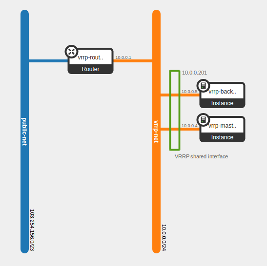

####################################################
Deploying Highly Available instances with Keepalived
####################################################

This tutorial assumes you have installed the OpenStack command line tools and
sourced an openrc file, as explained at :ref:`command-line-interface`. We also
assume that you have uploaded an SSH key, as explained at
:ref:`uploading-an-ssh-key`.

Introduction
============

In this tutorial, you will learn how to deploy a highly available instance pair
using VRRP. This tutorial is largely based on a `blog post`_ by Aaron O'Rosen
with modifications appropriate for the Catalyst Cloud. Networks and names have
been kept largely compatible with the source material. Additional information
about configuring ``allowed_address_pairs`` in Heat was sourced from this
`post`_.

.. _blog post: http://blog.aaronorosen.com/implementing-high-availability-instances-with-neutron-using-vrrp/

.. _post: https://www.hastexo.com/blogs/syed/2014/08/05/orchestrating-highly-available-load-balancers-openstack-heat

You will be using two different methods to set up this stack. Initially you will
use the ``openstack`` command line tool to complete the setup
manually. You will then replicate the manual configuration using a ``heat``
template to instantiate the same stack automatically.

.. note::

  Due to some functionality not yet being available in the ``openstack``
  command line tool, it is still necessary to use the ``neutron`` & ``nova``
  tools for certain operations.

Virtual Router Redundancy Protocol
==================================
`VRRP`_ provides hardware redundancy and automatic failover for routers. It
allows specifying a virtual router which maps to two or more physical routers.
Individual VRRP router instances share an IP address, but at any time, only one
of the instances is the master (active); the other instances are backups and
will not respond using the virtual address. If the master fails, one of the
backups is elected as the new master and will begin to respond on the virtual
address.

Instances use priorities from 1 (lowest) to 255 (highest). Devices running
VRRP dynamically elect master and backup routers based on their respective
priorities. Only the router that is acting as the master sends out VRRP
advertisements at any given point in time. The master router sends
advertisements to backup routers at regular intervals (default is every second).
If a backup router does not receive an advertisement for a set period, the
backup router with the next highest priority takes over as master and begins
forwarding packets.

VRRP instances communicate using packets with multicast IP address 224.0.0.18
and IP protocol number 112. The protocol is defined in `RFC3768`_.

.. _VRRP: https://en.wikipedia.org/wiki/Virtual_Router_Redundancy_Protocol

.. _RFC3768: https://en.wikipedia.org/wiki/Virtual_Router_Redundancy_Protocol

.. note::

 There is an extension to VRRP that uses IPSEC-AH (IP protocol 51) for
 integrity (see http://www.keepalived.org/draft-ietf-vrrp-ipsecah-spec-00.txt).
 This tutorial will demonstrate using standard VRRP. See this `article`_ for
 more information on securing VRRP.

.. _article: http://louwrentius.com/configuring-attacking-and-securing-vrrp-on-linux.html

.. warning::

 A Neutron bug that causes DHCP agents to reject previously held DHCP leases for instances
 after they have been migrated to another node has been discovered. The DHCP agent responds
 with a DHCPNAK message to instances trying to renew their leases after the agent has been
 migrated. The DHCPNAK message forces the instances to release the IP addresses assigned to
 them by the DHCP agent and re-negotiate the DHCP handshake process all over again. A keepalived
 master instance that receives a DHCPNAK message when attempting to renew the lease for the IP
 addresses on its primary interface would release all IP addresses including the virtual IP addresses
 associated with the interface, and this would not be noticed by the keepalived backup instance because
 the failure time is much shorter than the keepalived advertisement interval, thus leaving the virtual
 IP address unmanaged and unattached to any of the keepalived instances until the keepalived daemon
 on the master instance is restarted.

 While we work on getting this bug fixed, we would recommend that users create new keepalived instances
 and update existing keepalived instances to use fixed IP on their interfaces.

Allowed Address Pairs
=====================

Allowed Address Pairs is a Neutron Extension that extends the port attribute to
enable you to specify arbitrary ``mac_address/ip_address(cidr)`` pairs that are
allowed to pass through a port, regardless of the subnet associated with the
network.

Let's double check that this extension is available on the Catalyst Cloud:

.. code-block:: bash

 $ openstack extension list --network -c Name -c Alias
 +-----------------------------------------------+-----------------------+
 | Name                                          | Alias                 |
 +-----------------------------------------------+-----------------------+
 | DNS Integration                               | dns-integration       |
 | Neutron L3 Configurable external gateway mode | ext-gw-mode           |
 | Port Binding                                  | binding               |
 | agent                                         | agent                 |
 | Subnet Allocation                             | subnet_allocation     |
 | L3 Agent Scheduler                            | l3_agent_scheduler    |
 | Neutron external network                      | external-net          |
 | Neutron Service Flavors                       | flavors               |
 | Network MTU                                   | net-mtu               |
 | Quota management support                      | quotas                |
 | HA Router extension                           | l3-ha                 |
 | Provider Network                              | provider              |
 | Multi Provider Network                        | multi-provider        |
 | VPN service                                   | vpnaas                |
 | Neutron Extra Route                           | extraroute            |
 | Neutron Extra DHCP opts                       | extra_dhcp_opt        |
 | Neutron Service Type Management               | service-type          |
 | security-group                                | security-group        |
 | DHCP Agent Scheduler                          | dhcp_agent_scheduler  |
 | RBAC Policies                                 | rbac-policies         |
 | Neutron L3 Router                             | router                |
 | Allowed Address Pairs                         | allowed-address-pairs |
 | Distributed Virtual Router                    | dvr                   |
 +-----------------------------------------------+-----------------------+

As you can see, the Allowed Address Pairs extension is available.

.. _clone-orchestration-repo:

Clone Orchestration Git Repository
==================================

Before you start you should check out the
https://github.com/catalyst/catalystcloud-orchestration git repository. You will
be using some scripts and Heat templates from this repository in this tutorial.

.. code-block:: bash

 $ git clone https://github.com/catalyst/catalystcloud-orchestration.git && ORCHESTRATION_DIR="$(pwd)/catalystcloud-orchestration" && echo $ORCHESTRATION_DIR

Network Setup
=============

First, create a network called ``vrrp-net`` where you can run your highly
available hosts:

.. code-block:: bash

 $ openstack network create vrrp-net
 +-----------------+--------------------------------------+
 | Field           | Value                                |
 +-----------------+--------------------------------------+
 | admin_state_up  | UP                                   |
 | headers         |                                      |
 | id              | 98ec34ba-b25e-4720-ae5e-ab7a87fadc51 |
 | mtu             | 0                                    |
 | name            | vrrp-net                             |
 | project_id      | <PROJECT_ID>                         |
 | router:external | Internal                             |
 | shared          | False                                |
 | status          | ACTIVE                               |
 | subnets         |                                      |
 +-----------------+--------------------------------------+

Next, set up a subnet of the network you have just created. You are going to
do this so you can use part of the ``vrrp-net`` as a dynamically assigned pool
of addresses and reserve the rest of the addresses for manual assignment. In
this case, the pool addresses are in the range 2-200, while the remainder of the
``/24`` will be statically assigned.

.. code-block:: bash

 $ openstack subnet create --network vrrp-net --allocation-pool start=10.0.0.2,end=10.0.0.200 --subnet-range 10.0.0.0/24 vrrp-subnet
 +-------------------+--------------------------------------+
 | Field             | Value                                |
 +-------------------+--------------------------------------+
 | allocation_pools  | 10.0.0.2-10.0.0.200                  |
 | cidr              | 10.0.0.0/24                          |
 | dns_nameservers   |                                      |
 | enable_dhcp       | True                                 |
 | gateway_ip        | 10.0.0.1                             |
 | headers           |                                      |
 | host_routes       |                                      |
 | id                | cd376d6f-42f4-46c2-8988-717b2f642af4 |
 | ip_version        | 4                                    |
 | ipv6_address_mode | None                                 |
 | ipv6_ra_mode      | None                                 |
 | name              | vrrp-subnet                          |
 | network_id        | 98ec34ba-b25e-4720-ae5e-ab7a87fadc51 |
 | project_id        | <PROJECT_ID>                         |
 | subnetpool_id     | None                                 |
 +-------------------+--------------------------------------+

Now you will create a router. You will give this router an interface on your new
subnet and set its gateway as your public network:

.. code-block:: bash

 $ openstack router create vrrp-router
 +-----------------------+--------------------------------------+
 | Field                 | Value                                |
 +-----------------------+--------------------------------------+
 | admin_state_up        | UP                                   |
 | external_gateway_info | null                                 |
 | headers               |                                      |
 | id                    | 78701fa1-e831-4987-a26e-3c24a245294c |
 | name                  | vrrp-router                          |
 | project_id            | <PROJECT_ID>                         |
 | routes                |                                      |
 | status                | ACTIVE                               |
 +-----------------------+--------------------------------------+

 $ openstack router add subnet vrrp-router vrrp-subnet

 $ neutron router-gateway-set vrrp-router public-net
 Set gateway for router vrrp-router

.. note::

 * The previous command uses the old ``neutron`` command rather than the ``openstack`` command as setting router gateways is not yet implemented in the new client.
 * If you look at the ports created at this point using the ``openstack port list -c ID -c 'Fixed IP Addresses'`` command you will notice three interfaces have been created. The IP 10.0.0.1 is the gateway address while 10.0.0.2 and 10.0.0.3 provide DHCP for this network.
 * Note the DNS nameservers, gateway address, subnet mask and allocation pool of the subnet from the ``openstack subnet create`` command.

Next you will create ports with a fixed IP for your new keepalived instances:

To find the correct subnet and network ID use the following commands

.. code-block:: bash

 $ VRRP_SUBNET_ID=$( openstack subnet show vrrp-subnet -f value -c id ) && echo $VRRP_SUBNET_ID
 cd376d6f-42f4-46c2-8988-717b2f642af4

 $ VRRP_NET_ID=$( openstack network show vrrp-net -f value -c id ) && echo $VRRP_NET_ID
 98ec34ba-b25e-4720-ae5e-ab7a87fadc51

Then create the ports with your preferred IP addresses

.. code-block:: bash

 $ openstack port create --fixed-ip subnet=$VRRP_SUBNET_ID,ip-address=10.0.0.4 --network $VRRP_NET_ID vrrp_master_server_port

 $ openstack port create --fixed-ip subnet=$VRRP_SUBNET_ID,ip-address=10.0.0.5 --network $VRRP_NET_ID vrrp_backup_server_port

Security Group Setup
====================

Now create the ``vrrp-sec-group`` security group with rules to
allow HTTP, SSH and ICMP ingress:

.. code-block:: bash

 $ openstack security group create --description 'VRRP security group' vrrp-sec-group
 +-------------+---------------------------------------------------------------------------------+
 | Field       | Value                                                                           |
 +-------------+---------------------------------------------------------------------------------+
 | description | VRRP security group                                                             |
 | headers     |                                                                                 |
 | id          | f981cd9a-14fe-4aff-bccf-a60957a32023                                            |
 | name        | vrrp-sec-group                                                                  |
 | project_id  | <PROJECT_ID>                                                                    |
 | rules       | direction='egress', ethertype='IPv4', id='8aa56d18-4b41-4d4a-9cf4-1c2ca0ce2f4e' |
 |             | direction='egress', ethertype='IPv6', id='bc6ab597-e58f-405c-9b2a-685be0091d26' |
 +-------------+---------------------------------------------------------------------------------+

 $ openstack security group rule create --ingress --protocol icmp vrrp-sec-group
 +-------------------+--------------------------------------+
 | Field             | Value                                |
 +-------------------+--------------------------------------+
 | direction         | ingress                              |
 | ethertype         | IPv4                                 |
 | headers           |                                      |
 | id                | 269fe470-9d8c-40d8-ba4a-5261a4ff757a |
 | port_range_max    | None                                 |
 | port_range_min    | None                                 |
 | project_id        | <PROJECT_ID>                         |
 | protocol          | icmp                                 |
 | remote_group_id   | None                                 |
 | remote_ip_prefix  | 0.0.0.0/0                            |
 | security_group_id | f981cd9a-14fe-4aff-bccf-a60957a32023 |
 +-------------------+--------------------------------------+

 $ openstack security group rule create --ingress --protocol tcp --dst-port 80 vrrp-sec-group
 +-------------------+--------------------------------------+
 | Field             | Value                                |
 +-------------------+--------------------------------------+
 | direction         | ingress                              |
 | ethertype         | IPv4                                 |
 | headers           |                                      |
 | id                | 15e64147-1ed1-41f3-8dc1-a827877f726e |
 | port_range_max    | 80                                   |
 | port_range_min    | 80                                   |
 | project_id        | <PROJECT_ID>                         |
 | protocol          | tcp                                  |
 | remote_group_id   | None                                 |
 | remote_ip_prefix  | 0.0.0.0/0                            |
 | security_group_id | f981cd9a-14fe-4aff-bccf-a60957a32023 |
 +-------------------+--------------------------------------+

 $ openstack security group rule create --ingress --protocol tcp --dst-port 22 vrrp-sec-group
 +-------------------+--------------------------------------+
 | Field             | Value                                |
 +-------------------+--------------------------------------+
 | direction         | ingress                              |
 | ethertype         | IPv4                                 |
 | headers           |                                      |
 | id                | fb2a36d9-bb6e-4c73-b86f-0a45728e6872 |
 | port_range_max    | 22                                   |
 | port_range_min    | 22                                   |
 | project_id        | <PROJECT_ID>                         |
 | protocol          | tcp                                  |
 | remote_group_id   | None                                 |
 | remote_ip_prefix  | 0.0.0.0/0                            |
 | security_group_id | f981cd9a-14fe-4aff-bccf-a60957a32023 |
 +-------------------+--------------------------------------+

Next you will add a rule to allow your Keepalived instances to communicate with
each other via VRRP broadcasts:

.. code-block:: bash

 $ openstack security group rule create --protocol 112 --src-group vrrp-sec-group vrrp-sec-group
 +-------------------+--------------------------------------+
 | Field             | Value                                |
 +-------------------+--------------------------------------+
 | direction         | ingress                              |
 | ethertype         | IPv4                                 |
 | headers           |                                      |
 | id                | 3645d670-9cb5-4194-8352-16c5304f1e19 |
 | port_range_max    | None                                 |
 | port_range_min    | None                                 |
 | project_id        | <PROJECT_ID>                         |
 | protocol          | 112                                  |
 | remote_group_id   | f981cd9a-14fe-4aff-bccf-a60957a32023 |
 | remote_ip_prefix  | None                                 |
 | security_group_id | f981cd9a-14fe-4aff-bccf-a60957a32023 |
 +-------------------+--------------------------------------+

Instance Creation
=================

The next step is to boot two instances where you will run Keepalived and Apache.
You will be using the Ubuntu 14.04 image and ``c1.c1r1`` flavour. You will assign
these instances to the ``vrrp-sec-group`` security group. You will also provide
the name of your SSH key so you can log in to these machines via SSH once they are
created:

.. note::
 You will need to substitute the name of your SSH key.

To find the correct IDs you can use the following commands:

.. code-block:: bash

 $ VRRP_IMAGE_ID=$( openstack image show ubuntu-14.04-x86_64 -f value -c id ) && echo $VRRP_IMAGE_ID
 cab9f3f4-a3a5-488b-885e-892873c15f53

 $ VRRP_FLAVOR_ID=$( openstack flavor show c1.c1r1 -f value -c id ) && echo $VRRP_FLAVOR_ID
 28153197-6690-4485-9dbc-fc24489b0683

 $ VRRP_NET_ID=$( openstack network show vrrp-net -f value -c id ) && echo $VRRP_NET_ID
 98ec34ba-b25e-4720-ae5e-ab7a87fadc51

 $ VRRP_MASTER_PORT=$(openstack port show vrrp_master_server_port -f value -c id) && echo $VRRP_MASTER_PORT
 8f1997e4-fd12-41df-9fb9-d4605e5157d8

 $ VRRP_BACKUP_PORT=$(openstack port show vrrp_backup_server_port -f value -c id) && echo $VRRP_BACKUP_PORT
 1736183d-8beb-4131-bb60-eb447bcb18f4

 $ openstack keypair list
 +------------------+-------------------------------------------------+
 | Name             | Fingerprint                                     |
 +------------------+-------------------------------------------------+
 | vrrp-demo-key    | <SSH_KEY_FINGERPRINT>                           |
 +------------------+-------------------------------------------------+

You will be passing a script to our instance boot command using the
``--user-data`` flag. This script sets up Keepalived and Apache on your master
and backup instances. This saves you from having to execute these commands manually.
This script is located in the git repository you cloned previously at
:ref:`clone-orchestration-repo`.

.. code-block:: bash

 $ cat "$ORCHESTRATION_DIR/hot/ubuntu-14.04/vrrp-basic/vrrp-setup.sh"
 #!/bin/bash

 HOSTNAME=$(hostname)

 if [ "$HOSTNAME" == "vrrp-master" ]; then
     KEEPALIVED_STATE='MASTER'
     KEEPALIVED_PRIORITY=100
 elif [ "$HOSTNAME" == "vrrp-backup" ]; then
     KEEPALIVED_STATE='BACKUP'
     KEEPALIVED_PRIORITY=50
 else
     echo "invalid hostname $HOSTNAME for install script $0";
     exit 1;
 fi

 IP=$(ip addr | grep inet | grep eth0 | grep -v secondary | awk '{ print $2 }' | awk -F'/' '{ print $1 }')

 echo "$IP $HOSTNAME" >> /etc/hosts

 apt-get update
 apt-get -y install keepalived

 echo "auto eth0
       iface eth0 inet static
          address $IP
          netmask 255.255.255.0
          broadcast 10.0.0.255
          gateway   10.0.0.1 " > /etc/network/interfaces.d/eth0.cfg

 apt-get -y --purge remove resolvconf

 echo "nameserver 202.78.247.197
       nameserver 202.78.247.198
       nameserver 202.78.247.199
       search openstacklocal" > /etc/resolv.conf

 service networking reload

 echo "vrrp_instance vrrp_group_1 {
     state $KEEPALIVED_STATE
     interface eth0
     virtual_router_id 1
     priority $KEEPALIVED_PRIORITY
     authentication {
         auth_type PASS
         auth_pass password
     }
     virtual_ipaddress {
         10.0.0.201/24 brd 10.0.0.255 dev eth0
     }
 }" > /etc/keepalived/keepalived.conf

 apt-get -y install apache2
 echo "$HOSTNAME" > /var/www/html/index.html
 service keepalived restart

Run the boot command (you will need to substitute your SSH key name and
path to the ``vrrp-setup.sh`` script):

.. code-block:: bash

 $ openstack server create --image $VRRP_IMAGE_ID --flavor $VRRP_FLAVOR_ID --nic port-id=$VRRP_MASTER_PORT \
 --security-group vrrp-sec-group --user-data vrrp-setup.sh --key-name vrrp-demo-key vrrp-master
 +--------------------------------------+------------------------------------------------------------+
 | Field                                | Value                                                      |
 +--------------------------------------+------------------------------------------------------------+
 | OS-DCF:diskConfig                    | MANUAL                                                     |
 | OS-EXT-AZ:availability_zone          |                                                            |
 | OS-EXT-STS:power_state               | NOSTATE                                                    |
 | OS-EXT-STS:task_state                | scheduling                                                 |
 | OS-EXT-STS:vm_state                  | building                                                   |
 | OS-SRV-USG:launched_at               | None                                                       |
 | OS-SRV-USG:terminated_at             | None                                                       |
 | accessIPv4                           |                                                            |
 | accessIPv6                           |                                                            |
 | addresses                            |                                                            |
 | adminPass                            | <ADMIN_PASSWD>                                             |
 | config_drive                         |                                                            |
 | created                              | 2016-09-08T03:39:09Z                                       |
 | flavor                               | c1.c1r1 (28153197-6690-4485-9dbc-fc24489b0683)             |
 | hostId                               |                                                            |
 | id                                   | <INSTANCE_ID>                                              |
 | image                                | ubuntu-14.04-x86_64 (cab9f3f4-a3a5-488b-885e-892873c15f53) |
 | key_name                             | vrrp-demo-key                                              |
 | name                                 | vrrp-master                                                |
 | os-extended-volumes:volumes_attached | []                                                         |
 | progress                             | 0                                                          |
 | project_id                           | <PROJECT_ID>                                               |
 | properties                           |                                                            |
 | security_groups                      | [{u'name': u'vrrp-sec-group'}]                             |
 | status                               | BUILD                                                      |
 | updated                              | 2016-09-08T03:39:10Z                                       |
 | user_id                              | <USER_ID>                                                  |
 +--------------------------------------+------------------------------------------------------------+

 $ openstack server create --image $VRRP_IMAGE_ID --flavor $VRRP_FLAVOR_ID --nic port-id=$VRRP_BACKUP_PORT \
 --security-group vrrp-sec-group --user-data vrrp-setup.sh --key-name vrrp-demo-key vrrp-backup

Check the instances have been created:

.. code-block:: bash

 $ openstack server list
 +---------------------------------+-------------------------+---------+---------------------------------+------------------------------+
 | ID                              | Name                    | Status  | Networks                        | Image Name                   |
 +---------------------------------+-------------------------+---------+---------------------------------+------------------------------+
 | d920fa78-a463-4e17-90de-        | vrrp-backup             | ACTIVE  | vrrp-net=10.0.0.4               | ubuntu-14.04-x86_64          |
 | d3167b97a4a3                    |                         |         |                                 |                              |
 | ffebb72c-                       | vrrp-master             | ACTIVE  | vrrp-net=10.0.0.5               | ubuntu-14.04-x86_64          |
 | 54f7-4a25-a8a9-d164259f8fa5     |                         |         |                                 |                              |
 +---------------------------------+-------------------------+---------+---------------------------------+------------------------------+

Virtual Address Setup
=====================

The next step is to create the IP address that will be used by your virtual
router:

.. code-block:: bash

 $ openstack port create --network vrrp-net --fixed-ip ip-address=10.0.0.201 vrrp-port
 +-----------------------+---------------------------------------------------------------------------------------------+
 | Field                 | Value                                                                                       |
 +-----------------------+---------------------------------------------------------------------------------------------+
 | admin_state_up        | UP                                                                                          |
 | allowed_address_pairs |                                                                                             |
 | binding_vnic_type     | normal                                                                                      |
 | device_id             |                                                                                             |
 | device_owner          |                                                                                             |
 | dns_assignment        | fqdn='host-10-0-0-201.openstacklocal.', hostname='host-10-0-0-201', ip_address='10.0.0.201' |
 | dns_name              |                                                                                             |
 | fixed_ips             | ip_address='10.0.0.201', subnet_id='cd376d6f-42f4-46c2-8988-717b2f642af4'                   |
 | headers               |                                                                                             |
 | id                    | aa70e5e7-0dcb-4de2-8ccc-033b1851fa01                                                        |
 | mac_address           | fa:16:3e:36:8e:f2                                                                           |
 | name                  | vrrp-port                                                                                   |
 | network_id            | 98ec34ba-b25e-4720-ae5e-ab7a87fadc51                                                        |
 | project_id            | <PROJECT_ID>                                                                                |
 | security_groups       | 87426623-b895-4fa8-bf1b-b3ea6f074328                                                        |
 | status                | DOWN                                                                                        |
 +-----------------------+---------------------------------------------------------------------------------------------+

Now you need to create a floating IP and point it to your virtual router IP using
its port ID:

.. code-block:: bash

 $ VRRP_VR_PORT_ID=$(openstack port list | grep 10.0.0.201 | awk '{ print $2 }') && echo $VRRP_VR_PORT_ID

 $ openstack floating ip create --port $VRRP_VR_PORT_ID public-net
 +---------------------+--------------------------------------+
 | Field               | Value                                |
 +---------------------+--------------------------------------+
 | fixed_ip_address    | 10.0.0.201                           |
 | floating_ip_address | 150.242.40.101                       |
 | floating_network_id | 849ab1e9-7ac5-4618-8801-e6176fbbcf30 |
 | headers             |                                      |
 | id                  | a4209b06-74f5-4ea8-91c0-832ff75aa612 |
 | port_id             | deb027b4-0c3a-4c9e-a5e3-282313e1cb3c |
 | project_id          | <PROJECT_ID>                         |
 | router_id           | f14dfd59-0bb4-4bc2-b01b-c808d33bc775 |
 | status              | DOWN                                 |
 +---------------------+--------------------------------------+

Next, you update the ports associated with each instance to allow the virtual
router IP as an ``allowed-address-pair``. This will allow them to send traffic
using this address.

.. code-block:: bash

 $ VRRP_MASTER_PORT=$(openstack port list | grep '10.0.0.4' | awk '{ print $2 }') && echo $VRRP_MASTER_PORT
 8f1997e4-fd12-41df-9fb9-d4605e5157d8

 $ VRRP_BACKUP_PORT=$(openstack port list | grep '10.0.0.5' | awk '{ print $2 }') && echo $VRRP_BACKUP_PORT
 1736183d-8beb-4131-bb60-eb447bcb18f4

 $ neutron port-update $VRRP_MASTER_PORT --allowed_address_pairs list=true type=dict ip_address=10.0.0.201
 Updated port: 8f1997e4-fd12-41df-9fb9-d4605e5157d8

 $ neutron port-update $VRRP_BACKUP_PORT --allowed_address_pairs list=true type=dict ip_address=10.0.0.201
 Updated port: 1736183d-8beb-4131-bb60-eb447bcb18f4

Check that the virtual router address is associated with this port under
``allowed_address_pairs``:

.. code-block:: bash

 $ openstack port show $VRRP_MASTER_PORT
 +-----------------------+---------------------------------------------------------------------------------+
 | Field                 | Value                                                                           |
 +-----------------------+---------------------------------------------------------------------------------+
 | admin_state_up        | True                                                                            |
 | allowed_address_pairs | {"ip_address": "10.0.0.201", "mac_address": "fa:16:3e:f7:af:bf"}                |
 | binding:vnic_type     | normal                                                                          |
 | device_id             | ebd4b72f-6fcf-4e1d-ad7d-507b944f86df                                            |
 | device_owner          | compute:nz-por-1a                                                               |
 | extra_dhcp_opts       |                                                                                 |
 | fixed_ips             | {"subnet_id": "7c3ca3d4-70a2-4fdd-be9e-4b6bd1eef537", "ip_address": "10.0.0.4"} |
 | id                    | 8f1997e4-fd12-41df-9fb9-d4605e5157d8                                            |
 | mac_address           | fa:16:3e:f7:af:bf                                                               |
 | name                  |                                                                                 |
 | network_id            | 617ff618-9da6-4c47-ab3f-527fe5413ea8                                            |
 | security_groups       | 3d50882c-c8b8-4c39-9758-390593a5774b                                            |
 | status                | ACTIVE                                                                          |
 | tenant_id             | 0cb6b9b744594a619b0b7340f424858b                                                |
 +-----------------------+---------------------------------------------------------------------------------+

You should now have a stack that looks something like this:

.. _updating-instance:

Updating Existing VRRP Instances To Use Fixed IP
================================================

To update existing VRRP instances to use fixed IP on their interfaces, obtain
the port ID of the instances and update the port:

.. code-block:: bash

 $ VRRP_SUBNET_ID=$( openstack subnet show vrrp-subnet -f value -c id ) && echo $VRRP_SUBNET_ID
 cd376d6f-42f4-46c2-8988-717b2f642af4

 $ VRRP_NET_ID=$( openstack network show vrrp-net -f value -c id ) && echo $VRRP_NET_ID
 98ec34ba-b25e-4720-ae5e-ab7a87fadc51

 $ VRRP_MASTER_ID=$(openstack server list | grep 'vrrp-master' | awk '{print $2}') && echo $VRRP_MASTER_ID
 ffebb72c-54f7-4a25-a8a9-d164259f8fa5

 $ VRRP_MASTER_PORT=$(openstack port list --server $VRRP_MASTER_ID | grep '10.0.0.4' | awk '{print $2}') && echo $VRRP_MASTER_PORT
 8f1997e4-fd12-41df-9fb9-d4605e5157d8

 $ neutron port-update $VRRP_MASTER_PORT --request-format=json --fixed-ips type=dict list=true subnet_id=$VRRP_SUBNET_ID,ip_address=10.0.0.4

 $ VRRP_BACKUP_ID=$(openstack server list | grep 'vrrp-backup' | awk '{print $2}') && echo $VRRP_BACKUP_ID
 d920fa78-a463-4e17-90de-d3167b97a4a3

 $ VRRP_BACKUP_PORT=$(openstack port list --server $VRRP_BACKUP_ID | grep '10.0.0.5' | awk '{print $2}') && echo $VRRP_BACKUP_PORT

 $ neutron port-update $VRRP_BACKUP_PORT --request-format=json --fixed-ips type=dict list=true subnet_id=$VRRP_SUBNET_ID,ip_address=10.0.0.5

Then log in to the instances and edit their network interfaces and resolv.conf files:

.. code-block:: bash

 $ sudo vi /etc/network/interfaces.d/eth0.cfg
 auto eth0
 iface eth0 inet static
    address 10.0.0.4
    netmask 255.255.255.0
    broadcast 10.0.0.255
    gateway  10.0.0.1

 $ sudo apt-get -y --purge remove resolvconf

 $ sudo vi /etc/resolv.conf
 nameserver 202.78.247.197
 nameserver 202.78.247.198
 nameserver 202.78.247.199
 search openstacklocal

 $ sudo service networking reload

.. _vrrp-testing:

VRRP Testing
============

You should now have a working VRRP setup, so try it out! You should be able
to curl the floating IP associated with your virtual router:

.. code-block:: bash

 $ VRRP_FLOATING_IP=$(openstack floating ip list | grep 10.0.0.201 | awk '{ print $4 }') && echo $VRRP_FLOATING_IP
 150.242.40.121
 $ curl $VRRP_FLOATING_IP
 vrrp-master

As you can see, you are hitting the master instance. Take down the port the
virtual router address is configured on on the master to test that you failover
to the backup:

.. code-block:: bash

 $ os port set $VRRP_MASTER_PORT --disable

Curl again:

.. code-block:: bash

 $ curl $VRRP_FLOATING_IP
 vrrp-backup

.. _instance-access:

Instance Access
===============

If you want to take a closer look at what is happening when you switch between
VRRP hosts, you need to SSH to the instances. You won't use the floating IP
associated with your virtual router, as that will be switching between instances,
which will make our SSH client unhappy. Consequently, we will assign a floating
IP to each instance for SSH access.

.. code-block:: bash

 $ openstack floating ip create --port $VRRP_MASTER_PORT public-net
 +---------------------+--------------------------------------+
 | Field               | Value                                |
 +---------------------+--------------------------------------+
 | fixed_ip_address    | 10.0.0.4                             |
 | floating_ip_address | 150.242.42.223                       |
 | floating_network_id | 849ab1e9-7ac5-4618-8801-e6176fbbcf30 |
 | headers             |                                      |
 | id                  | c83a90df-0797-4407-822d-824dc4cbcf01 |
 | port_id             | e4ff861b-eb5f-4ec9-95fb-e6ede74b0ad5 |
 | project_id          | <PROJECT_ID>                         |
 | router_id           | f14dfd59-0bb4-4bc2-b01b-c808d33bc775 |
 | status              | DOWN                                 |
 +---------------------+--------------------------------------+

 $ openstack floating ip create --port $VRRP_BACKUP_PORT public-net
 +---------------------+--------------------------------------+
 | Field               | Value                                |
 +---------------------+--------------------------------------+
 | fixed_ip_address    | 10.0.0.5                             |
 | floating_ip_address | 150.242.42.226                       |
 | floating_network_id | 849ab1e9-7ac5-4618-8801-e6176fbbcf30 |
 | headers             |                                      |
 | id                  | f75bca89-a590-44d0-8a1c-0b5e1c3f18a9 |
 | port_id             | a32870b3-e70b-49e6-882d-d4f5332f181b |
 | project_id          | <PROJECT_ID>                         |
 | router_id           | f14dfd59-0bb4-4bc2-b01b-c808d33bc775 |
 | status              | DOWN                                 |
 +---------------------+--------------------------------------+

Now you can SSH to your instances. You will connect using the default ``ubuntu``
user that is configured on Ubuntu cloud images. You will need to substitute the
correct floating IP address.

You can tail syslog in order to see what keepalived is doing. For example, here
you can see the backup instance switch from backup to master state:

.. code-block:: bash

 $ tail -f /var/log/syslog
 Aug 26 05:17:47 vrrp-backup kernel: [ 4807.732605] IPVS: ipvs loaded.
 Aug 26 05:17:47 vrrp-backup Keepalived_vrrp[2980]: Opening file '/etc/keepalived/keepalived.conf'.
 Aug 26 05:17:47 vrrp-backup Keepalived_vrrp[2980]: Configuration is using : 60109 Bytes
 Aug 26 05:17:47 vrrp-backup Keepalived_healthcheckers[2979]: Opening file '/etc/keepalived/keepalived.conf'.
 Aug 26 05:17:47 vrrp-backup Keepalived_healthcheckers[2979]: Configuration is using : 4408 Bytes
 Aug 26 05:17:47 vrrp-backup Keepalived_vrrp[2980]: Using LinkWatch kernel netlink reflector...
 Aug 26 05:17:47 vrrp-backup Keepalived_vrrp[2980]: VRRP_Instance(vrrp_group_1) Entering BACKUP STATE
 Aug 26 05:17:47 vrrp-backup Keepalived_healthcheckers[2979]: Using LinkWatch kernel netlink reflector...
 Aug 26 05:22:21 vrrp-backup Keepalived_vrrp[2980]: VRRP_Instance(vrrp_group_1) Transition to MASTER STATE
 Aug 26 05:22:22 vrrp-backup Keepalived_vrrp[2980]: VRRP_Instance(vrrp_group_1) Entering MASTER STATE

You can also watch the VRRP traffic on the wire with this command:

.. code-block:: bash

 $ sudo tcpdump -n -i eth0 proto 112
 05:28:23.651795 IP 10.0.0.5 > 224.0.0.18: VRRPv2, Advertisement, vrid 1, prio 50, authtype simple, intvl 1s, length 20
 05:28:24.652909 IP 10.0.0.5 > 224.0.0.18: VRRPv2, Advertisement, vrid 1, prio 50, authtype simple, intvl 1s, length 20

You can see the VRRP advertisements every second.

If you bring the master port back up at this point, you will be able to see the
master node switch from the backup instance to the master instance:

.. code-block:: bash

 $ neutron port-update $VRRP_MASTER_PORT --admin_state_up=True
 Updated port: 8f1997e4-fd12-41df-9fb9-d4605e5157d8

on ``vrrp-backup``:

.. code-block:: bash

 $ sudo tcpdump -n -i eth0 proto 112
 05:30:11.773655 IP 10.0.0.5 > 224.0.0.18: VRRPv2, Advertisement, vrid 1, prio 50, authtype simple, intvl 1s, length 20
 05:30:11.774311 IP 10.0.0.4 > 224.0.0.18: VRRPv2, Advertisement, vrid 1, prio 100, authtype simple, intvl 1s, length 20
 05:30:12.775156 IP 10.0.0.4 > 224.0.0.18: VRRPv2, Advertisement, vrid 1, prio 100, authtype simple, intvl 1s, length 20

At this point you have successfully set up Keepalived with automatic failover
between instances. If this is all that you require for your setup, you can
stop here.

Resource Cleanup
================

At this point many people will want to clean up the OpenStack resources you have
been using in this tutorial. Running the following commands should remove all
networks, routers, ports, security groups and instances. Note that the order
in which you delete resources is important.

.. code-block:: bash

 # delete the instances
 $ openstack server delete vrrp-master
 $ openstack server delete vrrp-backup

 # delete instance ports
 $ for port_id in $(openstack port list | grep 10.0.0 | grep -v 10.0.0.1 | awk '{ print $2 }'); do openstack port delete $port_id; done

 # delete router interface
 $ neutron router-interface-delete vrrp-router $(neutron subnet-list | grep vrrp-subnet | awk '{ print $2 }')
 Removed interface from router vrrp-router.

 # delete router
 $ openstack router delete vrrp-router

 # delete subnet
 $ openstack subnet delete vrrp-subnet

 # delete network
 $ openstack network delete vrrp-net

 # delete security group
 $ neutron security-group-delete vrrp-sec-group

Setup Using Heat Templates
==========================

Up to this point in this tutorial, you have been using the Nova and Neutron
command line clients to set up our system. You have needed to run a large number
of different commands in the right order. It would be nice if you could define
the entire setup in one configuration file and ask OpenStack to create that
setup based on your blueprint.

OpenStack provides just such an orchestration system, known as Heat. In
this section, you will run Heat, in order to recreate with a single command
the stack you previously created manually.

It is beyond the scope of this tutorial to explain the syntax of writing Heat
templates, thus you will make use of a predefined example from the
cloud-orchestration repository. For more information on writing Heat templates
please consult the documentation at :ref:`cloud-orchestration`.

That said, there are a number of parts of the Heat template you should have a
look at in more detail. The template is located in the
``catalystcloud-orchestration`` repository we cloned earlier.

.. code-block:: bash

 $ cat "$ORCHESTRATION_DIR/hot/ubuntu-14.04/vrrp-basic/vrrp.yaml"

The first thing to note is the Security Group rule for VRRP traffic:

.. code-block:: yaml

 - direction: ingress
   protocol: 112
   remote_group_id:
   remote_mode: remote_group_id

Note that the ``remote_mode`` is set to ``remote_group_id`` and
``remote_group_id`` is not set. If no value is set, then the rule uses the
current security group (`heat documentation`_).

.. _heat documentation: http://docs.openstack.org/developer/heat/template_guide/openstack.html#OS::Neutron::SecurityGroup-props

The next code block demonstrates how to configure the port and floating IP that
will be shared between the VRRP instances.

.. code-block:: yaml

 vrrp_shared_port:
   type: OS::Neutron::Port
   properties:
     network_id: { get_resource: private_net }
     fixed_ips:
       - ip_address: { get_param: vrrp_shared_ip }

 vrrp_shared_floating_ip:
   type: OS::Neutron::FloatingIP
   properties:
     floating_network_id: { get_param: public_net_id }
     port_id: { get_resource: vrrp_shared_port }
   depends_on: router_interface

Finally, let's take a look at the Server and Port definition for an instance:

.. code-block:: yaml

 vrrp_master_server:
   type: OS::Nova::Server
   properties:
     name: vrrp-master
     image: { get_param: image }
     flavor: { get_param: servers_flavor }
     key_name: { get_param: key_name }
     user_data_format: RAW
     networks:
       - port: { get_resource: vrrp_master_server_port }
     user_data:
       get_file: vrrp-setup.sh

 vrrp_master_server_port:
   type: OS::Neutron::Port
   properties:
     network_id: { get_resource: private_net }
     allowed_address_pairs:
       - ip_address: { get_param: vrrp_shared_ip }
     fixed_ips:
       - subnet_id: { get_resource: private_subnet }
         ip_address: 10.0.0.4
     security_groups:
        - { get_resource: vrrp_secgroup }

Note the line ``user_data_format: RAW`` in the server properties; this is
required so that cloud init will setup the ``ubuntu`` user correctly (see this
`blog post`__ for details).

__ http://blog.scottlowe.org/2015/04/23/ubuntu-openstack-heat-cloud-init/

The ``allowed_address_pairs`` section associates the shared VRRP address with
the instance port. You are explicitly setting the port IP address to
``10.0.0.4``. This is not required; you are doing it in order to stay consistent
with the manual configuration. If you do not set it, you cannot control which
IPs are assigned to instances and which are assigned for DCHP. If you don't
set these, the assigned addresses will be inconsistent across Heat invocations.

This configuration is mirrored for the backup instance.

Building the VRRP Stack using Heat Templates
============================================

Before we start, check that the template is valid:

.. code-block:: bash

 $ openstack orchestration template validate -t $ORCHESTRATION_DIR/hot/ubuntu-14.04/vrrp-basic/vrrp.yaml

This command will echo the yaml if it succeeds and will return an error if it
does not. Assuming the template validates, build a stack:

.. code-block:: bash

 $ openstack stack create -t $ORCHESTRATION_DIR/hot/ubuntu-14.04/vrrp-basic/vrrp.yaml vrrp-stack
 +---------------------+---------------------------------------------------------------------------------------------------+
 | Field               | Value                                                                                             |
 +---------------------+---------------------------------------------------------------------------------------------------+
 | id                  | d5096a5e-4934-490e-822b-d5831fbf57d5                                                              |
 | stack_name          | vrrp-stack                                                                                        |
 | description         | HOT template for building a Keepalived/Apache VRRP stack in the Catalyst Cloud (nz-por-1) region. |
 |                     |                                                                                                   |
 | creation_time       | 2016-09-18T23:57:33Z                                                                              |
 | updated_time        | None                                                                                              |
 | stack_status        | CREATE_IN_PROGRESS                                                                                |
 | stack_status_reason | Stack CREATE started                                                                              |
 +---------------------+---------------------------------------------------------------------------------------------------+

As you can see the creation is in progress. You can use the ``openstack stack
event list`` or ``openstack stack resource list`` commands to check the
progress of the creation process:

.. code-block:: bash

  $ openstack stack event list vrrp-stack
  2016-09-19 03:20:05Z [vrrp-stack]: CREATE_IN_PROGRESS  Stack CREATE started
  2016-09-19 03:20:06Z [private_net]: CREATE_IN_PROGRESS  state changed
  2016-09-19 03:20:07Z [vrrp_secgroup]: CREATE_IN_PROGRESS  state changed
  2016-09-19 03:20:09Z [router]: CREATE_IN_PROGRESS  state changed
  2016-09-19 03:20:11Z [private_net]: CREATE_COMPLETE  state changed
  2016-09-19 03:20:11Z [vrrp_secgroup]: CREATE_COMPLETE  state changed
  2016-09-19 03:20:11Z [router]: CREATE_COMPLETE  state changed
  2016-09-19 03:20:11Z [private_subnet]: CREATE_IN_PROGRESS  state changed
  2016-09-19 03:20:14Z [private_subnet]: CREATE_COMPLETE  state changed
  2016-09-19 03:20:14Z [vrrp_master_server_port]: CREATE_IN_PROGRESS  state changed
  2016-09-19 03:20:16Z [vrrp_backup_server_port]: CREATE_IN_PROGRESS  state changed
  2016-09-19 03:20:18Z [vrrp_shared_port]: CREATE_IN_PROGRESS  state changed
  2016-09-19 03:20:19Z [router_interface]: CREATE_IN_PROGRESS  state changed
  2016-09-19 03:20:22Z [vrrp_master_server_port]: CREATE_COMPLETE  state changed
  2016-09-19 03:20:22Z [vrrp_backup_server_port]: CREATE_COMPLETE  state changed
  2016-09-19 03:20:22Z [vrrp_shared_port]: CREATE_COMPLETE  state changed
  2016-09-19 03:20:23Z [router_interface]: CREATE_COMPLETE  state changed
  2016-09-19 03:20:24Z [vrrp_master_server_floating_ip]: CREATE_IN_PROGRESS  state changed
  2016-09-19 03:20:25Z [vrrp_backup_server_floating_ip]: CREATE_IN_PROGRESS  state changed
  2016-09-19 03:20:27Z [vrrp_shared_floating_ip]: CREATE_IN_PROGRESS  state changed
  2016-09-19 03:20:28Z [vrrp_master_server]: CREATE_IN_PROGRESS  state changed
  2016-09-19 03:20:31Z [vrrp_master_server_floating_ip]: CREATE_COMPLETE  state changed
  2016-09-19 03:20:31Z [vrrp_backup_server_floating_ip]: CREATE_COMPLETE  state changed
  2016-09-19 03:20:32Z [vrrp_shared_floating_ip]: CREATE_COMPLETE  state changed
  2016-09-19 03:20:43Z [vrrp_master_server]: CREATE_COMPLETE  state changed
  2016-09-19 03:20:44Z [vrrp_backup_server]: CREATE_IN_PROGRESS  state changed
  2016-09-19 03:21:06Z [vrrp_backup_server]: CREATE_COMPLETE  state changed
  2016-09-19 03:21:06Z [vrrp-stack]: CREATE_COMPLETE  Stack CREATE completed successfully

 $ openstack stack resource list -c resource_name -c resource_type -c resource_status  vrrp-stack
 +--------------------------------+------------------------------+-----------------+
 | resource_name                  | resource_type                | resource_status |
 +--------------------------------+------------------------------+-----------------+
 | vrrp_backup_server_port        | OS::Neutron::Port            | CREATE_COMPLETE |
 | vrrp_backup_server_floating_ip | OS::Neutron::FloatingIP      | CREATE_COMPLETE |
 | vrrp_master_server             | OS::Nova::Server             | CREATE_COMPLETE |
 | router_interface               | OS::Neutron::RouterInterface | CREATE_COMPLETE |
 | vrrp_master_server_port        | OS::Neutron::Port            | CREATE_COMPLETE |
 | vrrp_master_server_floating_ip | OS::Neutron::FloatingIP      | CREATE_COMPLETE |
 | vrrp_secgroup                  | OS::Neutron::SecurityGroup   | CREATE_COMPLETE |
 | private_subnet                 | OS::Neutron::Subnet          | CREATE_COMPLETE |
 | private_net                    | OS::Neutron::Net             | CREATE_COMPLETE |
 | router                         | OS::Neutron::Router          | CREATE_COMPLETE |
 | vrrp_backup_server             | OS::Nova::Server             | CREATE_COMPLETE |
 | vrrp_shared_floating_ip        | OS::Neutron::FloatingIP      | CREATE_COMPLETE |
 | vrrp_shared_port               | OS::Neutron::Port            | CREATE_COMPLETE |
 +--------------------------------+------------------------------+-----------------+

If you prefer to create this stack in the Wellington region, you
can modify the appropriate parameters on the command line:

.. code-block:: bash

 $ OS_REGION_NAME=nz_wlg_2
 $ heat stack-create vrrp-stack --template-file $ORCHESTRATION_DIR/hot/ubuntu-14.04/vrrp-basic/vrrp.yaml /
 --parameters "public_net_id=e0ba6b88-5360-492c-9c3d-119948356fd3;private_net_dns_servers=202.78.240.213,202.78.240.214,202.78.240.215"

The ``stack-show`` and ``resource-list`` commands are useful commands for
viewing the state of your stack. Give them a go:

.. code-block:: bash

 $ openstack stack show vrrp-stack
 $ openstack stack resource list vrrp-stack

Once all resources in your stack are in the ``CREATE_COMPLETE`` state, you are
ready to re-run the tests as described under :ref:`vrrp-testing`. The Neutron
``floatingip-list`` command will give you the IP addresses and port IDs you
need:

.. code-block:: bash

 $ openstack floating ip list

If you wish, you can SSH to the master and backup instances as described under
:ref:`instance-access`.

Once satisfied with the configuration, you can clean up and get back to
your original state:

.. code-block:: bash

 $ openstack stack delete vrrp-stack
 Are you sure you want to delete this stack(s) [y/N]? y

This ends the tutorial on setting up hot swap VRRP instances in the Catalyst
Cloud.
