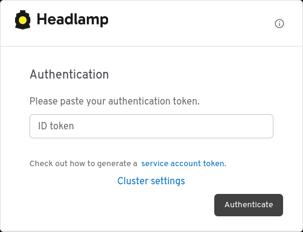
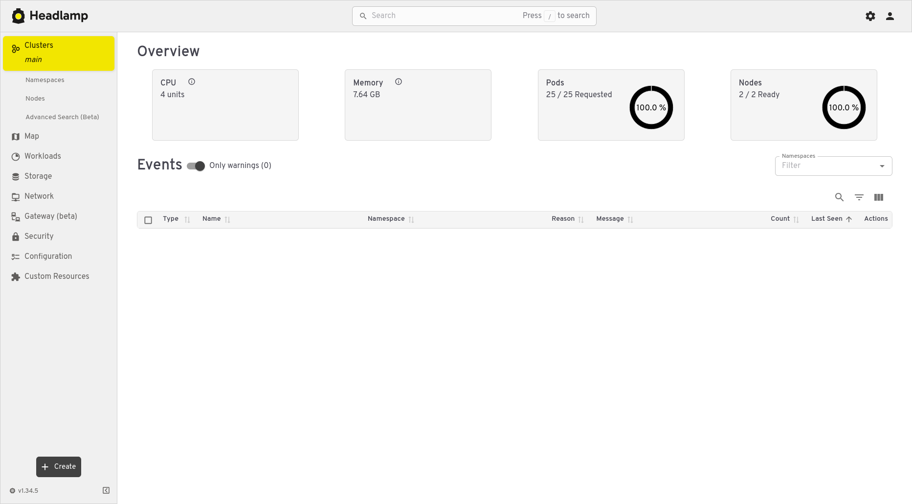
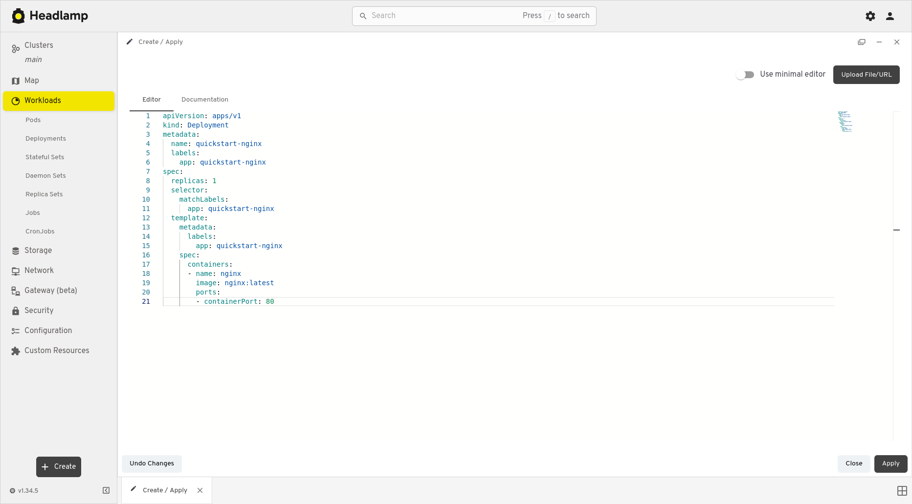
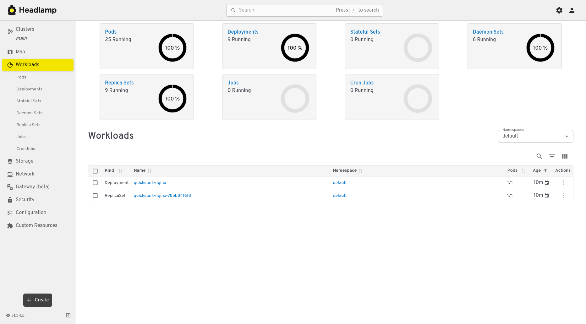
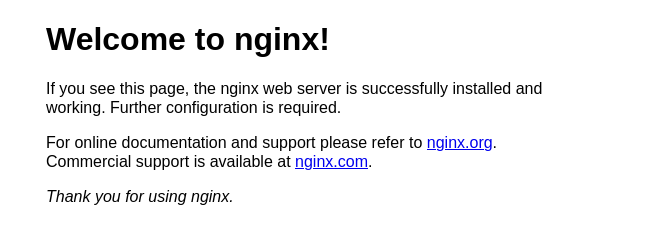

*****************************************
Deploying Headlamp (Kubernetes Dashboard)
*****************************************

`Headlamp`_ is a web user-interface for Kubernetes that replaces Kubernetes Dashboard as an easy way
to deploy and monitor cluster workloads. It can be used as a desktop application (using a local
kubeconfig file), or hosted in-cluster which is the method that will be covered in this tutorial.
You can visit the `Headlamp documentation`_ for more information.

.. _Headlamp: https://headlamp.dev
.. _Headlamp documentation: https://headlamp.dev/docs/latest/

Prerequisites
=============

You will need:

* To be authenticated with Catalyst Cloud by sourcing an OpenRC file in the same project as your
  Kubernetes cluster.
* To have access to your Kubernetes cluster via a kubeconfig file.

Deploying Headlamp with ``kubectl``
===================================

.. tabs::

    .. group-tab:: Linux / macOS

      In the currently open terminal (with your OpenRC file sourced), run the following command
      to fetch the authentication token from the environment, and copy it to the clipboard.

      We will use this once Headlamp is open.

      .. code-block:: bash

        echo $OS_TOKEN

    .. group-tab:: Windows (PowerShell)

      In the currently open terminal (with your OpenRC file sourced), run the following command
      to fetch the authentication token from the environment, and copy it to the clipboard.

      We will use this once Headlamp is open.

      .. code-block:: powershell

        echo $Env:OS_TOKEN

    .. group-tab:: Windows (Command Prompt)

      In the currently open terminal (with your OpenRC file sourced), run the following command
      to fetch the authentication token from the environment, and copy it to the clipboard.

      We will use this once Headlamp is open.

      .. code-block:: bat

        echo %OS_TOKEN%

Then deploy Headlamp using ``kubectl`` following the instructions in Headlamp's documentation page.

.. code-block:: bash

    kubectl apply -f https://raw.githubusercontent.com/kubernetes-sigs/headlamp/main/kubernetes-headlamp.yaml

This will deploy Headlamp to the ``kube-system`` namespace.

Make the service available locally by, once again, invoking ``kubectl``.

.. code-block:: bash

    kubectl port-forward -n kube-system svc/headlamp 8001:80

View the web interface from http://localhost:8001. It may take some time for the service to become
available. Check by refreshing the page periodically.

Once Headlamp is running, you should be presented by a prompt. Paste in the authentication token
acquired in the previous steps.

Click **Authenticate** to login, and you should now have Headlamp open in your browser.

Deploying other applications with Headlamp
==========================================

Let's try creating a deployment for a different application on Kubernetes using Headlamp instead
of ``kubectl``.

First, click the **+ Create** button in the bottom-left corner of the Headlamp dashboard to open the
editor. Paste the following YAML into the editor.

This YAML creates a new deployment called ``quickstart-nginx``, which consists of a single
``nginx`` web server, serving the default test page via HTTP (port 80).

.. code-block:: yaml

    apiVersion: apps/v1
    kind: Deployment
    metadata:
      name: quickstart-nginx
      labels:
        app: quickstart-nginx
    spec:
      replicas: 1
      selector:
        matchLabels:
          app: quickstart-nginx
      template:
        metadata:
          labels:
            app: quickstart-nginx
        spec:
          containers:
          - name: nginx
            image: nginx:latest
            ports:
            - containerPort: 80

The filled-in form should look like this:

Click **Apply** to create the deployment.

You will now be directed back to the Headlamp dashboard. Access **Workloads** from the menu on the
left-hand side of the page where the new deployment will be tracked in real-time. You can restrict
visible namespaces to just 'default' to isolate the ``quickstart-nginx`` resources.

Let's check that our new application is working properly. This application is not accessible from
the internet, so we will need to create a port-forward from the local machine to the application
in the cluster as we have before with Headlamp.

Since the terminal window we have been using is currently running the ``kubectl port-forward``
command for Headlamp, open a new terminal window. Make sure to source your OpenRC file, and set the
``KUBECONFIG`` environment variable (as shown in :ref:`quickstart-configuring-kubectl`).

Then run the following command to create the port-forward to the application:

.. code-block:: bash

    kubectl port-forward deployment/quickstart-nginx 8888:80

This maps port 80 from the application to port 8888 on the local machine.

.. code-block:: console

    $ kubectl port-forward deployment/quickstart-nginx 8888:80

    Forwarding from 127.0.0.1:8888 -> 80
    Forwarding from [::1]:8888 -> 80

You should now be able to open the following URL and access the application:

http://localhost:8888

If the following page is returned, congratuations! Your first deployment on a Catalyst Cloud
Kubernetes cluster is working correctly.

