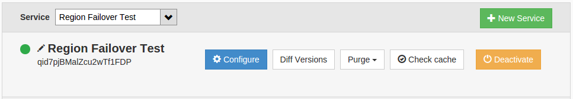
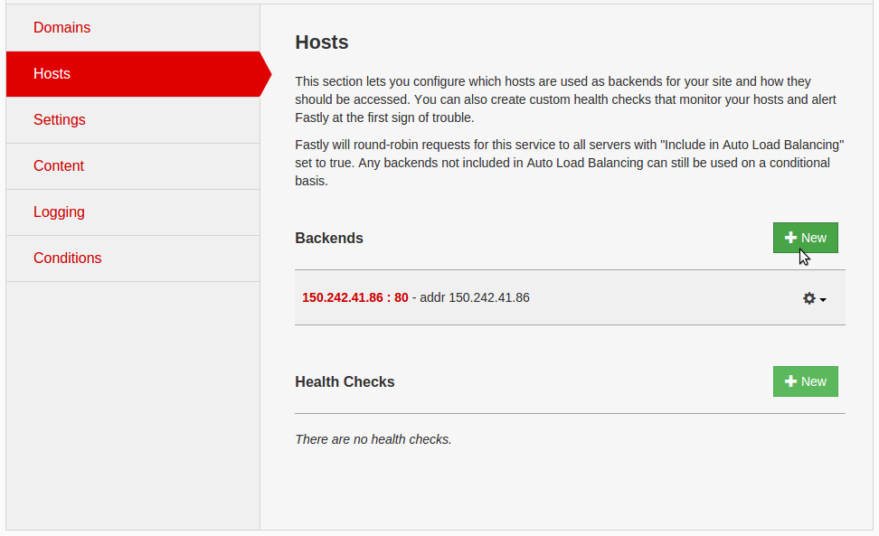
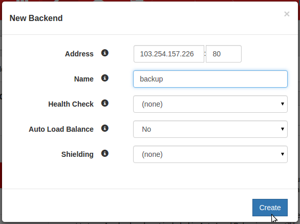
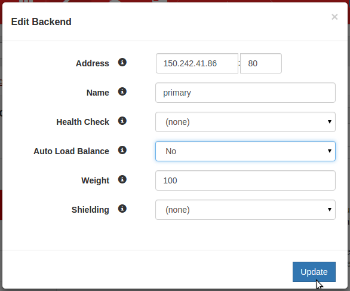
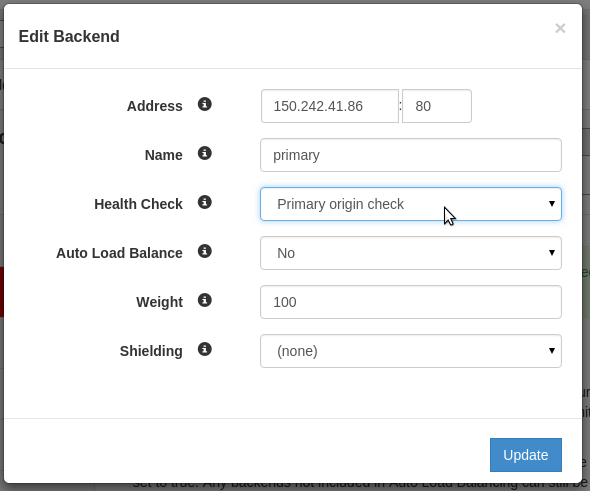
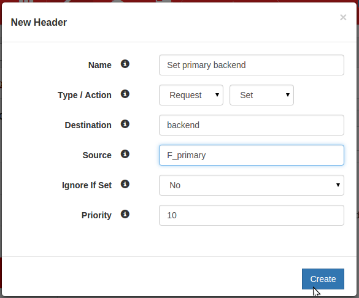

####################################
Region failover using the fastly CDN
####################################

This tutorial assumes you have installed the OpenStack command line tools and
sourced an openrc file, as explained at :ref:`command-line-interface`. You also
need to have uploaded an SSH key called ``nginx-demo-key``, as explained
at :ref:`uploading-an-ssh-key`.

************
Introduction
************

This tutorial demonstrates how to set up automatic failover for a website that
is hosted in two different Catalyst Cloud regions. In order to achieve
automatic failover, two components are required:

- Monitoring of the origin servers so you can decide when you need to switch
  from the primary to the backup
- A mechanism to redirect traffic from the primary to the backup origin server

These components can be decoupled; they do not need to be provided by the same
system.

Monitoring usually comprises a health check that ensures the site is responding
to HTTP requests. A health check will usually have a threshold for the number
of failed requests that must occur in order for the service to be considered
down.

There are many mechanisms for redirecting traffic to alternative origin servers
based on availability. The main ones are:

- DNS redirection
- Redirect via a proxy
- Network redirection

DNS based traffic redirection is a very common method that is relatively easy
to set up. It is a generally effective method for traffic redirection, however
it is not atomic and suffers from a lag due to DNS propagation. Even with low
TTLs (e.g. 300 sec) it can take more than 15 minutes before greater than 90% of
traffic has switched. In many cases, a small volume of traffic will continue to
be directed to the primary address 24 hours after switching. These issues are
often caused by poorly implemented DNS services on CPE routers and to a lesser
extent ISP and Operating System resolvers.

Proxy redirection is an effective method that avoids the lag present with DNS
based solutions. With this method the frontend address that the client connects
to does not change; the redirection is achieved by the HTTP proxy. `Anycast`_
is sometimes used in these solutions in order to provide a single static
frontend address while providing a geographically diverse set of POPs.

.. _Anycast: https://en.wikipedia.org/wiki/Anycast

The third common method is to rely on a network protocol like `BGP`_ to
achieve failover to the backup origin server when the primary origin server
becomes unavailable. This is achieved at the network layer such that traffic is
directed to the router in front of the backup origin, when the router in front
of the primary origin server becomes unavailable. This configuration is not
trivial and requires you to have control of your own `ASN`_.

.. _BGP: https://en.wikipedia.org/wiki/Border_Gateway_Protocol

.. _ASN: https://en.wikipedia.org/wiki/Autonomous_system_%28Internet%29

This tutorial describes using a proxy redirection service. If you are
interested in DNS based failover options, there are a number of providers who
provide combined monitoring and automated failover:

- http://totaluptime.com/solutions/cloud-dns/cloud-dns-failover/
- http://dyn.com/managed-dns/active-failover/
- https://docs.aws.amazon.com/Route53/latest/DeveloperGuide/dns-failover.html
- http://www.dnsmadeeasy.com/services/dnsfailover/
- https://www.zoneedit.com/failover.html

**********
Fastly CDN
**********

This tutorial demonstrates how you can use the `Fastly`_ CDN service to provide
automatic failover between Catalyst Cloud regions.

.. _Fastly: https://www.fastly.com/

Fastly is a `content delivery network`_ (CDN) that provides `many points of
presence`_ (POPs) globally. Fastly has good coverage in Australasia with two
POPs in New Zealand (Auckland and Wellington). Fastly POPs act as a cache that
sits between your origin servers and the end users of the site. All end user
traffic is served by Fastly POPs; the POP will respond to an end user with
either cached content or content fetched from an origin server, depending on
the caching rules set by the origin servers.

.. _content delivery network: https://en.wikipedia.org/wiki/Content_delivery_network

.. _many points of presence: https://www.fastly.com/network

Please consult Fastly's `getting started guide`_ and `documentation`_ for more
in depth coverage of how their service works.

.. _getting started guide: https://docs.fastly.com/guides/basic-setup/getting-started-with-fastly

.. _documentation: https://docs.fastly.com/guides/about-fastly-services/how-fastlys-cdn-service-works

Fastly has a number of features that make it useful for us:

- Fastly has POPs in New Zealand
- Fastly's POPs are Anycasted meaning that you avoid DNS propagation issues as
  the IP address and domain name remain static for clients
- Fastly provides a global network of Anycasted POPs that provides good
  resiliency and availability at the CDN layer
- Fastly provides an origin health check and failover feature. There are not
  many other CDN providers who provide both the required services as a single
  solution
- Fastly does origin health checks and failover per POP which provides the best
  failover behaviour. Only POPs that cannot reach the primary origin will
  failover
- Anycast solutions like that provided by Fastly are effective DDoS
  mitigation tools that shield the origin servers from direct attack
- Fastly's global network of POPs will improve site performance for users
  particularly those outside of New Zealand
- You can prototype the solution without any financial outlay

Disadvantages of this solution include:

- Increased complexity for your site
- Increased cost for your site (although this will be offset by lower bandwidth
  usage on the Catalyst Cloud)
- Requires entering into a commercial relationship with an additional company
- Your site content is cached outside of New Zealand (this is also a positive)

*************
Website setup
*************

Now that you understand what you are trying to achieve here, your first task is
to set up your website in both regions. You are going to configure a simple
Nginx webserver to serve the default Nginx web page. As this tutorial is not
focused on how to set up web servers, you will configure the required stacks
using the Heat cloud orchestration system.

It is beyond the scope of this tutorial to explain the syntax of writing Heat
templates, thus you will make use of a predefined example from the
`catalystcloud-orchestration`_ git repository. For more information on writing
Heat templates, please consult the documentation at :ref:`cloud-orchestration`.

First, check out the catalystcloud-orchestration repository, which includes the
Heat templates you will be using:

.. _catalystcloud-orchestration: https://github.com/catalyst/catalystcloud-orchestration

.. code-block:: bash

 $ git clone https://github.com/catalyst/catalystcloud-orchestration.git && ORCHESTRATION_DIR="$(pwd)/catalystcloud-orchestration" && echo $ORCHESTRATION_DIR

.. note::

 This heat template references an SSH key called ``nginx-demo-key``. You will need to change this to a key that already exists or upload a key with this name. This key needs to exist in both regions.

************************************************************
Building the Nginx Stack in two regions using Heat templates
************************************************************

In order to demonstrate region failover, you need to be running the service we
wish to failover in both regions. To achieve this, you will build two simple
stacks running an Nginx webserver.

Before you start, check that the template is valid:

.. code-block:: bash

 $ heat template-validate -f $ORCHESTRATION_DIR/hot/ubuntu-14.04/nginx-region-instance/nginx.yaml

This command will echo the yaml if it succeeds and will return an error if it
does not. Assuming the template validates, the next step is to build a stack.

Heat templates cannot be used to build a stack in more than one region
simultaneously, so you will build a stack in each region individually. This
Heat template is configured for the Porirua region, so start there:

.. code-block:: bash

 $ heat stack-create nginx-por-stack --template-file $ORCHESTRATION_DIR/hot/ubuntu-14.04/nginx-region-instance/nginx.yaml
 +--------------------------------------+-----------------+--------------------+----------------------+
 | id                                   | stack_name      | stack_status       | creation_time        |
 +--------------------------------------+-----------------+--------------------+----------------------+
 | 18d3a376-ac33-4740-a2d3-19879f4807af | nginx-por-stack | CREATE_IN_PROGRESS | 2015-11-12T20:19:42Z |
 +--------------------------------------+-----------------+--------------------+----------------------+

As you can see, the creation is in progress. You can use the ``event-list``
command to check the progress of the creation process:

.. code-block:: bash

 $ heat event-list nginx-por-stack

Check the output of stack show:

.. code-block:: bash

 $ heat stack-show nginx-por-stack
 +----------------------+--------------------------------------------------------------------------------------------------------------------------------------------+
 | Property             | Value                                                                                                                                      |
 +----------------------+--------------------------------------------------------------------------------------------------------------------------------------------+
 | capabilities         | []                                                                                                                                         |
 | creation_time        | 2015-11-12T20:54:53Z                                                                                                                       |
 | description          | HOT template for building a simple nginx stack in the                                                                                      |
 |                      | Catalyst Cloud nz-por-1 region.                                                                                                            |
 | disable_rollback     | True                                                                                                                                       |
 | id                   | 13ad022c-cbd3-4211-984c-6a7a95f1c935                                                                                                       |
 | links                | https://api.nz-por-1.catalystcloud.io:8004/v1/0cb6b9b744594a619b0b7340f424858b/stacks/nginx-por-stack/13ad022c-cbd3-4211-984c-6a7a95f1c935 |
 | notification_topics  | []                                                                                                                                         |
 | outputs              | []                                                                                                                                         |
 | parameters           | {                                                                                                                                          |
 |                      |   "nginx_secgroup_name": "nginx-sec-group",                                                                                                |
 |                      |   "OS::stack_name": "nginx-por-stack",                                                                                                     |
 |                      |   "private_net_cidr": "10.10.0.0/24",                                                                                                      |
 |                      |   "private_subnet_name": "nginx-subnet",                                                                                                   |
 |                      |   "key_name": "nginx-demo-key",                                                                                                            |
 |                      |   "image": "ubuntu-14.04-x86_64",                                                                                                          |
 |                      |   "private_net_pool_end": "10.10.0.200",                                                                                                   |
 |                      |   "domain_name": "localdomain",                                                                                                            |
 |                      |   "OS::stack_id": "13ad022c-cbd3-4211-984c-6a7a95f1c935",                                                                                  |
 |                      |   "private_net_gateway": "10.10.0.1",                                                                                                      |
 |                      |   "public_net": "public-net",                                                                                                              |
 |                      |   "public_net_id": "849ab1e9-7ac5-4618-8801-e6176fbbcf30",                                                                                 |
 |                      |   "private_net_pool_start": "10.10.0.2",                                                                                                   |
 |                      |   "private_net_dns_servers": "202.78.247.197,202.78.247.198,202.78.247.199",                                                               |
 |                      |   "private_net_name": "nginx-net",                                                                                                         |
 |                      |   "router_name": "nginx-router",                                                                                                           |
 |                      |   "servers_flavor": "c1.c1r1",                                                                                                             |
 |                      |   "host_name": "primary"                                                                                                                   |
 |                      | }                                                                                                                                          |
 | parent               | None                                                                                                                                       |
 | stack_name           | nginx-por-stack                                                                                                                            |
 | stack_owner          | your@email.net.nz                                                                                                                          |
 | stack_status         | CREATE_COMPLETE                                                                                                                            |
 | stack_status_reason  | Stack CREATE completed successfully                                                                                                        |
 | template_description | HOT template for building a simple nginx stack in the                                                                                      |
 |                      | Catalyst Cloud nz-por-1 region.                                                                                                            |
 | timeout_mins         | 60                                                                                                                                         |
 | updated_time         | None                                                                                                                                       |
 +----------------------+--------------------------------------------------------------------------------------------------------------------------------------------+

Once your stack status is ``CREATE_COMPLETE`` you can proceed to build your
Wellington region stack. To build the Wellington region stack, you will
use the same template while overriding a number of parameters. You also need to
change your ``OS_REGION_NAME`` environment variable to point at the Wellington
region:

.. code-block:: bash

 $ OS_REGION_NAME=nz_wlg_2
 $ heat stack-create nginx-wlg-stack --template-file $ORCHESTRATION_DIR/hot/ubuntu-14.04/nginx-region-instance/nginx.yaml \
   --parameters "public_net_id=e0ba6b88-5360-492c-9c3d-119948356fd3;private_net_dns_servers=202.78.240.213,202.78.240.214,202.78.240.215;host_name=backup"

Consult the output of the ``stack-show`` and ``resource-list`` commands to
view the state of your stack:

.. code-block:: bash

 $ heat stack-show nginx-wlg-stack
 $ heat resource-list nginx-wlg-stack

You should now have a stack in each region which comprises an Nginx webserver
serving identical content. When you begin to test region failover, you will
want to be able to see which region you are hitting. To help you do this, a
clound-init script was added to the Heat template you ran previously. This
script adds an ``Origin`` header to your Nginx configuration which you can use
to see which region you are accessing.

In addition to adding an Origin header, you are also adding a ``Cache-Control``
header that tells the Varnish service on Fastly's POPs to not cache your
content. This will let you observe the failover behaviour without needing to be
aware of caching or waiting for the cached version of pages to expire.

Test this now:

.. code-block:: bash

 $ PRIMARY_IP=$( OS_REGION_NAME=nz-por-1 nova show --minimal primary | grep network | awk '{print $(NF-1)}' )
 $ curl -I -s $PRIMARY_IP
 HTTP/1.1 200 OK
 Server: nginx/1.4.6 (Ubuntu)
 Date: Mon, 30 Nov 2015 02:57:12 GMT
 Content-Type: text/html
 Content-Length: 612
 Last-Modified: Tue, 04 Mar 2014 11:46:45 GMT
 Connection: keep-alive
 ETag: "5315bd25-264"
 Origin: primary
 Cache-Control: max-age=0, no-store
 Accept-Ranges: bytes

 $ BACKUP_IP=$( OS_REGION_NAME=nz_wlg_2 nova show --minimal backup | grep network | awk '{print $(NF-1)}' )
 $ curl -I -s $BACKUP_IP
 HTTP/1.1 200 OK
 Server: nginx/1.4.6 (Ubuntu)
 Date: Mon, 30 Nov 2015 02:57:55 GMT
 Content-Type: text/html
 Content-Length: 612
 Last-Modified: Tue, 04 Mar 2014 11:46:45 GMT
 Connection: keep-alive
 ETag: "5315bd25-264"
 Origin: backup
 Cache-Control: max-age=0, no-store
 Accept-Ranges: bytes

Now you are ready to configure Fastly to begin proxying for your site.

*************
Fastly signup
*************

You need to `signup`_ to Fastly in order to configure your service. You can use
the free developer trial to evaluate the service: you get $50 of traffic for
free. After this you will be billed according to the `pricing`_ plan you
select.

.. _signup: https://www.fastly.com/signup

.. _pricing: https://docs.fastly.com/guides/account-types-and-billing/accounts-and-pricing-plans

**************************
Fastly basic configuration
**************************

.. note::

 We will not be doing any DNS or HTTPS setup for the purposes of this demonstration.

Please follow the Fastly documentation to `signup and create your first
service`_. You can skip the final step of creating a CNAME for your domain if
you do not wish to configure DNS.

.. _signup and create your first service: https://docs.fastly.com/guides/basic-setup/sign-up-and-create-your-first-service

Once you have signed up and logged in to the Fastly app using the verification
link emailed to you, you will be presented with a Quick Start wizard.

Name your service something like *Region Failover Test*.

Add the IP address of your primary server: this should be available in the
environment variable ``$PRIMARY_IP``.

You will need to select a domain name for the service. You can use the domain
``www.failover.net.nz`` which does not exist at the time of writing. Fastly
does not check if this domain is valid or if it belongs to you.

.. image:: ../_static/rf-quickstart.png
   :align: center

Click *Configure* and your site will be set up.

After 30 seconds or so, you should be able to hit your site via the URL
provided:

http://www.failover.net.nz.global.prod.fastly.net

You should be presented with the default **Welcome to nginx!** being served up
from your primary instance.

To verify this from the command line:

.. code-block:: bash

 $ curl -I -s -H 'Host: www.failover.net.nz' http://global.prod.fastly.net
 HTTP/1.1 200 OK
 Server: nginx/1.4.6 (Ubuntu)
 Content-Type: text/html
 Last-Modified: Tue, 04 Mar 2014 11:46:45 GMT
 ETag: "5315bd25-264"
 Origin: primary
 Content-Length: 612
 Accept-Ranges: bytes
 Date: Mon, 30 Nov 2015 02:52:27 GMT
 Via: 1.1 varnish
 Age: 0
 Connection: keep-alive
 X-Served-By: cache-akl6420-AKL
 X-Cache: MISS
 X-Cache-Hits: 0
 X-Timer: S1448851947.210128,VS0,VE32

.. note::

 When hitting Fastly, you always need to specify a valid host header (``-H`` flag in curl). Fastly needs this header so it knows which origin site to proxy for.

Notice the additional headers that have been added by Fastly. You can see that
Fastly uses the `varnish`_ cache from the ``Via: 1.1 varnish`` header.
``X-Served-By`` indicates which Fastly node you are hitting. You can also see
that Fastly is not caching any of your content from the ``X-Cache: MISS`` header.
This is expected due to the Cache-Control headers you have set in Nginx.

.. _varnish: https://www.varnish-cache.org/

***********************************
Fastly backup backend configuration
***********************************

The next step is to configure your backup site. Click on the **configure** tab
on the toolbar.

Now click the Blue **Configure** button.

Now you need to clone your current configuration by clicking on the **+ Clone**
button. This will let you edit a cloned configuration which you can deploy once
you are happy that it is sane and validates. Please see the Fastly `working
with services`_ documentation for more information about service versions and
their activation.

.. _working with services: https://docs.fastly.com/guides/basic-setup/working-with-services#service-versions-and-their-activation

To set up your backup origin server as a Fastly backend, click the **Hosts**
tab and click on the green **+ New** button.

Add a new backend called **backup** with the public IP address of your backup
instance which should be available in the ``$BACKUP_IP`` environment variable.
Set **Auto Load Balance** to **No**.

Now edit the original backend, rename it **primary** and ensure that
**Auto Load Balance** is set to **No**.

*********************************
Fastly health check configuration
*********************************

The next step is to configure a health check for your site. You will only be
doing this for the primary instance. Click on the green **+ New** button to
create a new **Health Check**. Name your check something like **Primary origin
check** and provide an appropriate **Host Header** , use
``www.failover.net.nz`` or the domain name you chose when you did the initial
setup. Change the **Check Frequency** to **Normal** and click **Create**.

.. image:: ../_static/rf-health-check-create.png
   :align: center

Now you need to assign this Health Check to your primary backend. Navigate to
the **Backends** section under the **Hosts** menu item and edit the primary
backend by selecting **edit** from the gear menu. Select the health check that
you just created in the **Health Check** dropdown for this backend:

See the Fastly `health checks tutorial`_ for additional information.

.. _health checks tutorial: https://docs.fastly.com/guides/basic-configuration/health-checks-tutorial

*****************************
Fastly failover configuration
*****************************

Now you are going to follow the Fastly `documentation for configuring a
failover origin server`_.

.. _documentation for configuring a failover origin server: https://docs.fastly.com/guides/performance-tuning/load-balancing-and-failover#configuring-a-failover-origin-server

This comprises three steps:

1. Turn off automatic load balancing on both the primary origin server and the
   server that will become your failover
2. Create headers that configure both the primary and failover origin servers
3. Create a header condition that specifies exactly when to use the failover
   server

You have already ensured that automatic load balancing is turned off. You can
check this if you are not sure.

The next step is to create two new request headers, one each for our primary
and backup servers. Click the **Content** item in the menu on the left. In the
**Headers** section click on the green **+ New** button:

.. image:: ../_static/rf-headers-new.png
   :align: center

Fill out the form with the following settings:

- Set **Name** to **Set primary backend**
- Set **Type / Action** to **Request / Set**
- Set **Destination** to **backend**
- Set **Source** to **F_primary**
- Set **Ignore If Set** to **No**
- Set **Priority** to **10**

Note that the **Source** value should be the name of your primary instance
prefixed with an ``F_``.

Now you will repeat the process to create a header for the backup:

- Set **Name** to **Set backup backend**
- Set **Type / Action** to **Request / Set**
- Set **Destination** to **backend**
- Set **Source** to **F_backup**
- Set **Ignore If Set** to **No**
- Set **Priority** to **10**

.. image:: ../_static/rf-headers-backup-create.png
   :align: center

The final step is to configure a header condition that specifies exactly when
to use the failover server. To do this, click on the gear icon next to the
**Set backup backend** Header and select **Request Conditions**:

.. image:: ../_static/rf-headers-request-conditions.png
   :align: center

Fill out this form with the following:

- Set **Name** to **Primary Down**
- Set **Apply If** to **req.restarts > 0 || !req.backend.healthy**
- Set **Priority** to **11**

.. image:: ../_static/rf-headers-condition-create.png
   :align: center

You have now completed your setup. Your final task is to check that the
configuration you have built is valid, and if it is, you need to apply it.

Ensure that your configuration version is shown to be valid by checking the VCL
status in the top right corner. If it is, click **Activate**. If not, you will
need to go back and check you have followed all the instructions correctly to
this point.

.. image:: ../_static/rf-valid-activate.png
   :align: center

***********************
Testing region failover
***********************

To test region failover, you will log in to your primary server and issue
the following commands:

.. code-block:: bash

 $ ssh ubuntu@$PRIMARY_IP
 ubuntu@primary:~$ sudo service nginx stop
 ubuntu@primary:~$ # wait for successful failover to backup
 ubuntu@primary:~$ sudo service nginx start
 ubuntu@primary:~$ logout

At the same time, you will run cURL in a loop, hitting the Fastly frontend.
Note the addition of the two commented lines in the output: these lines
indicate when the nginx stop and start commands are executed.

.. code-block:: bash

 $ while true; do curl -i -s -H 'Host: www.failover.net.nz' http://global.prod.fastly.net | egrep 'HTTP|Origin' | tr -s '\r\n' ' ' | sed 's/$/\n/'; sleep 20; done
 HTTP/1.1 200 OK Origin: primary
 HTTP/1.1 200 OK Origin: primary # ubuntu@primary:~$ sudo service nginx stop
 HTTP/1.1 503 Connection refused
 HTTP/1.1 503 Connection refused
 HTTP/1.1 503 Connection refused
 HTTP/1.1 503 Connection refused
 HTTP/1.1 200 OK Origin: backup
 HTTP/1.1 200 OK Origin: backup
 HTTP/1.1 200 OK Origin: backup # ubuntu@primary:~$ sudo service nginx start
 HTTP/1.1 200 OK Origin: primary

.. note::

 There is a small amount of downtime when the primary is not available and Fastly has not yet switched as the threshold for switching has not been reached. This window can be made shorter by increasing the Fastly Health Check Frequency. Also note that you have explicitly disabled caching for the purposes of this demonstration. In normal operations, Fastly will continue to serve cached content during this window.

************************************
Restrict HTTP access to fastly nodes
************************************

To finish, you are going to restrict HTTP access to fastly nodes. As Fastly is
proxying for your site, there is no need for users to hit the site directly.
Restricting access to Fastly address ranges provides DDoS resiliency for your
site.

.. note::

 You are using the `jq`_ utility to parse the json returned by https://api.fastly.com/public-ip-list. If you do not have jq, it is highly recommended. If you cannot use jq, an alternative command is provided.

.. _jq: https://stedolan.github.io/jq/

.. code-block:: bash

 $ nova secgroup-list-rules nginx-sec-group
 +-------------+-----------+---------+-----------+--------------+
 | IP Protocol | From Port | To Port | IP Range  | Source Group |
 +-------------+-----------+---------+-----------+--------------+
 | tcp         | 22        | 22      | 0.0.0.0/0 |              |
 | tcp         | 80        | 80      | 0.0.0.0/0 |              |
 +-------------+-----------+---------+-----------+--------------+

 $ nova secgroup-delete-rule nginx-sec-group tcp 80 80 0.0.0.0/0
 +-------------+-----------+---------+-----------+--------------+
 | IP Protocol | From Port | To Port | IP Range  | Source Group |
 +-------------+-----------+---------+-----------+--------------+
 | tcp         | 80        | 80      | 0.0.0.0/0 |              |
 +-------------+-----------+---------+-----------+--------------+

 $ for ip in $( curl -s https://api.fastly.com/public-ip-list | jq -r '.addresses[]' ); do nova secgroup-add-rule nginx-sec-group tcp 80 80 $ip; done
 $ #alternative
 $ #for ip in $( curl -s https://api.fastly.com/public-ip-list | python -c 'import json,sys; print("\n".join(json.loads(sys.stdin.read())["addresses"]))' ); do nova secgroup-add-rule nginx-sec-group tcp 80 80 $ip; done
 +-------------+-----------+---------+----------------+--------------+
 | IP Protocol | From Port | To Port | IP Range       | Source Group |
 +-------------+-----------+---------+----------------+--------------+
 | tcp         | 80        | 80      | 23.235.32.0/20 |              |
 +-------------+-----------+---------+----------------+--------------+
 +-------------+-----------+---------+----------------+--------------+
 | IP Protocol | From Port | To Port | IP Range       | Source Group |
 +-------------+-----------+---------+----------------+--------------+
 | tcp         | 80        | 80      | 43.249.72.0/22 |              |
 +-------------+-----------+---------+----------------+--------------+
 ......

 $ nova secgroup-list-rules nginx-sec-group
 +-------------+-----------+---------+------------------+--------------+
 | IP Protocol | From Port | To Port | IP Range         | Source Group |
 +-------------+-----------+---------+------------------+--------------+
 | tcp         | 80        | 80      | 103.245.222.0/23 |              |
 | tcp         | 22        | 22      | 0.0.0.0/0        |              |
 | tcp         | 80        | 80      | 23.235.32.0/20   |              |
 | tcp         | 80        | 80      | 103.244.50.0/24  |              |
 | tcp         | 80        | 80      | 202.21.128.0/24  |              |
 | tcp         | 80        | 80      | 43.249.72.0/22   |              |
 | tcp         | 80        | 80      | 203.57.145.0/24  |              |
 | tcp         | 80        | 80      | 199.27.72.0/21   |              |
 | tcp         | 80        | 80      | 104.156.80.0/20  |              |
 | tcp         | 80        | 80      | 185.31.16.0/22   |              |
 | tcp         | 80        | 80      | 103.245.224.0/24 |              |
 | tcp         | 80        | 80      | 172.111.64.0/18  |              |
 | tcp         | 80        | 80      | 157.52.64.0/18   |              |
 +-------------+-----------+---------+------------------+--------------+
